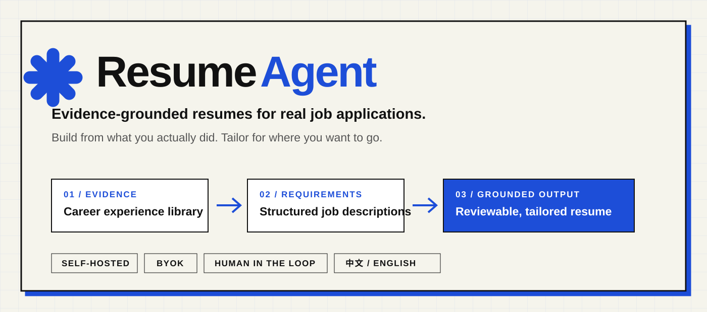
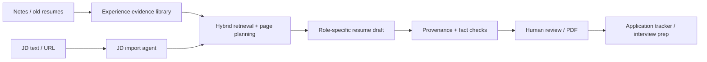
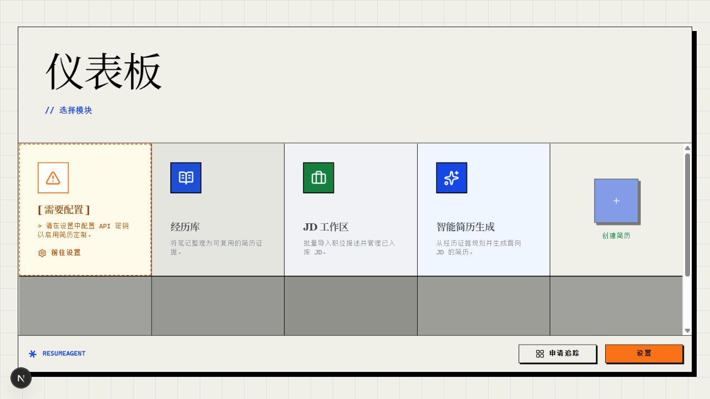
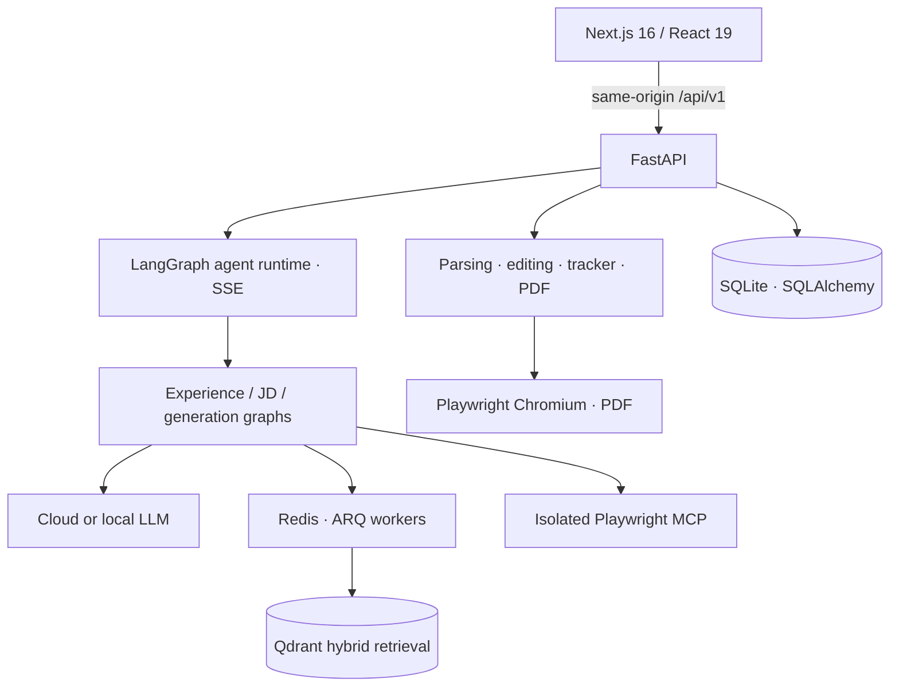

<div align="center">



# ResumeAgent

**Turn real career evidence into job-specific, traceable, reviewable resumes.**

[简体中文](README.md) · **English**

[](https://github.com/Strel1tz1a02/resume-agent/actions/workflows/ci.yml)
[](LICENSE)
[](https://github.com/Strel1tz1a02/resume-agent/stargazers)
[](apps/backend/pyproject.toml)
[](apps/frontend/package.json)

[Quick start](#quick-start) · [Workflow](#workflow) · [Architecture](#architecture) · [Contributing](#contributing) · [⭐ Star ResumeAgent](https://github.com/Strel1tz1a02/resume-agent)

</div>

ResumeAgent is a self-hostable job-search workspace. It turns scattered work, project, and campus experience into reusable evidence; structures target job requirements; plans relevant content within a page budget; and shows provenance and fact-check results before you approve the output.

It is designed for job seekers who do not want an AI to freely invent a better story. The model helps organize and rewrite; the underlying evidence and final decision remain yours.

> [!NOTE]
> ResumeAgent is under active development and currently targets personal use on a local machine or trusted network. It does not yet provide multi-user authentication, so do not expose an instance directly to the public Internet. Cloud LLM providers receive the resume and job-description content needed for each request.

## Why ResumeAgent?

Most AI resume tools start with “one resume + one job description” and immediately rewrite. ResumeAgent builds a reusable, inspectable evidence chain instead:

| One-off AI rewriting | ResumeAgent |
|---|---|
| Recall your history for every application | Capture career evidence once and reuse it |
| Treat a JD as one large text block | Structure requirements, priorities, and gaps |
| Let the model decide what belongs | Retrieve evidence and plan the page first |
| Lose track of where claims came from | Link sources and run citation/fact checks |
| Stop after generating a document | Prepare interviews and track the application |

## Quick start

Docker Compose is the simplest route to the complete workflow. Install [Git](https://git-scm.com/) and [Docker Desktop](https://www.docker.com/products/docker-desktop/) (or Docker Engine with Compose), then run:

```bash
git clone https://github.com/Strel1tz1a02/resume-agent.git
cd resume-agent
docker compose up --build -d
```

Open **<http://localhost:3000>**, go to **Settings**, choose an LLM provider, and add your API key. You can also connect a local Ollama or another OpenAI-compatible service.

```bash
# Inspect services and logs
docker compose ps
docker compose logs -f resume-matcher

# Stop services while retaining Docker volumes
docker compose down
```

The first build downloads application dependencies and Playwright Chromium. See the [setup guide](SETUP.md) for platform-specific development, Ollama, environment variables, and troubleshooting.

## Workflow



### Capture once, reuse for every application

Turn notes, retrospectives, and old resumes into structured experiences. Each record keeps context, actions, results, technologies, and supporting evidence.

### Make job descriptions actionable

Import one or more job descriptions from text or URLs. The JD agent structures company and role metadata, requirements, and priorities, and can ask for clarification when information is missing or contradictory.

### Plan before generating

ResumeAgent uses dense + BM25 hybrid retrieval in Qdrant, then balances requirement relevance, evidence strength, and a page budget. The UI exposes covered requirements and honest gaps.

### Trace sources and review changes

Generated content is linked back to career evidence and passes deterministic citation checks plus model-assisted fact checks. High-risk actions can pause for human approval through recoverable agent interactions.

### Continue through the application lifecycle

Edit seven resume templates and export PDF files, optionally create a cover letter, outreach copy, and interview preparation, then track the application on a Kanban board.

## Preview



> This is the real first-run state with an empty data directory. Configure a model to continue into the experience library, JD workspace, and generation flow.

## Models and data boundaries

| Mode | Providers | Data boundary |
|---|---|---|
| Cloud API | OpenAI, Anthropic, Gemini, OpenRouter, DeepSeek, Groq | Request content is sent to the selected provider |
| Local model | Ollama | Model requests can stay on your machine |
| Self-hosted compatible API | OpenAI-compatible services such as LM Studio, llama.cpp, or vLLM | Depends on the endpoint you configure |

- Bring your own key (BYOK); API keys are encrypted in SQLite.
- Business data, agent checkpoints, and configuration persist in local Docker volumes by default.
- JD URL import runs through an isolated Playwright MCP and a restricted egress proxy that blocks local, private-network, and cloud-metadata targets.
- Review the privacy policy of any cloud model provider before processing sensitive resume data.

## Architecture



The backend is a modular monolith. A shared runtime owns runs, interactions, checkpoints, context assembly, and SSE events; each domain keeps its own graph, state, and result model. Read the [architecture guide](docs/codebase/ARCHITECTURE.md) and [stack reference](docs/codebase/STACK.md) for details.

## Stack

| Area | Technology |
|---|---|
| Frontend | Next.js 16, React 19, TypeScript, Tailwind CSS 4, TanStack Query |
| API and agents | FastAPI, Pydantic, LangChain, LangGraph, MCP |
| Data | SQLite / SQLAlchemy, Redis / ARQ, Qdrant / FastEmbed |
| Documents | MarkItDown, python-docx, pdfminer, Playwright Chromium |
| Quality | pytest, Vitest, Testing Library, ESLint, Prettier, structured eval harness |

## Development

Prerequisites: Python 3.13, Node.js 22, [uv](https://docs.astral.sh/uv/), and Docker.

```bash
# Infrastructure
docker compose up -d redis qdrant playwright-mcp-gateway

# Backend dependencies and tests
cd apps/backend
uv sync --extra dev
uv run pytest

# Frontend dependencies and quality checks
cd ../frontend
npm ci
npm test
npm run lint
npm run build
```

See [SETUP.md](SETUP.md) for all processes and environment variables. The [developer documentation index](docs/agent/README.md) covers the agent runtime, feature designs, and testing strategy.

## Status and limits

Implemented:

- [x] Structured experience evidence library with AI-assisted enrichment
- [x] Text, URL, and batch JD import with clarification interactions
- [x] Dense + BM25 retrieval, page planning, and evidence-grounded generation
- [x] Citation checks, fact checking, and human approval
- [x] Resume editor, seven templates, PDF export, job-search content, and tracker
- [x] Chinese/English UI, multiple model providers, and Ollama

Improving next:

- [ ] SSE replay and interaction recovery after a browser refresh
- [ ] Multi-user authentication and public deployment hardening
- [ ] Reproducible Python locks and formal releases
- [ ] Lightweight media covering the new evidence-driven workflow

## Contributing

Bug fixes, documentation, design, and features are welcome. Read the [contributing guide](.github/CONTRIBUTING.md) and look for `good first issue` or `help wanted` labels.

- [Report a bug](https://github.com/Strel1tz1a02/resume-agent/issues/new?template=bug_report.yml)
- [Request a feature](https://github.com/Strel1tz1a02/resume-agent/issues/new?template=feature_request.yml)
- [Browse issues](https://github.com/Strel1tz1a02/resume-agent/issues)
- [Privately report a vulnerability](https://github.com/Strel1tz1a02/resume-agent/security/advisories/new)

If an evidence-grounded resume workflow is useful to you, give ResumeAgent a [⭐ Star](https://github.com/Strel1tz1a02/resume-agent). It helps more job seekers discover the project.

## Acknowledgements and license

ResumeAgent is developed independently from the open-source [srbhr/Resume-Matcher](https://github.com/srbhr/Resume-Matcher) project. This repository adds the career-evidence library, agentic JD import, evidence retrieval, and traceable generation workflow. Thank you to the upstream maintainers and contributors.

Licensed under the [Apache License 2.0](LICENSE).
