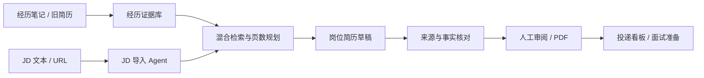
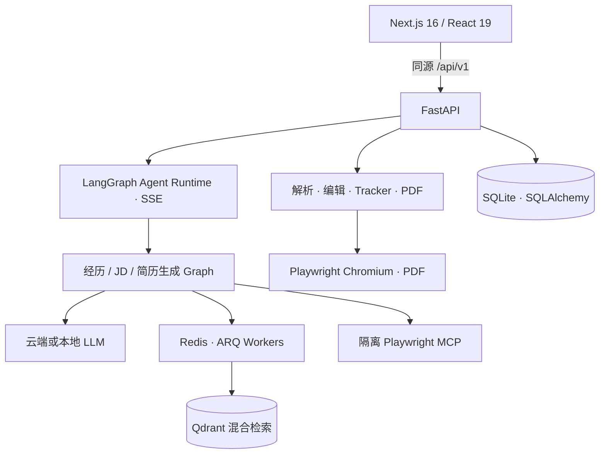

<div align="center">


# ResumeAgent

**从真实经历证据出发，生成针对岗位、来源可追溯、可审阅的简历。**

**简体中文** · [English](README.en.md)

[](https://github.com/Strel1tz1a02/resume-agent/actions/workflows/ci.yml)
[](LICENSE)
[](https://github.com/Strel1tz1a02/resume-agent/stargazers)
[](apps/backend/pyproject.toml)
[](apps/frontend/package.json)

[快速开始](#快速开始) · [了解工作流](#工作流) · [查看架构](#架构) · [参与贡献](#参与贡献) · [⭐ Star ResumeAgent](https://github.com/Strel1tz1a02/resume-agent)

</div>

ResumeAgent 是一个可自托管的 AI 求职工作台。它把零散的项目、工作和校园经历沉淀为可复用证据，解析目标职位要求，在页数预算内选择最相关的内容，并在生成后展示来源与事实核对结果。

它适合不希望 AI “自由发挥”的求职者：模型可以帮助组织和改写，但最终内容仍来自你的经历，并由你审阅确认。

> [!NOTE]
> ResumeAgent 正在快速迭代，当前更适合个人本地使用或可信网络。项目尚未提供多用户认证，请不要把实例直接暴露到公网。使用云端 LLM 时，简历与 JD 内容会发送给相应模型提供商。

## 为什么是 ResumeAgent

多数 AI 简历工具从“一份简历 + 一段 JD”直接开始改写。ResumeAgent 把求职过程拆成一条可复用、可检查的证据链：

| 传统一次性改写 | ResumeAgent |
|---|---|
| 每次投递重新回忆经历 | 经历库沉淀一次，后续重复使用 |
| 把 JD 当作一大段文本 | 结构化要求、优先级和缺失信息 |
| 模型自行决定写什么 | 先检索证据、规划页数，再生成 |
| 很难判断内容从哪里来 | 关联来源，执行引用与事实核对 |
| 生成后流程结束 | 继续生成求职材料、准备面试、跟踪投递 |

## 快速开始

完整功能最省心的方式是使用 Docker Compose。你只需要 [Git](https://git-scm.com/) 与 [Docker Desktop](https://www.docker.com/products/docker-desktop/)（或 Docker Engine + Compose）：

```bash
git clone https://github.com/Strel1tz1a02/resume-agent.git
cd resume-agent
docker compose up --build -d
```

打开 **<http://localhost:3000>**，进入 **设置**，选择模型提供商并填写 API Key；也可以连接本机 Ollama 或其他 OpenAI-compatible 服务。

```bash
# 查看服务状态与日志
docker compose ps
docker compose logs -f resume-matcher

# 停止服务；数据卷会保留
docker compose down
```

第一次构建需要下载前后端依赖与 Playwright Chromium，耗时取决于网络。Windows 本地开发也可使用 `./start-dev.ps1 -Setup`。更多平台、Ollama、故障排查与手动开发说明见 [安装指南](SETUP.zh-CN.md)。

## 工作流



### 沉淀一次，复用每次投递

把零散笔记、项目复盘和旧简历整理成结构化经历与证据。每条经历保留背景、行动、结果、技术栈与来源，不再为每个岗位从头回忆。

### 把 JD 变成可执行要求

从纯文本或 URL 导入一个或多个职位描述。JD Agent 会结构化公司、岗位、要求与优先级；遇到缺失或冲突信息时，可以向你发起澄清。

### 先规划，再生成

系统通过 Qdrant 的 dense + BM25 混合检索寻找相关证据，再结合岗位要求和页数预算规划内容。界面会展示已覆盖要求与真实缺口。

### 来源可追踪，改动可审阅

生成内容会关联经历证据，并经过确定性引用检查与模型事实核对。需要人工决策的高风险操作通过可恢复的 Agent 交互确认。

### 覆盖完整求职流程

在可视化编辑器中调整 7 套简历模板并导出 PDF；按需生成求职信、外联消息与面试准备，再通过 Kanban 看板管理投递状态。

## 界面预览


> 上图是干净数据目录下的真实首启状态；完成模型配置后即可进入经历库、JD 工作区与智能生成流程。

## 模型与数据

| 运行方式 | 提供商 | 数据边界 |
|---|---|---|
| 云端 API | OpenAI、Anthropic、Gemini、OpenRouter、DeepSeek、Groq | 请求内容会发送到你选择的提供商 |
| 本地模型 | Ollama | 模型请求可保留在本机 |
| 自托管兼容接口 | OpenAI-compatible（如 LM Studio、llama.cpp、vLLM） | 取决于你配置的服务地址 |

- API Key 由用户自带（BYOK），在 SQLite 中加密存储。
- 业务数据、Agent checkpoint 与配置默认保存在本地 Docker volume。
- JD URL 导入使用隔离的 Playwright MCP，并通过受限出口代理阻止访问本机、私网和云元数据地址。
- 如果简历含敏感信息，请先阅读目标模型提供商的隐私政策。

## 架构



后端采用模块化单体：统一 Runtime 管理 Run、Interaction、checkpoint、上下文和 SSE 事件，各业务保留自己的 Graph、领域状态与结果模型。更深入的说明见 [架构文档](docs/codebase/ARCHITECTURE.md) 与 [技术栈](docs/codebase/STACK.md)。

## 技术栈

| 区域 | 技术 |
|---|---|
| 前端 | Next.js 16、React 19、TypeScript、Tailwind CSS 4、TanStack Query |
| API 与 Agent | FastAPI、Pydantic、LangChain、LangGraph、MCP |
| 数据 | SQLite / SQLAlchemy、Redis / ARQ、Qdrant / FastEmbed |
| 文档处理 | MarkItDown、python-docx、pdfminer、Playwright Chromium |
| 质量 | pytest、Vitest、Testing Library、ESLint、Prettier、结构化 eval harness |

## 本地开发

前置条件：Python 3.13、Node.js 22、[uv](https://docs.astral.sh/uv/) 与 Docker。

```bash
# 基础设施
docker compose up -d redis qdrant playwright-mcp-gateway

# 后端依赖与测试
cd apps/backend
uv sync --extra dev
uv run pytest

# 前端依赖与质量检查
cd ../frontend
npm ci
npm test
npm run lint
npm run build
```

完整的多进程启动命令、环境变量与故障排查见 [安装指南](SETUP.zh-CN.md)。Agent Runtime、功能设计与测试策略见 [开发者文档索引](docs/agent/README.md)。

## 项目状态与边界

已实现：

- [x] 结构化经历证据库与 AI 辅助补全
- [x] 文本、URL 与批量 JD 导入，支持澄清交互
- [x] dense + BM25 混合检索、页数规划与证据驱动生成
- [x] 来源引用检查、事实核对、人工确认
- [x] 简历编辑、7 套模板、PDF 导出、求职材料与投递看板
- [x] 中英双语 UI、多模型提供商与 Ollama

仍在改进：

- [ ] SSE 断线重放与等待交互的刷新恢复
- [ ] 完整的多用户认证与公网部署加固
- [ ] 可复现的 Python 锁文件与正式版本发布
- [ ] 覆盖新工作流的轻量演示视频和截图

## 参与贡献

Bug、文档、设计和功能改进都欢迎。开始前请阅读 [贡献指南](.github/CONTRIBUTING.md)，并优先选择带有 `good first issue` 或 `help wanted` 标签的任务。

- [提交 Bug](https://github.com/Strel1tz1a02/resume-agent/issues/new?template=bug_report.yml)
- [提出功能建议](https://github.com/Strel1tz1a02/resume-agent/issues/new?template=feature_request.yml)
- [查看现有 Issues](https://github.com/Strel1tz1a02/resume-agent/issues)
- [安全问题私下报告](https://github.com/Strel1tz1a02/resume-agent/security/advisories/new)

如果“基于真实经历证据、可审阅地生成岗位简历”正是你想要的工作流，欢迎给 ResumeAgent 一个 [⭐ Star](https://github.com/Strel1tz1a02/resume-agent)。它能帮助更多求职者发现这个项目。

## 致谢与许可证

ResumeAgent 基于 [srbhr/Resume-Matcher](https://github.com/srbhr/Resume-Matcher) 的开源代码独立演进，并在此基础上新增经历证据库、Agent 化 JD 导入、证据检索与可追溯生成等能力。感谢原项目作者与所有贡献者。

本项目使用 [Apache License 2.0](LICENSE)。
