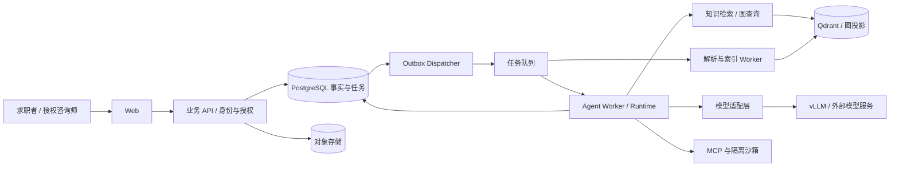

# 产品与技术开发路线

## 1. 产品定位与价值

建议定位：**基于个人真实经历证据的求职工作台**。

目标用户先选有多段项目经历、需要针对多个岗位准备材料的求职者。第二阶段验证职业咨询师与求职者协作，不同时扩展到招聘筛选、课程平台和自动海投。

核心闭环：导入经历材料 → 确认事实 → 导入职位 → 找出匹配证据与缺口 → 补充澄清 → 生成有来源的简历 → 人工审核 → 导出与跟踪 → 将修改反馈用于下一次优化。

二次开发边界：不继承上游全部功能。首期收敛到经历、职位、证据生成、审核和导出；旧主简历中心、重复 tailor/wizard 流程、求职信/outreach、复杂模板配置和无关营销展示按整理方案裁剪。轻量跟踪按需保留，完整 Campaign 后续建设。现有 Runtime 和检索内部设计也允许简化。

产品差异不应只是“聊天改简历”，而应是：

- 每条关键表述可定位到原文、页码或用户确认的事实。
- 每项岗位要求显示“有直接证据 / 相关但不足 / 未找到”，而不是一个无法解释的总分。
- 同一经历可以生成不同岗位版本，但事实和原始资料不会被覆盖。
- 用户离开后任务仍可推进；需要补充或批准时暂停，回来后接着做。
- 用户知道结果的成本、版本和状态；失败能重试，重复点击不会生成多个副本。

首批验证建议邀请 5–10 名真实目标用户，观察其从材料到可用简历的过程。记录人工修改时间、事实纠错次数、关键表述采纳率和重复使用情况。这个规模只用于发现产品问题，不用于宣称统计显著性。

首要产品指标：一次任务产出经用户确认的可用简历的比例，以及达到可用状态的人工修改时间。面试邀约率可长期跟踪，但受岗位、候选人和市场影响，不能直接当模型训练奖励或产品因果收益。

## 2. 能力与真实需求的对应

| 能力 | 真实业务需求 | 建议实现 | 验收证据 |
|---|---|---|---|
| Agent | 输入不完整，需判断补问、检索、改写顺序 | 在受约束 Workflow 中选择工具、调整局部计划 | 成功率、补问有效性、步数与成本 |
| 多 Agent | 多个 JD 可独立分析；写作与核验需要职责隔离 | 有上限的 JD 子任务；生成 Agent 与独立核验 Agent | 对比单 Agent，测质量收益与额外耗时 |
| 多模态 | JD 截图、扫描简历、证书、作品截图 | 文本解析优先，OCR/视觉模型补充，页码与区域引用 | 布局复杂集的字段/证据准确率和错误定位 |
| 长程任务 | 批量岗位准备、多轮补材料、跨天恢复 | Campaign + Task DAG + durable Run + 人工等待 | Worker 被杀、断网、重启后的恢复演示 |
| MCP | 从浏览器或外部文档系统导入材料 | 延用浏览器 MCP，通过注册适配器扩展来源 | 真实协议契约、超时/断连/重连测试 |
| Skills | 不同行业需要不同写作与审查规则 | 可版本化技能包，含输入输出、工具声明和 eval | 同一工作流切换技能包，行为可回归 |
| 沙箱 | 浏览器和不可信文档解析需限制影响范围 | 独立低权限容器、出口控制、资源与时间限制 | 私网访问、路径逃逸、资源耗尽等阻断测试 |
| 权限控制 | 私人经历不能串租户；咨询师仅访问授权材料 | workspace/资源授权 + 工具能力授权 + 审批 | 直接 API、检索、下载、SSE 均有越权测试 |
| Agent RAG | 第一轮检索不足，需要改写查询或找反证 | 检索 → 证据充分性判断 → 限次补检索/提问 | 相对单轮检索的收益、成本、终止率 |
| Graph RAG | 跨项目关联技能、行动、成果与岗位要求 | 证据关系图检索，与向量结果融合 | 多跳问题集和图检索消融 |
| SFT | 小模型抽取/证据判定不稳定，重复大模型调用贵 | 先训练一个有金标准的窄任务 | 未见用户/项目上的质量、成本、延迟 |
| RL | 多步检索策略浪费工具次数或漏找关键证据 | 可复现模拟环境中的策略奖励训练 | SFT 与 SFT+RL 的盲测及 reward hacking 检查 |
| vLLM | 部署领域模型，控制吞吐与成本 | 独立 GPU 服务，与业务 API 解耦 | 实际模型的质量、TTFT、吞吐、显存、成本 |
| 高并发 | 上传、SSE、模型请求和导出争抢资源 | 分队列、限流、背压、并发池、缓存 | 固定硬件与流量模型下的压测报告 |
| 幂等 | 重试、双击、重复投递和审批重复回调 | 请求幂等 + Outbox + 消费幂等 + 版本约束 | 重复与故障注入后只产生一份业务结果 |
| 消息队列 | 解析、索引、生成脱离 HTTP 请求 | 先复用 ARQ/Redis；跨语言时评估统一消息协议 | 积压、重投、毒消息、失败处理、恢复报告 |
| Go / Java | 业务控制面与 Python 模型运行时独立迭代 | 后期任选一个，负责账户、任务、配额等稳定领域 | 独立部署、契约测试、故障隔离 |
| 微服务 | GPU、浏览器、API 和 Worker 负载/信任边界不同 | 先拆部署单元；有独立数据与发布归属才拆领域服务 | 边界图、数据归属、故障与运维成本 |
| 多线程 | 阻塞 I/O 或 JVM 并发任务需要受控资源 | 线程池、超时、队列容量；Python CPU 重任务用进程 | 主循环不被阻塞，压力下无无限排队 |
| 链路追踪 | 无法定位慢在检索、工具、排队还是模型 | OpenTelemetry 跨 HTTP/队列/Worker/工具传播 | 一个任务能定位完整耗时和重试轨迹 |
| 数据中台 | 反馈、评测、训练需要统一可追溯数据 | 先做轻量数据与质量闭环，不建设通用中台 | 数据来源、版本、质量、授权和删除链路 |
| 规范测试 | 重构和依赖升级不能悄悄破坏行为 | 分层测试、CI、真实集成和故障测试 | 可复现报告和发布门禁 |
| 自动化评估 | 模型能运行不代表结果更好 | 扩展已有黄金集与评分器，增加 E2E 和人工盲审 | 对照实验、分切片指标、失败案例 |
| AI coding | 大改动容易制造重复抽象和隐蔽回归 | 契约先行、小 diff、独立验收、失败复现 | review 记录、测试证据、ADR 与迭代样例 |

## 3. 第一条应当做深的业务链路

演示场景：用户上传已有简历、项目材料和 3 个目标岗位，要求为每个岗位准备一版可核验简历。

1. 系统建立 Campaign，记录资料版本、岗位版本和预算。
2. 导入任务提取文本；图片页面交给 OCR/视觉模型。每份材料保存来源坐标。
3. JD 子任务分析各岗位要求；共享同一份已授权的个人事实快照。
4. 检索返回证据 ID、引用片段和来源版本。缺少经历归属时批量提问，不自行猜测。
5. 生成 Agent 形成草稿；规则验证器检查来源存在、数字一致、Schema 等约束。
6. 核验 Agent 检查语义支持与夸大表述。其输出是建议或拒绝理由，不能自行改写原始事实。
7. 用户按 diff 确认，系统保存新的简历版本；随后异步导出。
8. 中途关闭浏览器或重启 Worker，任务可恢复；重复确认只落库一次。

多 Agent 只用于独立工作与独立核验。Planner、Extractor、Writer 每个函数都包装成 Agent，会增加成本和失败路径，必须用对照实验证明必要性。

## 4. 架构分期与数据归属

第一阶段：Next.js + Python 模块化单体 + 独立 Worker + PostgreSQL + Redis + 现有 Qdrant + 对象存储。

浏览器/解析沙箱与 GPU 推理服务独立运行。这样能隔离负载和权限，而不必先拆十几个业务服务。

这是目标结构示意，PostgreSQL、对象存储、图投影和独立 Agent Worker 尚不是本轮验证过的现有能力。

核心实体：Workspace、Membership、SourceDocument、ExperienceRevision、Evidence、JobRevision、Campaign、Task、Run、ToolCall、Interaction、ResumeRevision、Artifact、UsageRecord、AuditEvent。

- Experience/Evidence 管事实，ResumeRevision 管表达；模型改写不能反向覆盖事实。
- Campaign 管目标、依赖和进度；Runtime 管执行状态，Conversation 只管理消息与展示。
- PostgreSQL 是业务事实源；Qdrant 和图索引是可重建投影。模型上下文与缓存都不是事实主库。
- 所有私有资源附 workspace 与 owner/ACL。worker 从可信任务上下文取得权限，不能相信模型传来的 tenant_id。
- 派生数据保存 source_revision、index_version。旧索引不得覆盖新修订；删除要传播到向量、图、对象、缓存和可控日志。

若后端岗位权重高，P4 后可抽出 Java/Spring Boot 业务服务，承接身份、Campaign、任务入口、配额与审计；Python 保留 AI Runtime。若偏 Go 后端，则用 Go 替代 Java，二选一。

真正拆服务后，各服务独占自己的表或 schema；跨服务靠 API/事件，不得双方写同一任务表。API 服务拥有业务 Task，AI 服务拥有执行 Run，通过版本化事件同步投影。ARQ 是 Python 任务工具，不能默认 Java/Go 直接发送其内部协议；到此阶段再评估 RabbitMQ 等共享消息协议，避免同时维护多套队列。

## 5. 长程执行、并发与幂等

Checkpoint 只解决部分恢复问题。外部副作用、任务派发、状态投影和人工审批仍需独立保证。LangGraph 的持久化与恢复能力可沿用，但不能据此声称业务恰好执行一次。[LangGraph 持久化文档](https://docs.langchain.com/oss/python/langgraph/persistence)

目标业务任务状态可用 `queued/running/waiting/succeeded/failed/cancelled`；waiting_reason 区分 input/approval。这是新的任务层建议，不要求立即重命名现有 ToolCall 状态。

关键机制：

- 创建任务与 Outbox 在同一数据库事务提交。dispatcher 可重复派发，消费者必须可重复执行。
- 幂等键按 `(workspace_id, operation, idempotency_key)` 唯一，保存请求摘要；同键同请求返回原任务，同键不同请求返回冲突。
- 消费者按业务操作 ID 去重；数据库唯一约束保护最终结果，不依赖 Redis job ID 或进程内锁。
- Run 持有租约、心跳与 fencing token；旧 Worker 恢复后不能覆盖新 Worker 的结果。
- 审批绑定具体 ToolCall、参数摘要和资源修订号；内容变化后旧批准失效。
- 外部系统支持幂等键时透传；不支持时记录不确定状态并对账，不能盲目重试非幂等动作。
- SSE 只是展示通道；事件带稳定序号，重连能补拉。客户端断开不能自动等同于任务取消。
- 限制每租户活跃任务数、每任务 token/金额/时长、每工具超时和最大重试。取消信号沿子任务传播。
- 解析、模型、导出分队列，失败任务进入人工可见的终态或待处理队列；恢复必须可审计。

高并发需要先区分四个数字：普通 API QPS、SSE 连接数、任务提交速率、模型实际并行量。排队成功不等于模型完成成功。

起步压测方案：固定硬件、数据规模和请求长度，逐档测试 10/50/100 个并发用户、100/500 条 SSE 连接、1/4/8 个模型活跃任务；这些是实验档位，不是已实现指标或上线承诺。记录 p50/p95/p99、错误率、排队时间、完成吞吐与单位成本，找到饱和点后设准入上限。

并发先解决阻塞、背压与资源池。Python 的 async 不等于多线程，线程池也不等于 CPU 并行；不要为简历关键词无依据地增加线程。

## 6. RAG 与证据图

先保留现有混合检索，建立四组对照：dense；dense+sparse；混合+reranker；混合+图扩展。Agent 补检索再单独加入，避免一次改变所有变量。

图可以表达：`Experience -HAS_EVIDENCE-> Evidence -DEMONSTRATES-> Skill`，以及 `JobRequirement -REQUIRES-> Skill`。成果节点保留原始数量、单位、时间和证据来源；不能因为两个实体语义相近就补出用户未做过的经历。

业务查询例：“岗位要求系统稳定性，哪些项目中有直接证明，而不只是出现 Redis 关键词？”先召回候选，再沿证据与技能关系寻找支持路径。每次图扩展限制跳数、节点数和 workspace，最终回答仍引用原文。

早期关系可存 PostgreSQL 关系表；只有真实多跳查询和性能/维护需求得到验证后再引入 Neo4j。采用知识图谱辅助检索，不必照搬 Microsoft GraphRAG 的整库社区摘要流程；后者还支持面向全局语料问题的搜索，个人经历的小语料不一定需要。[GraphRAG 查询概览](https://microsoft.github.io/graphrag/query/overview/)

Agent RAG 的停止条件：证据已充分、无新证据、达到检索预算，或需要用户澄清。缺失证据必须允许返回“未找到”。空检索、无相关经历和引用失效应当进入专门测试集。

访问过滤必须在召回与图遍历前执行；不能先把其他用户资料送入模型，再在答案里过滤。

## 7. 多模态、MCP、Skills 与沙箱

多模态先做 JD 截图和扫描材料，这是当前文本导入的直接缺口。输入文件要校验真实类型、页数与大小；提取结果携带页码、bbox 和原文，不清楚的数字请用户确认。语音面试放后面，不要同时引入音视频实时系统。

MCP 负责连接工具，Skill 负责描述完成任务的方法，两者都不自动获得权限。产品 Skill 建议包含：稳定 ID、版本、说明、输入/输出 Schema、允许工具、预算、风险级别和回归样本。先由开发者审查发布，后续才考虑用户安装第三方包。

首批 Skill 示例：技术经历证据提取、后端岗位定制、简历事实审查。调用时记录版本，支持回退；不能通过 Skill 文本绕过工具注册、资源授权和人工确认。

权限分三层：用户是否有权访问资源；当前 Agent 是否被授予该工具；这一次副作用是否需要批准。模型只提出调用，确定性策略执行授权。

现有浏览器出口隔离值得保留并验证。进一步要求：任务隔离文件目录、非 root、只读基础文件系统、无宿主 Docker socket、无业务主库凭据、限制 CPU/内存/PID/时间、出口白名单和任务结束清理。文件解析任务与浏览器也应按需隔离。

Docker 是隔离基础，不是任意恶意代码执行的完整安全保证。首期不提供通用任意代码执行；若后续支持生成代码，需独立加强隔离与逃逸测试。网页和文档内容属于数据，不能转化为授权指令。

## 8. 后训练：先做一个窄任务，再做真实 RL 实验

首选任务：输入岗位要求与候选证据，输出“直接支持 / 部分支持 / 不支持”、引用证据 ID 和理由。比训练整份简历更容易标注、评估和定位收益。

SFT 步骤：

1. 用现有真实失败案例定义标注规则；候选池包含关键词相同但不支持结论的难负例。
2. 经授权收集脱敏样本，人工复核。建议先完成数百条高质量验证样本，再依据学习曲线决定是否扩展到数千条训练数据；数量是预算规划，不是成功门槛。
3. 按用户、项目、来源文档和模板分组切分训练/验证/测试，近重复去重。一个项目的改写不能同时出现在训练集和测试集。
4. 比较原始小模型、优化 Prompt 小模型、SFT 小模型、外部强模型。固定上下文、采样参数与检索输入。
5. 用 LoRA/QLoRA 等低成本适配方式做可复现实验；保存数据哈希、基座 revision、训练配置、随机种子和权重版本。
6. 以未见样本上的证据判定质量、结构合法率、拒答能力、延迟和成本决定是否部署。

TRL 提供 SFTTrainer 及对话/提示完成数据支持；具体版本与基座组合应在独立训练环境做兼容验证。[TRL SFT 文档](https://huggingface.co/docs/trl/sft_trainer)

RL 作为独立进阶里程碑：构建“检索—检查—补检索—回答/澄清”的有限动作环境，固定训练语料和工具响应，使最终证据覆盖和调用成本可以验证。状态是可观察任务数据，动作是工具选择/查询/停止，奖励来自有标注的结果及约束。

奖励考虑：支持结论的正确性、有效证据覆盖、任务完成，扣除无效调用、越权和来源外断言。事实错误作为硬失败约束；同时防止空答案靠“不造假”拿高分，防止输出大量引用骗覆盖率。奖励权重需通过反例调试，不把 Judge 分数直接当唯一奖励。

GRPO 可以作为候选算法，但真正的多轮工具环境、轨迹采样和奖励实现仍需要自己接入；调用 Trainer 不等于完成 Agent RL。[TRL GRPO 文档](https://huggingface.co/docs/trl/grpo_trainer)

对比 SFT 与 SFT+RL，并报告不同数据切片和多随机种子的波动。若只做离线偏好优化，应如实称为 DPO/偏好优化，不能写成在线 Agent RL。RL 没有胜出也可保留为实验报告，不强行上线。

训练样本不直接从用户点击“采纳”产生真值：采纳可能只是文风偏好。需要分开事实正确、内容选择与表达偏好。公开简历数据也不自动等于可以训练；产品数据默认不进入训练集，使用需明确授权。

## 9. vLLM 与部署

先使用现有模型适配层接远端模型完成产品，再选择任务适配的小模型部署到独立 Linux GPU 环境。GPU 型号、显存、基座和上下文长度未确定前，不给出固定吞吐或费用承诺。

实验报告至少包含：模型与量化配置、GPU/驱动/运行时版本、上下文与输出长度分布、并发档位、成功吞吐、TTFT、每 token 延迟、p95 总延迟、显存与单位成功任务成本。vLLM 提供生产指标接口，但指标需要结合自身任务链路解读。[vLLM Metrics](https://docs.vllm.ai/en/latest/design/metrics/)

自部署不一定便宜。低利用率时，GPU 空闲成本可能高于 API；比较总租用成本与成功任务量，训练费用单独列出。模型故障时允许降级，但记录实际模型、价格与质量变化；涉及私有资料的外部模型降级必须符合用户的数据使用设置。

部署顺序：

1. 本地 Compose 可复现启动：API、Worker、数据服务、MCP；样例资料不含真实隐私。
2. staging：与生产一致镜像、独立数据和密钥；执行迁移、真实集成、备份恢复与故障演练。
3. 小规模 production：TLS、身份认证、配额、监控、备份、预算告警、镜像回滚和部署手册。
4. 出现独立扩缩容或多节点运维需求后，再做 Kubernetes。就绪/存活探针、资源限制、优雅终止、队列积压指标与发布策略需要一并验收。

镜像固定版本或 digest；数据库/向量端口放私网；浏览器和 GPU 接口不能裸露。当前 Compose 与发布工作流的镜像命名不同，部署整理时统一核实，不能默认拉到个人项目最新构建。

## 10. 测试、自动评估与可观测性

现有 eval 是有价值的资产。特别是它已区分合成回归、oracle retrieval 生成测试和真实质量声明，后续必须保留这些边界。

| 层次 | 内容 | 运行时机 |
|---|---|---|
| Unit | 状态转换、版本冲突、引用校验、评分器正确性 | 每次 PR |
| Integration | 真实 PostgreSQL/Redis/Qdrant 的事务、约束和过滤 | 相关 PR / CI |
| Contract | OpenAPI、事件、MCP、模型结构输出 | 协议或依赖变化 |
| E2E | 导入→澄清→生成→批准→导出；跨租户拒绝 | 核心 PR / 发布前 |
| Recovery | Worker 中断、重复消息、队列丢失恢复、租约冲突、SSE 重连 | Runtime/队列变更 / 发布前 |
| Security | 资源越权、提示注入、SSRF、恶意文件、秘密泄漏 | 相关 PR / 发布前 |
| Performance | API、SSE、任务吞吐、GPU 排队与成本 | 稳定阶段和性能变更 |
| Eval | 检索、生成、端到端、人工盲审与消融 | Prompt/模型/检索/Skill 变更 |

真实模型 eval 独立预算执行；快速 CI 不依赖外部模型。真实集成检查失败不能被 mock 通过掩盖，环境缺失要记为未验证，而不是通过。

评估增加：跨用户/岗位切分、无证据案例、矛盾资料、扫描错误、长上下文、注入文本、工具超时。评价维度至少分事实准确、选择合理、内容可用、成本与速度。规则引用命中只能证明片段存在，语义支持仍需标注或人工判断。

对照实验：单 Agent vs 多 Agent；混合检索 vs 图扩展；单轮检索 vs Agent RAG；基座 vs SFT vs RL。每次只改一个主要变量，报告样本量、切片结果和失败例。小样本不包装成普遍结论。

初始发布门禁建议：固定验收集无越权和重复业务写入；关键故障恢复用例全部通过；引用与任务完整性不可退化；质量/性能阈值从 R0 基线和用户可接受程度确定。测试里“零违规”只代表测试覆盖范围，不能宣称绝对安全。

OpenTelemetry 用于把 HTTP、队列与 Worker 的相关操作关联起来；异步任务用上下文传播或 span link，而不是全靠搜索字符串日志。[OpenTelemetry Traces](https://opentelemetry.io/docs/concepts/signals/traces/)

关联字段：request_id、workspace_id、campaign_id、task_id、run_id、tool_call_id、trace_id、模型/Prompt/Skill 版本、token 和重试次数。默认日志保留结构元数据，原始简历和提示词进入受控存储；避免把用户 ID 直接当无限基数的指标 label。

故障手册至少覆盖：任务积压、模型不可用、向量落后、MCP 不通、数据库恢复、用户资料删除。备份不是完成标准，实际恢复成功才是。

## 11. 数据闭环，而非先建数据中台

起步只需要四类可追溯数据：授权原始资料、经确认的事实版本、模型执行记录、评测/标注结果。

流程：失败案例 → 脱敏与授权检查 → 标注 → 数据集版本 → 离线评估 → 可选训练 → 模型/Prompt 发布 → 线上反馈。

数据记录包含来源、授权范围、审核状态、分组去重标识和版本。未经核验的模型输出不能自动成为事实或金标准。删除原始资料时，同时追踪可删除派生物；已进入训练权重的数据处理能力有局限，因此优先使用可控授权数据，提前说明生命周期。

此阶段 PostgreSQL 元数据加对象存储足够。只有多团队、多来源、多消费方产生真实治理需求时，才考虑仓库、调度和更完整的数据平台；不为“中台”二字引入 Kafka、Flink、Spark 全家桶。

## 12. 分阶段交付与停止条件

| 阶段 | 交付物 | 完成标志 | 明确推迟 |
|---|---|---|---|
| P0 裁剪与整理 | 主线/删除清单、R0–R3、架构地图、基线与启动说明 | 无关功能退出；新环境可复现主线，代码边界清晰 | 技术栈迁移 |
| P1 可用产品 | 证据闭环、多用户/workspace、PostgreSQL、配额、基础 CI 与 staging | 真实用户完成任务；隔离、备份恢复与核心测试通过 | RL、图数据库、大规模微服务 |
| P2 可靠 Agent | durable 任务、人工等待、恢复、幂等、受控工具、全链路追踪 | 故障演示可复现，任务不丢且不重复落业务数据 | 无边界自治、自动海投 |
| P3 质量提升 | 多模态导入、Agent RAG、图辅助检索、有限多 Agent、Skills | 至少一项改进在固定对照与用户测试中有效 | 没收益的 Agent/图组件上线 |
| P4 推理与运维 | vLLM 接入、真实负载报告、成本比较、部署演练 | 给出质量和单位成本依据；可灰度回滚 | 不必要的多机 GPU/K8s |
| P5 后训练 | SFT 数据与训练闭环、模型卡；再做 RL 环境和对照 | 独立测试与可复现实验报告；胜出的模型才上线 | 用训练 loss 代替业务质量 |
| P6 可选扩展 | Java 或 Go 服务拆分、共享消息协议、K8s | 有稳定服务归属、独立发布/扩缩容收益 | 为凑要素拆服务 |

P1 起就积累授权数据，不等 P5 才开始标注。P4 可以先部署基座验证推理服务，再部署 P5 的训练产物。

如果时间只能完成一段，优先 P0–P2 加一份可信的端到端评估；如果目标明确是训练算法岗，则在 P1/P2 最小闭环后优先 P5，压缩微服务工作。没有足够数据或 GPU 时可以准备训练环境与数据规范，但不能称为已经完成后训练。

## 13. 对简历竞争力与 AI coding 的建议

最有竞争力的三条故事线：

1. 可靠 Agent Runtime：跨天恢复、人工审批、任务幂等、工具权限，有故障注入证据。
2. 可信生成：结构化个人证据、混合/图检索、Agent 补检索、来源校验，有对照实验。
3. 模型闭环：错误数据收集、SFT/RL、vLLM 服务、成本与质量对照，有可复现产物。

每条准备设计说明、关键代码、可运行 demo、测试/评估报告、一次失败复盘。真实工作量、指标和本人贡献分清；不能把框架提供的能力都写成自研，更不能将规划当成已实现。

AI coding 工作法：先写验收用例与输入输出契约，再给模型限定模块和禁止修改项；一次只交付一个可 review 的用例；涉及状态、数据、权限的改动独立审查。模型生成实现后，用独立构造的反例验证，而不是让同一模型根据代码编一套必过测试。

把高风险边界写进仓库说明与架构测试：Runtime 不导入业务、租户过滤不能省、事实源不能由文案覆盖、不得隐式触发付费集成、迁移需恢复验证。记录可复用的开发任务模板，比展示“用了多少 AI 工具”更有说服力。

坦率建议：

- “企业级”应落实为多用户隔离、可靠运行、可观测、可恢复、可发布。它不是组件数量，也不要求一开始微服务。
- 产品体验同样是技术成果：来源一键定位、diff 审批、失败提示、导出排版和等待状态，直接决定是否有人使用。
- 别训练“更会吹简历”的模型。训练目标应是更可靠的证据判断与更低的任务成本。
- 图与多 Agent 都设退出机制；如果消融没有收益，就保留实验结论并移出主链路。
- 不建议首期自动投递或模拟人操作招聘网站。用户审核后的材料准备已经是完整业务价值，外部动作另立授权与失败处理。
- 保留上游项目来源与贡献边界，清楚展示自己新增的架构与实验，避免让项目被理解为只改了界面的 fork。
- 若尚未确定求职方向，先把 Agent 工程作为主线；Go/Java、训练和 Infra 是可以逐步增强的纵深，不必每项同等投入。
