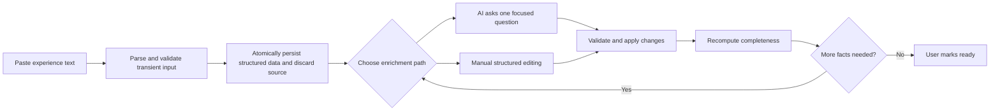
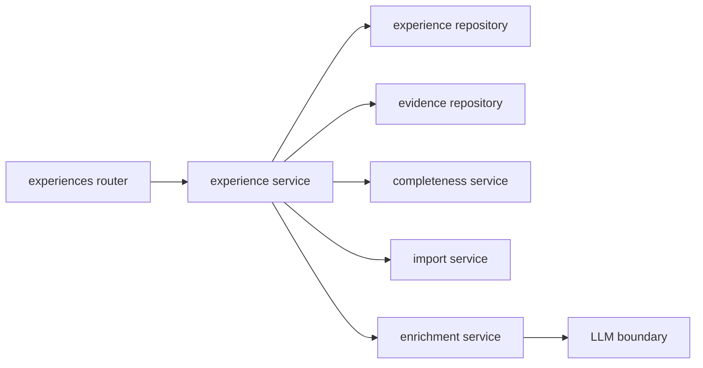

# Personal Experience Library — Design Spec

> **Status:** Approved design (2026-07-29)
>
> **Scope:** Resume-Matcher second-stage development. This specification defines the
> personal experience library, evidence records, text import, manual enrichment, AI
> questioning boundaries, archive/permanent-delete behavior, and the backend/frontend
> structure that later implementation plans must follow.

## 1. Goal

Build a long-lived personal experience library that describes **what experiences a
person has**, independently of any individual resume.

The first supported ingestion path is intentionally simple: the user pastes a free-form
experience paragraph, the application saves it immediately as a draft, and the user then
improves the same stored record through AI questions and/or manual structured editing.

The experience library becomes a factual source for future job matching and resume
generation. Existing resumes remain immutable snapshots and are not coupled to library
record lifecycle changes.

## 2. Locked decisions

1. Development happens only in the `Resume-Matcher` repository.
2. Importing parsed sections from the master resume is out of scope.
3. The only initial import source is a user-pasted block of free-form text.
4. Import text is transient. Parse and validate it, atomically persist only structured
   experience and evidence data, then discard the source text. On failure no partial row
   is created and the frontend retains the user's unsubmitted input.
5. An imported draft is progressively corrected in place by AI questioning and manual
   editing; it is not copied into successive experience versions in this phase.
6. The experience library is person-level data, not resume-level data.
7. `experience_id` and evidence IDs are ordinary auto-incrementing integers.
8. A single experience may contain multiple evidence records. The experience stores
   their ordered IDs in `evidence_ids`, a JSON array of integers.
9. Action, result, and metrics are not independent arrays. They form one evidence unit
   in `EvidenceItem` so their causal relationship is preserved.
10. Completeness is stored as a server-computed integer from 0 to 100.
11. Default delete means archive. Permanent deletion is a second-level action available
    from the archive/recycle-bin view.
12. Existing resumes are never modified or deleted when an experience is archived or
    permanently deleted.
13. Once job matching exists, permanent deletion must disclose affected matches. On
    confirmation, the experience is removed only from each match's referenced experience
    IDs; all other match content remains intact.
14. No general database migration framework is introduced. Fresh databases still use
    SQLAlchemy metadata initialization, while the later `experience_field_states` addition
    must use one explicit, traceable schema/data migration instead of runtime backfilling.
15. Experience persistence must use repositories under `app/repositories/`; new behavior
    must not be added to the monolithic `database.py` facade.
16. AI conversation-history persistence is explicitly deferred.
17. No provenance columns such as `source_type`, `source_resume_id`, or `source_section`
    are added.
18. There is no `date_text`. Uncertain or missing dates remain empty until corrected by
    the user or Agent.

## 3. Domain boundaries

### 3.1 Experience library versus resume

An `ExperienceItem` is reusable factual material. A resume is a rendered/edited snapshot
created for a general profile or a job application.

- Editing a library experience does not update any existing resume.
- Archiving or permanently deleting a library experience does not alter existing resumes.
- Future resume generation may copy selected library facts into a new resume snapshot.
- Future generated resume entries may retain an optional source experience ID for
  traceability, but that reference does not create live synchronization.

### 3.2 Experience versus evidence

An experience contains its general context: type, title, organization, role, dates,
background, technologies, and tags. An evidence item contains one connected factual
claim:

```text
action performed -> result produced -> measurable evidence
```

This avoids losing the relationship between an action and the specific outcome or metric
that supports it.

### 3.3 AI boundary

The LLM proposes structured changes; it does not write database rows directly. Every AI
response is validated by Pydantic schemas and applied by the experience application
service. Missing facts must result in a follow-up question, never fabrication.

## 4. User flow and state



### 4.1 Import state

The import request only validates and stores the text. It does not wait for LLM
extraction. The initial record uses safe placeholders where non-null storage fields are
required. Placeholders such as `Untitled experience` do not earn completeness points.

### 4.2 Draft and ready state

- New and imported experiences start as `draft`.
- Completeness does not automatically mark an experience `ready`.
- The user may mark an experience ready only when it meets the server-side minimum
  completeness threshold.
- A ready experience may still be edited. Editing it recomputes completeness; if it falls
  below the minimum threshold, the service returns it to `draft`.

### 4.3 Archive state

- Archiving changes `status` to `archived` and records `archived_at`.
- Active list queries exclude archived records by default.
- Restoring an archived experience returns it to `draft`; the user confirms readiness
  again after review.
- Permanent delete is permitted only for an archived experience.

## 5. Persistence model

### 5.1 `ExperienceItem`

Table name: `experience_items`

| Column | Type | Null | Default | Notes |
|---|---|---:|---|---|
| `experience_id` | Integer PK | no | autoincrement | Stable library ID shared by every future consumer |
| `kind` | String(32) | no | `other` | `work`, `internship`, `project`, `research`, `campus`, `volunteer`, `other` |
| `title` | String(200) | no | `""` | User-facing name; empty/placeholder does not count as complete |
| `organization` | String(200) | yes | null | Company, school, team, laboratory, or project owner |
| `role` | String(160) | yes | null | User's role |
| `location` | String(160) | yes | null | Optional location |
| `start_date` | String(7) | yes | null | `YYYY-MM`; validation occurs at the schema boundary |
| `end_date` | String(7) | yes | null | `YYYY-MM`; mutually compatible with `is_current` |
| `is_current` | Boolean | no | false | When true, `end_date` must be null |
| `background` | Text | yes | null | Structured context/problem/goal |
| `evidence_ids` | JSON | no | `[]` | Ordered, unique integer IDs pointing to `evidence_items` |
| `technologies` | JSON | no | `[]` | Ordered, normalized strings |
| `tags` | JSON | no | `[]` | Flat labels, not a hierarchy |
| `notes` | Text | yes | null | Private working notes; not automatically used in resumes |
| `status` | String(16) | no | `draft` | `draft`, `ready`, or `archived` |
| `completeness` | Integer | no | `0` | Server-computed, constrained to 0–100 |
| `archived_at` | String | yes | null | UTC ISO-8601, present only while archived |
| `created_at` | String | no | UTC now | Follows existing project timestamp representation |
| `updated_at` | String | no | UTC now | Updated for every material change |

Indexes:

- Index `status` for active/archive filtering.
- Index `kind` for type filtering.
- Index `updated_at` for the default recent-first list.

No `resume_id` or user ownership column is introduced in this local single-user phase.

### 5.2 `EvidenceItem`

Table name: `evidence_items`

| Column | Type | Null | Default | Notes |
|---|---|---:|---|---|
| `id` | Integer PK | no | autoincrement | Evidence ID stored in `ExperienceItem.evidence_ids` |
| `action` | Text | no | none | Concrete action taken by the user |
| `result` | Text | yes | null | Result caused by the action |
| `metrics` | Text | yes | null | Quantitative proof for that result |
| `created_at` | String | no | UTC now | |
| `updated_at` | String | no | UTC now | |

### 5.3 JSON-reference invariants

SQLite cannot enforce foreign keys embedded in a JSON array. The service and repository
layers must therefore enforce these invariants transactionally:

1. Every ID in `evidence_ids` exists.
2. An ID appears at most once within an experience.
3. Ordering in `evidence_ids` is the presentation ordering.
4. Evidence is owned by exactly one experience in this phase and is not shared.
5. Evidence creation inserts the evidence and appends its ID within one database
   transaction.
6. Evidence deletion removes its ID and deletes the evidence row within one transaction.
7. Permanent experience deletion removes all evidence rows owned by that experience.
8. Reads tolerate historical corruption by reporting missing evidence IDs in logs while
   returning the valid evidence records; writes repair/reject invalid references rather
   than propagating them.

The API uses `evidence_ids` because the field is plural and JSON-valued. `evidence_id`
is reserved for routes and operations concerning one evidence item.

## 6. Completeness

Completeness is calculated by a pure backend service and persisted after every mutation
to an experience or its evidence. Clients may read but never set it.

| Dimension | Points | Rule |
|---|---:|---|
| Identity | 10 | Meaningful kind and non-placeholder title |
| Organization | 10 | Organization is present |
| Role | 10 | Role is present |
| Dates | 10 | Start date plus end date, or start date plus `is_current` |
| Background | 15 | Structured background is present |
| Action evidence | 20 | At least one evidence item has a nonblank action |
| Result evidence | 15 | At least one evidence item has a nonblank result |
| Metric evidence | 10 | At least one evidence item has nonblank metrics |
| **Total** | **100** | |

The initial ready threshold is 60. The threshold must be a named constant, not repeated
through routers or UI components.

Completeness output also includes derived guidance that is not persisted:

```json
{
  "completeness": 65,
  "missing_dimensions": ["role", "metrics"],
  "suggested_questions": [
    "What was your specific role in this experience?",
    "Can the result be expressed as a count, percentage, duration, scale, or ranking?"
  ]
}
```

Deterministic questions are the fallback when no LLM is configured or an LLM call fails.

## 7. API contract

All routes are mounted below the existing `/api/v1` prefix.

### 7.1 Experience CRUD and queries

```http
GET    /experiences
POST   /experiences
POST   /experiences/import-text
GET    /experiences/{experience_id}
PATCH  /experiences/{experience_id}
POST   /experiences/{experience_id}/mark-ready
POST   /experiences/{experience_id}/archive
POST   /experiences/{experience_id}/restore
DELETE /experiences/{experience_id}/permanent
```

`GET /experiences` supports:

- `q`: case-insensitive search over title, organization, role, background, technologies,
  and tags.
- `kind`: one experience kind.
- `status`: `active`, `draft`, `ready`, or `archived`; default `active` means draft plus
  ready.
- `sort`: initially `updated_at_desc`, `created_at_desc`, or `created_at_asc`.

The first implementation may return the complete filtered list because the app is local
and datasets are expected to be small. The response shape must permit later pagination
without changing individual item schemas.

### 7.2 Text import

Request:

```http
POST /api/v1/experiences/import-text
Content-Type: application/json

{
  "text": "In my third year I worked with three classmates to build..."
}
```

Behavior:

1. Reject blank text and text beyond the configured maximum length with `422`.
2. Treat the text as transient input and parse it into structured experience fields and
   ordered evidence items.
3. Validate the parse result against strict schemas and business rules.
4. Create the experience, evidence items, field states, and computed completeness in one
   transaction.
5. Discard the source text after commit and return `201` with the expanded experience
   detail; parsing or persistence failure creates no record.

### 7.3 Evidence operations

```http
POST   /experiences/{experience_id}/evidence
PATCH  /experiences/{experience_id}/evidence/{evidence_id}
DELETE /experiences/{experience_id}/evidence/{evidence_id}
PUT    /experiences/{experience_id}/evidence-order
```

Creation request:

```json
{
  "action": "Refactored concurrent job collection tasks",
  "result": "Reduced processing time and retry failures",
  "metrics": "Average runtime fell from 18 minutes to 7 minutes"
}
```

Reorder request:

```json
{
  "evidence_ids": [15, 12, 19]
}
```

The reorder list must contain exactly the current ID set with no duplicates.

### 7.4 Expanded response

Experience detail responses include both stored IDs and expanded evidence:

```json
{
  "experience_id": 7,
  "kind": "project",
  "title": "Campus Recruiting Assistant",
  "organization": "Personal project",
  "role": "Backend and AI developer",
  "location": null,
  "start_date": "2026-07",
  "end_date": "2026-08",
  "is_current": false,
  "background": "Students needed a consistent way to organize job information.",
  "evidence_ids": [12],
  "evidence_items": [
    {
      "id": 12,
      "action": "Built job collection and filtering APIs",
      "result": "Unified multiple recruiting sources",
      "metrics": "Covered five source categories",
      "created_at": "...",
      "updated_at": "..."
    }
  ],
  "technologies": ["Python", "FastAPI"],
  "tags": ["AI application"],
  "notes": null,
  "status": "draft",
  "completeness": 85,
  "missing_dimensions": [],
  "suggested_questions": [],
  "archived_at": null,
  "created_at": "...",
  "updated_at": "..."
}
```

`evidence_items`, `missing_dimensions`, and `suggested_questions` are response aggregates;
they are not duplicate database columns.

### 7.5 Validation and errors

- Missing, permanently deleted, or otherwise unavailable resources return `404`.
- Invalid dates, enum values, evidence ownership, or reorder sets return `422`.
- Attempting to mark an incomplete experience ready returns `409` with current
  completeness and missing dimensions.
- Attempting permanent deletion before archive returns `409`.
- LLM failures preserve all stored state and return a retryable error without partial AI
  mutations.

## 8. AI enrichment without conversation persistence

The authoritative business-fact context for each turn is the current persisted experience,
its evidence items, and the messages in the current conversation. Discarded import text is
never restored into chat context.

### 8.1 Next question

```http
POST /experiences/{experience_id}/questions/next
```

Response:

```json
{
  "question_id": "metrics",
  "question": "How many users were affected, or how much time did this save?",
  "target": "evidence",
  "evidence_id": 12,
  "is_fallback": false
}
```

`question_id` identifies the target dimension for this request/response only. It is not a
foreign key and is not persisted.

### 8.2 Submit answer

```http
POST /experiences/{experience_id}/answers
```

Request:

```json
{
  "question_id": "metrics",
  "answer": "It covered about 500 students and reduced collection time by 60%.",
  "evidence_id": 12
}
```

Processing:

1. Load the latest experience and evidence state.
2. Ask the LLM for a typed patch, not a full database object.
3. Reject changes outside the requested experience or evidence item.
4. Reject invented employers, dates, technologies, results, or metrics not supported by
   saved structured facts plus the user's current conversation answers.
5. Apply the validated patch in one transaction.
6. Recompute completeness.
7. Return the updated expanded detail and optionally the next question.

The LLM response schema permits only:

- updates to editable experience fields;
- creation of a new evidence item;
- updates to one owned evidence item;
- no deletion, archival, readiness, or permanent-delete operations.

Question generation may use deterministic completeness guidance when the LLM is absent.
Conversation history, multi-turn memory tables, and resumable chat sessions remain out of
scope.

## 9. Archive and permanent deletion

### 9.1 Current phase

Archive is reversible and has no downstream side effects. Permanent delete:

1. Requires the record to be archived.
2. Requires an explicit second confirmation in the UI.
3. Deletes the experience and its owned evidence in one transaction.
4. Does not inspect, edit, or delete existing resumes.
5. Returns a deletion-impact object with empty match impact until matching exists, keeping
   the future UI contract explicit.

### 9.2 Future matching integration

Before permanent deletion, the application will expose:

```http
GET /experiences/{experience_id}/deletion-impact
```

Example:

```json
{
  "affected_matches": [
    {
      "match_id": 31,
      "job_title": "AI Application Engineer"
    }
  ],
  "affected_resumes": []
}
```

After user confirmation, deletion will:

- remove the experience ID from each affected match's referenced/candidate experience
  list;
- preserve the match record, score, analysis text, gaps, risks, and every unrelated
  experience reference;
- optionally mark the match as having a removed source so the UI can recommend rematching;
- preserve every existing resume snapshot unchanged.

This future cleanup belongs in the matching service/repository boundary, invoked by the
experience deletion application service. It must not be implemented as direct
cross-table edits in the router.

## 10. Backend architecture

```text
apps/backend/app/
├── models.py
├── schemas/
│   ├── experiences.py
│   └── evidence_items.py
├── repositories/
│   ├── experience_repository.py
│   └── evidence_repository.py
├── services/
│   ├── experience_service.py
│   ├── experience_import_service.py
│   ├── experience_enrichment_service.py
│   └── experience_completeness_service.py
├── prompts/
│   └── experience_enrichment.py
└── routers/
    └── experiences.py
```

Dependency direction:



### 10.1 Router responsibilities

- HTTP request/response handling.
- Dependency injection and status codes.
- No direct SQLAlchemy queries.
- No completeness calculation.
- No prompt construction or LLM output merging.

### 10.2 Service responsibilities

- Business validation and transaction orchestration.
- Experience/evidence ownership invariants.
- Completeness recomputation.
- Archive, restore, ready, and permanent-delete rules.
- AI output validation and application.

### 10.3 Repository responsibilities

- SQLAlchemy reads/writes only.
- Filtering, search, ordering, and row locking/transaction participation.
- Batch expansion of evidence IDs to avoid frontend N+1 requests.
- No HTTP exceptions, prompt logic, or UI-specific messages.

Repositories receive an async SQLAlchemy session and do not open independent sessions
inside a multi-row service operation. This allows experience plus evidence changes to
commit or roll back together.

### 10.4 Database initialization

The new ORM classes must be imported before the existing metadata `create_all` path runs,
so fresh development databases create both tables automatically. This work does not add
Alembic or a TinyDB compatibility layer. The one-time schema/data migration required for
`experience_field_states` and removal of `raw_input` is specified by the ExperienceAdapter
design.

## 11. Frontend design

Route:

```text
/experiences
```

Files:

```text
apps/frontend/
├── app/(default)/experiences/page.tsx
├── components/experiences/
│   ├── experience-library-page.tsx
│   ├── experience-list.tsx
│   ├── experience-editor.tsx
│   ├── evidence-list-editor.tsx
│   ├── completeness-panel.tsx
│   ├── experience-question-panel.tsx
│   ├── text-import-dialog.tsx
│   └── permanent-delete-dialog.tsx
└── lib/api/
    └── experiences.ts
```

The API module reuses the existing centralized `lib/api/client.ts` wrapper. It must not
introduce a second base-URL or timeout implementation.

### 11.1 Entry points

- Add a dashboard tile/link for Personal Experience Library.
- The experience page includes a clear route back to the dashboard.
- A global application-shell/navigation redesign is not required for this module.

### 11.2 Primary layout

Desktop uses a list/detail workspace with an optional assistance panel:

```text
┌───────────────────────────────────────────────────────────────┐
│ Experience Library   Search   Filters   Paste text   + New   │
├────────────────┬───────────────────────────┬──────────────────┤
│ Experience list│ Structured editor         │ Completeness/AI  │
│                │ Title and metadata        │ Missing facts    │
│ Title          │ Structured context        │ One question     │
│ Kind/org/date  │ Evidence cards            │ Answer box       │
│ Completeness   │ Technologies and tags     │                  │
└────────────────┴───────────────────────────┴──────────────────┘
```

On smaller screens, use list -> detail navigation; do not compress all three columns.

### 11.3 Import interaction

The paste dialog has a text area and two actions: cancel, and save/start organizing.
After a successful `import-text` response:

1. Close the dialog.
2. Select the newly created draft.
3. Display its parsed structured fields and evidence immediately.
4. Offer `Help me organize with AI` and `Edit manually`.
5. Preserve the saved structured draft if any later AI request fails.

### 11.4 Editing

- Evidence is edited as connected action/result/metrics cards.
- Evidence cards support add, edit, remove, and ordering.
- The completeness panel updates from server responses after every successful mutation.
- Unsaved local edits trigger a navigation/selection confirmation.
- Only one destructive primary action is visible in a dialog.
- Permanent delete is unavailable outside the archive view.

### 11.5 Internationalization and visual system

- All static UI strings use the existing translation system and maintain locale-key
  parity across every supported locale.
- AI questions use the configured content language.
- Components follow the existing Swiss design tokens: square corners, clear borders,
  hard shadows, serif display headings, and mono metadata labels.
- Text areas follow the repository's Enter-key propagation rule.

## 12. Security and truthfulness

- Transient import text and user answers are untrusted content, never system instructions.
- Prompts explicitly delimit user content and prohibit following instructions embedded
  in it.
- AI output is parsed into a narrow schema; arbitrary field paths are not accepted.
- The model may rewrite supported facts for clarity but may not invent organization,
  role, dates, technology, action, result, or metrics.
- Empty facts remain empty and become questions.
- Server logs may include IDs and validation failures, but must not log full experience
  text or LLM secrets at normal log levels.

## 13. Testing and verification

### 13.1 Backend unit tests

- Completeness scores every dimension and clamps to 0–100.
- Empty/placeholder titles do not score.
- Current roles validate without an end date.
- Evidence ID order and duplicate detection.
- Ready threshold and automatic fallback to draft after destructive edits.
- Archive and restore state transitions.
- AI patches cannot mutate IDs, status, completeness, or unrelated evidence.
- Deterministic questions cover every missing dimension.

### 13.2 Repository tests with real temporary SQLite

- Experience CRUD and filters.
- Evidence create/update/delete in a shared transaction.
- Rollback leaves no orphan evidence or dangling JSON IDs.
- Permanent delete removes owned evidence.
- Active queries exclude archived records.
- Expanded detail preserves `evidence_ids` ordering.

### 13.3 API integration tests

- Text import persists only validated structured data, discards the source text, and returns `201`.
- Blank and oversized import text return `422` without creating rows.
- Manual create, patch, list, detail, and filters.
- Evidence ownership and reorder validation.
- Mark-ready conflict response includes missing dimensions.
- Archive, restore, and archive-only permanent delete.
- LLM failure leaves stored state unchanged.
- Permanent deletion does not touch resume rows.

### 13.4 Frontend tests

- Dashboard entry routes to `/experiences`.
- Empty library and paste-import flow.
- Imported record appears and is selected before AI enrichment.
- Manual experience and evidence editing.
- Completeness and missing fields update after saves.
- Filter/search/archive/recycle-bin behavior.
- Unsaved-change confirmation.
- AI failure retains data and permits retry/manual editing.
- Permanent-delete impact/confirmation presentation.
- Locale parity and production build.

Tests must include failure-path assertions and be demonstrated to fail when their target
behavior is broken, following the repository's anti-theater testing policy.

## 14. Delivery phases

### Phase 1 — Persistence and manual library

- ORM tables and automatic fresh-database creation.
- Schemas, repositories, completeness service, and experience application service.
- CRUD, text import, evidence operations, ready state, filtering, archive/restore, and
  permanent deletion.
- `/experiences` page, paste dialog, structured editor, completeness panel, and recycle
  bin.
- Full deterministic backend/frontend coverage for these paths.

### Phase 2 — AI questioning and enrichment

- Narrow enrichment prompt and typed patch schema.
- Next-question and answer endpoints.
- Deterministic fallback questions.
- Question panel, loading/error/retry states, and manual fallback.
- No conversation-history persistence.

### Phase 3 — Future matching integration

- Candidate selection reads active/ready library experiences.
- Match records retain referenced experience IDs.
- Deletion-impact lookup and confirmation.
- Permanent deletion removes only the deleted ID from affected matches and preserves all
  other match content.
- Existing resume snapshots remain unchanged.

## 15. Acceptance criteria

Phase 1 is complete only when:

1. A user can paste free-form text and the draft is stored before any AI work.
2. A user can create and edit structured experience fields manually.
3. A user can manage ordered evidence units containing action, result, and metrics.
4. Completeness is calculated and persisted exclusively by the backend.
5. A user can mark a sufficiently complete experience ready.
6. A user can search and filter active experiences.
7. Archive is reversible and does not affect resumes.
8. Permanent delete is available only after archive and does not affect resumes.
9. Experience/evidence multi-row operations are transactional and leave no dangling IDs.
10. New persistence code lives in `repositories/experience_repository.py` and
    `repositories/evidence_repository.py`, not `database.py`.
11. The feature respects the existing API client, design system, and all locale parity
    rules.
12. Backend tests, frontend tests, lint, and production build pass.

## 16. Explicit non-goals

- Importing experiences from a master resume or uploaded document.
- Synchronizing the experience library with existing resumes.
- Persisting AI conversation turns or chat sessions.
- Building semantic/vector retrieval or job matching in this phase.
- Creating a standalone skills database or experience-skill relationship.
- Sharing one evidence item across multiple experiences.
- Introducing a general migration framework; the one-time field-state and source-text
  removal migration is explicitly allowed.
- Reworking the entire application navigation shell.
- Automatically setting an experience ready solely because its completeness is high.

## 17. Implementation-plan handoff

The implementation plan derived from this spec must:

1. Use test-driven, vertically sliced tasks rather than building every backend layer
   before any user-visible flow.
2. Complete Phase 1 before starting AI questioning.
3. Keep repository, service, and router responsibilities separate in every task.
4. Treat transient text parsing/import and later AI enrichment as separate transactions
   and endpoints; never persist the import source text.
5. Include explicit commands and expected results for backend tests, frontend tests,
   locale parity, lint, and production build.
6. Preserve unrelated working-tree changes and avoid editing the existing resume CRUD
   facade unless required to register ORM metadata or shared session plumbing.
