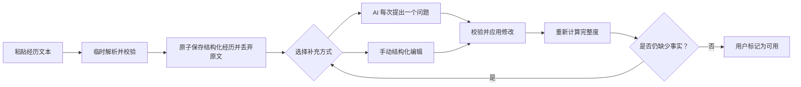
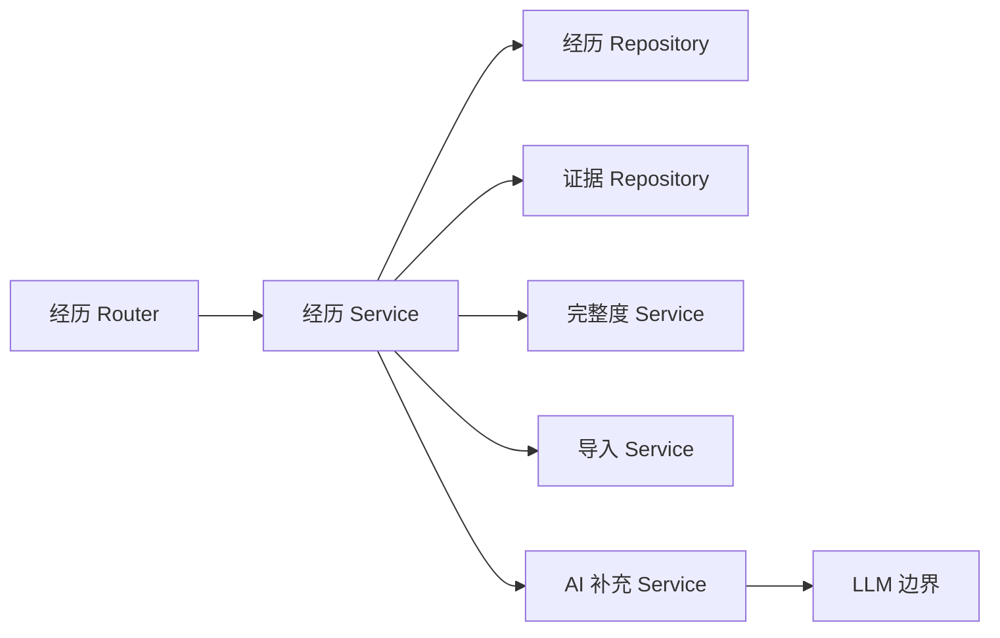

# 个人经历库——设计规格说明

> **状态：** 已确认设计（2026-07-29）
>
> **范围：** 基于 Resume-Matcher 的二次开发。本规格定义个人经历库、证据记录、
> 文本导入、手动补充、AI 问询边界、归档与永久删除行为，以及后续实现必须遵循的
> 前后端结构。

## 1. 目标

构建一个长期维护的个人经历库，用于描述**一个人拥有哪些经历**，而不是描述某一份
简历中写了哪些经历。

首个版本只支持一种导入方式：用户粘贴一段自由文本经历。应用将原文作为临时输入解析，
校验后只保存结构化经历与证据并立即丢弃原文；之后用户通过 AI 对话和/或手动编辑持续修正同一条经历记录。

经历库将成为后续岗位匹配和简历生成的可信事实来源。已有简历是独立快照，不与经历库
记录的生命周期联动。

## 2. 已锁定决策

1. 所有开发只在 `Resume-Matcher` 仓库中进行。
2. 暂不支持从主简历解析结果导入经历。
3. 首个版本唯一的导入来源是用户粘贴的一段自由文本。
4. 导入文本只作为本次解析的临时输入；解析、校验并原子写入结构化经历与证据后立即丢弃，不得持久化。解析失败时不创建半成品记录，由前端保留用户尚未提交成功的文本。
5. 导入后的草稿由 AI 问询和手动编辑逐步原地修正；本阶段不为每次修正创建经历版本。
6. 经历库保存的是个人层级数据，而不是简历层级数据。
7. `experience_id` 和证据 ID 都使用普通自增整数。
8. 一条经历可以关联多条证据。经历通过 `evidence_ids` JSON 整数数组保存这些证据的
   有序 ID。
9. 行动、结果和指标不能拆成三个相互独立的数组。三者组成一个 `EvidenceItem`，从而
   保留行动与对应结果、量化指标之间的因果关系。
10. 完整度保存为后端计算的 0～100 整数。
11. 默认删除操作是归档。永久删除是归档/回收站页面中的下一级操作。
12. 归档或永久删除经历时，不修改也不删除任何已有简历。
13. 岗位匹配功能完成后，永久删除前必须提示受影响的匹配记录。用户确认后，只从每条
    匹配引用的经历 ID 中移除被删除经历，匹配中的其他内容全部保留。
14. 不引入完整数据库迁移框架；全新数据库仍由 SQLAlchemy metadata 初始化。后续新增
    `experience_field_states` 时必须执行一次正式、可追踪的 schema/data migration，不能依赖运行时补数据。
15. 经历持久化必须使用 `app/repositories/` 下的 Repository，不得继续向单体
    `database.py` 中添加相关业务。
16. AI 对话历史的持久化明确延后设计。
17. 不添加 `source_type`、`source_resume_id`、`source_section` 等来源字段。
18. 不添加 `date_text`。不确定或缺失的日期保持为空，之后通过 Agent 或手动输入修正。

## 3. 领域边界

### 3.1 经历库与简历

`ExperienceItem` 是可以重复利用的事实素材。简历则是针对通用画像或某次岗位申请生成、
编辑后保存的内容快照。

- 修改经历库中的经历，不更新任何已有简历。
- 归档或永久删除经历，不修改任何已有简历。
- 后续生成新简历时，可以将用户选中的经历事实复制到新的简历快照中。
- 后续生成的简历条目可以保留可选的来源经历 ID，用于追溯，但该引用不建立实时同步。

### 3.2 经历与证据

经历保存整体上下文，包括类型、标题、组织、角色、日期、背景、技术和标签。证据记录
保存一组相互关联的事实：

```text
采取的行动 → 产生的结果 → 支撑结果的量化指标
```

这种结构可以避免行动与具体结果、指标之间的对应关系丢失。

### 3.3 AI 边界

LLM 只能提出结构化修改建议，不能直接写数据库。所有 AI 响应都必须通过 Pydantic
Schema 校验，并由经历应用服务执行。缺少事实时必须继续提问，禁止编造内容。

## 4. 用户流程与状态



### 4.1 导入状态

导入请求只校验并保存文本，不等待 LLM 抽取。初始记录在数据库非空字段中使用安全默认
值。类似“未命名经历”的占位值不能获得完整度分数。

### 4.2 草稿与可用状态

- 新建和导入的经历初始状态均为 `draft`。
- 达到某个完整度不会自动将经历改成 `ready`。
- 只有达到后端最低完整度阈值后，用户才能主动标记为 `ready`。
- `ready` 经历仍然可以编辑。编辑后重新计算完整度；如果低于最低阈值，服务自动将其
  退回 `draft`。

### 4.3 归档状态

- 归档将 `status` 设为 `archived`，同时记录 `archived_at`。
- 默认列表查询不返回归档记录。
- 恢复归档记录后统一回到 `draft`，由用户检查后再次确认是否可用。
- 只有已经归档的经历才能永久删除。

## 5. 持久化模型

### 5.1 `ExperienceItem`

表名：`experience_items`

| 字段 | 类型 | 可空 | 默认值 | 说明 |
|---|---|---:|---|---|
| `experience_id` | Integer PK | 否 | 自增 | 稳定的经历库 ID，供后续所有功能共同引用 |
| `kind` | String(32) | 否 | `other` | `work`、`internship`、`project`、`research`、`campus`、`volunteer`、`other` |
| `title` | String(200) | 否 | `""` | 经历名称；空值或占位值不计完整度 |
| `organization` | String(200) | 是 | null | 公司、学校、团队、实验室或项目归属 |
| `role` | String(160) | 是 | null | 用户承担的角色 |
| `location` | String(160) | 是 | null | 可选地点 |
| `start_date` | String(7) | 是 | null | `YYYY-MM`，由 Schema 层校验 |
| `end_date` | String(7) | 是 | null | `YYYY-MM`，必须与 `is_current` 状态一致 |
| `is_current` | Boolean | 否 | false | 为 true 时，`end_date` 必须为空 |
| `background` | Text | 是 | null | 结构化的背景、问题或目标 |
| `evidence_ids` | JSON | 否 | `[]` | 指向 `evidence_items` 的有序且不重复的整数 ID |
| `technologies` | JSON | 否 | `[]` | 有序、规范化的技术名称 |
| `tags` | JSON | 否 | `[]` | 扁平标签，不构建分类树 |
| `notes` | Text | 是 | null | 私人工作备注，不自动进入简历 |
| `status` | String(16) | 否 | `draft` | `draft`、`ready` 或 `archived` |
| `completeness` | Integer | 否 | `0` | 后端计算，限制在 0～100 |
| `archived_at` | String | 是 | null | UTC ISO-8601 时间，仅归档期间存在 |
| `created_at` | String | 否 | 当前 UTC 时间 | 延续项目现有时间戳表示方式 |
| `updated_at` | String | 否 | 当前 UTC 时间 | 每次实质修改时更新 |

索引：

- 为 `status` 建索引，用于活动记录和归档记录筛选。
- 为 `kind` 建索引，用于经历类型筛选。
- 为 `updated_at` 建索引，用于默认按最近更新排序。

当前是本地单用户阶段，不添加 `resume_id` 或用户归属字段。

### 5.2 `EvidenceItem`

表名：`evidence_items`

| 字段 | 类型 | 可空 | 默认值 | 说明 |
|---|---|---:|---|---|
| `id` | Integer PK | 否 | 自增 | 保存在 `ExperienceItem.evidence_ids` 中的证据 ID |
| `action` | Text | 否 | 无 | 用户采取的具体行动 |
| `result` | Text | 是 | null | 该行动产生的结果 |
| `metrics` | Text | 是 | null | 支撑该结果的量化指标 |
| `created_at` | String | 否 | 当前 UTC 时间 | |
| `updated_at` | String | 否 | 当前 UTC 时间 | |

### 5.3 JSON 引用约束

SQLite 无法对 JSON 数组中的 ID 建立数据库外键，因此 Service 和 Repository 必须在
事务中保证以下不变量：

1. `evidence_ids` 中的每个 ID 都实际存在。
2. 同一条经历中，一个 ID 最多出现一次。
3. `evidence_ids` 的顺序就是证据的展示顺序。
4. 当前阶段每条证据只属于一条经历，不支持跨经历共享。
5. 创建证据时，插入证据和将 ID 追加进经历必须在同一事务中完成。
6. 删除证据时，从数组移除 ID 和删除证据记录必须在同一事务中完成。
7. 永久删除经历时，同时删除该经历拥有的全部证据。
8. 读取时如果发现历史脏数据，应记录缺失证据 ID，并返回仍然有效的证据；后续写入必须
   修复或拒绝非法引用，不能继续传播脏数据。

API 使用复数名称 `evidence_ids`，因为它是 JSON 数组。单数 `evidence_id` 只用于针对
某一条证据的路由和操作。

## 6. 完整度

完整度由纯后端服务计算，每次修改经历或其证据后重新计算并持久化。客户端只能读取，
不能直接设置完整度。

| 维度 | 分值 | 规则 |
|---|---:|---|
| 基础标识 | 10 | 类型明确且标题不是空值或占位值 |
| 组织 | 10 | 已填写组织 |
| 角色 | 10 | 已填写角色 |
| 时间 | 10 | 有开始时间和结束时间，或有开始时间且 `is_current=true` |
| 背景 | 15 | 已填写结构化背景 |
| 行动证据 | 20 | 至少一条证据具有非空行动 |
| 结果证据 | 15 | 至少一条证据具有非空结果 |
| 量化证据 | 10 | 至少一条证据具有非空指标 |
| **合计** | **100** | |

首个版本的 `ready` 最低阈值为 60。该阈值必须定义为一个命名常量，不能散落在 Router
和 UI 中重复书写。

完整度响应同时提供不持久化的派生建议：

```json
{
  "completeness": 65,
  "missing_dimensions": ["role", "metrics"],
  "suggested_questions": [
    "你在这段经历中承担的具体角色是什么？",
    "结果能否用数量、比例、耗时、规模或排名表示？"
  ]
}
```

未配置 LLM 或 LLM 调用失败时，使用确定性的缺失项问题作为降级方案。

## 7. API 契约

所有接口挂载在现有 `/api/v1` 前缀下。

### 7.1 经历 CRUD 与查询

```http
GET    /experiences
POST   /experiences
POST   /experiences/import-text
GET    /experiences/{experience_id}
PATCH  /experiences/{experience_id}
POST   /experiences/{experience_id}/mark-ready
POST   /experiences/{experience_id}/archive
POST   /experiences/{experience_id}/restore
DELETE /experiences/{experience_id}/permanent
```

`GET /experiences` 支持：

- `q`：在标题、组织、角色、背景、技术和标签中进行不区分大小写搜索。
- `kind`：按一种经历类型筛选。
- `status`：`active`、`draft`、`ready` 或 `archived`；默认 `active` 表示 draft
  和 ready。
- `sort`：首版支持 `updated_at_desc`、`created_at_desc`、`created_at_asc`。

由于应用为本地使用且数据量预计较小，首版可以返回完整筛选列表，但响应中单条记录的
Schema 设计必须允许后续增加分页，而不改变数据项结构。

### 7.2 文本导入

请求：

```http
POST /api/v1/experiences/import-text
Content-Type: application/json

{
  "text": "大三时我和三名同学开发了一套校园招聘助手……"
}
```

行为：

1. 空文本或超过配置最大长度的文本返回 `422`。
2. 将文本作为临时输入解析为结构化的经历字段与有序证据项。
3. 对解析结果执行严格的 Schema 与业务规则校验。
4. 在一个事务中创建经历、证据项、字段状态并计算完整度。
5. 提交成功后丢弃原始文本，返回 `201` 和展开后的经历详情；解析或写入失败时不创建记录。

### 7.3 证据操作

```http
POST   /experiences/{experience_id}/evidence
PATCH  /experiences/{experience_id}/evidence/{evidence_id}
DELETE /experiences/{experience_id}/evidence/{evidence_id}
PUT    /experiences/{experience_id}/evidence-order
```

创建请求：

```json
{
  "action": "重构岗位采集任务的并发执行流程",
  "result": "降低处理时间和任务重试次数",
  "metrics": "平均耗时由18分钟降低到7分钟"
}
```

排序请求：

```json
{
  "evidence_ids": [15, 12, 19]
}
```

排序列表必须与当前证据 ID 集合完全一致，且不能包含重复值。

### 7.4 展开响应

经历详情同时返回数据库保存的 ID 和展开后的证据：

```json
{
  "experience_id": 7,
  "kind": "project",
  "title": "校园招聘助手",
  "organization": "个人项目",
  "role": "后端与AI开发",
  "location": null,
  "start_date": "2026-07",
  "end_date": "2026-08",
  "is_current": false,
  "background": "学生需要统一整理岗位信息。",
  "evidence_ids": [12],
  "evidence_items": [
    {
      "id": 12,
      "action": "开发岗位采集和筛选接口",
      "result": "统一管理多个招聘来源",
      "metrics": "覆盖5类岗位来源",
      "created_at": "...",
      "updated_at": "..."
    }
  ],
  "technologies": ["Python", "FastAPI"],
  "tags": ["AI应用"],
  "notes": null,
  "status": "draft",
  "completeness": 85,
  "missing_dimensions": [],
  "suggested_questions": [],
  "archived_at": null,
  "created_at": "...",
  "updated_at": "..."
}
```

`evidence_items`、`missing_dimensions` 和 `suggested_questions` 是响应聚合字段，
不在数据库中重复保存。

### 7.5 校验与错误处理

- 不存在、已永久删除或不可用的资源返回 `404`。
- 非法日期、枚举值、证据归属或排序集合返回 `422`。
- 将完整度不足的经历标为 ready 时返回 `409`，并携带当前完整度和缺失维度。
- 对尚未归档的经历执行永久删除时返回 `409`。
- LLM 失败时保留所有已存数据，返回可重试错误，不能产生部分 AI 修改。

## 8. 不持久化对话历史的 AI 补充

每一轮问询的业务事实上下文由当前已保存的经历、证据以及当前会话消息组成；已经丢弃的
导入原文不进入对话上下文。

### 8.1 获取下一个问题

```http
POST /experiences/{experience_id}/questions/next
```

响应：

```json
{
  "question_id": "metrics",
  "question": "这个功能影响了多少用户，或者节省了多少时间？",
  "target": "evidence",
  "evidence_id": 12,
  "is_fallback": false
}
```

`question_id` 只标识本次请求/响应针对的补充维度，不是外键，也不持久化。

### 8.2 提交回答

```http
POST /experiences/{experience_id}/answers
```

请求：

```json
{
  "question_id": "metrics",
  "answer": "覆盖约500名学生，岗位整理时间减少了60%。",
  "evidence_id": 12
}
```

处理步骤：

1. 读取最新经历和证据状态。
2. 要求 LLM 返回类型化 Patch，而不是完整数据库对象。
3. 拒绝修改目标经历或目标证据之外的数据。
4. 拒绝任何不能由已保存的结构化事实与当前对话中的用户回答支持的组织、日期、技术、结果或指标。
5. 在一个事务中应用校验后的 Patch。
6. 重新计算完整度。
7. 返回更新后的展开详情，并可同时返回下一个问题。

LLM 响应 Schema 只允许：

- 更新允许编辑的经历字段；
- 新建一条证据；
- 更新一条属于当前经历的证据；
- 不允许删除、归档、标为 ready 或永久删除。

问题生成在 LLM 不可用时可以使用确定性完整度建议。对话历史、多轮记忆表和可恢复聊天
会话均不在本期范围内。

## 9. 归档与永久删除

### 9.1 当前阶段

归档是可恢复操作，不产生下游副作用。永久删除必须满足：

1. 经历已经归档。
2. UI 中进行明确的二次确认。
3. 在一个事务中删除经历及其拥有的全部证据。
4. 不查询、不修改、不删除已有简历。
5. 在匹配功能尚未实现时，返回空的匹配影响对象，使未来 UI 契约保持明确。

### 9.2 未来匹配集成

永久删除前提供：

```http
GET /experiences/{experience_id}/deletion-impact
```

示例：

```json
{
  "affected_matches": [
    {
      "match_id": 31,
      "job_title": "AI应用开发工程师"
    }
  ],
  "affected_resumes": []
}
```

用户确认后：

- 从每条受影响匹配的引用/候选经历 ID 列表中移除该 ID；
- 保留匹配记录、分数、分析文本、差距、风险和其他所有经历引用；
- 可以给匹配记录添加“来源材料已删除”标记，提示用户后续重新匹配；
- 保留所有已有简历快照不变。

未来的清理逻辑属于匹配 Service/Repository，由经历删除应用服务协调调用。Router 不得
直接跨表修改匹配数据。

## 10. 后端架构

```text
apps/backend/app/
├── models.py
├── schemas/
│   ├── experiences.py
│   └── evidence_items.py
├── repositories/
│   ├── experience_repository.py
│   └── evidence_repository.py
├── services/
│   ├── experience_service.py
│   ├── experience_import_service.py
│   ├── experience_enrichment_service.py
│   └── experience_completeness_service.py
├── prompts/
│   └── experience_enrichment.py
└── routers/
    └── experiences.py
```

依赖方向：



### 10.1 Router 职责

- 处理 HTTP 请求、响应、依赖注入和状态码。
- 不直接执行 SQLAlchemy 查询。
- 不计算完整度。
- 不构造 Prompt，也不合并 LLM 输出。

### 10.2 Service 职责

- 业务校验和事务编排。
- 保证经历与证据归属不变量。
- 重新计算完整度。
- 实现归档、恢复、ready 和永久删除规则。
- 校验并应用 AI 输出。

### 10.3 Repository 职责

- 只负责 SQLAlchemy 读写。
- 实现筛选、搜索、排序，并参与上层事务。
- 批量展开证据 ID，避免前端 N+1 请求。
- 不抛 HTTP 异常，不包含 Prompt 逻辑或 UI 文案。

Repository 接收异步 SQLAlchemy Session。在一个多记录 Service 操作中，Repository
不得自行打开相互独立的 Session，从而保证经历和证据修改能够一起提交或回滚。

### 10.4 数据库初始化

现有 metadata `create_all` 执行前必须导入新的 ORM 类，使全新开发数据库可以自动创建
两张表。本期不引入 Alembic 或 TinyDB 兼容层；`experience_field_states` 与删除
`raw_input` 所需的一次性 schema/data migration 由经历适配器 SPEC 单独定义。

## 11. 前端设计

路由：

```text
/experiences
```

文件：

```text
apps/frontend/
├── app/(default)/experiences/page.tsx
├── components/experiences/
│   ├── experience-library-page.tsx
│   ├── experience-list.tsx
│   ├── experience-editor.tsx
│   ├── evidence-list-editor.tsx
│   ├── completeness-panel.tsx
│   ├── experience-question-panel.tsx
│   ├── text-import-dialog.tsx
│   └── permanent-delete-dialog.tsx
└── lib/api/
    └── experiences.ts
```

API 模块复用现有 `lib/api/client.ts`，不得另建一套 base URL 或超时实现。

### 11.1 页面入口

- Dashboard 添加“个人经历库”入口卡片或链接。
- 经历库页面提供明确的返回 Dashboard 入口。
- 本模块不要求重构整个应用的全局导航外壳。

### 11.2 主布局

桌面端采用列表、详情以及可选辅助面板：

```text
┌────────────────────────────────────────────────────────────┐
│ 个人经历库       搜索    筛选    粘贴文本    + 新建       │
├───────────────┬────────────────────────┬───────────────────┤
│ 经历列表      │ 结构化编辑区           │ 完整度/AI         │
│               │ 标题与基本信息         │ 缺失事实          │
│ 标题          │ 背景                   │ 单个问题          │
│ 类型/组织/时间│ 证据卡片               │ 回答输入框        │
│ 完整度        │ 技术与标签             │                   │
└───────────────┴────────────────────────┴───────────────────┘
```

小屏设备采用“列表 → 详情”导航，不将三栏强行压缩在一个屏幕中。

### 11.3 导入交互

粘贴弹窗包含文本框、取消和“保存并开始整理”两个操作。`import-text` 成功后：

1. 关闭弹窗。
2. 选中新建草稿。
3. 立即展示解析后的结构化字段和证据。
4. 提供“AI 帮我整理”和“手动编辑”入口。
5. 后续任何 AI 请求失败时，都保留已经保存的结构化草稿。

### 11.4 编辑交互

- 证据按“行动、结果、指标”关联卡片编辑。
- 支持新增、修改、移除和排序证据卡片。
- 每次保存成功后，根据服务端响应更新完整度面板。
- 切换经历或离开页面时，如果存在未保存修改，需要进行确认。
- 一个弹窗中只显示一个破坏性主操作。
- 非归档列表中不得出现永久删除入口。

### 11.5 国际化与视觉系统

- 所有静态 UI 文案使用现有翻译系统，并保证所有支持语言的 key 完全一致。
- AI 问题使用用户配置的内容语言。
- 组件遵循现有 Swiss 设计规范：直角、清晰边框、硬阴影、衬线展示标题和等宽元信息。
- Textarea 遵循仓库现有的 Enter 键事件传播规则。

## 12. 安全与真实性

- 导入阶段的临时文本和用户回答都是不可信内容，不能作为系统指令执行。
- Prompt 必须明确分隔用户内容，并禁止执行用户文本中嵌入的指令。
- AI 输出必须解析为范围受限的 Schema，不接受任意字段路径。
- 模型可以增强已有事实的表达，但禁止编造组织、角色、日期、技术、行动、结果或指标。
- 缺失事实保持为空，并转化为后续问题。
- 普通日志可以记录 ID 和校验失败，但不能记录完整经历文本或 LLM 密钥。

## 13. 测试与验证

### 13.1 后端单元测试

- 完整度覆盖所有维度并限制在 0～100。
- 空标题和占位标题不计分。
- 当前仍在进行的经历可以没有结束日期。
- 证据 ID 顺序和重复检测。
- ready 阈值，以及破坏性修改后自动退回 draft。
- 归档和恢复状态转换。
- AI Patch 不能修改 ID、状态、完整度或其他无关证据。
- 每个缺失维度都有确定性问题。

### 13.2 使用真实临时 SQLite 的 Repository 测试

- 经历 CRUD 和筛选。
- 在共享事务中创建、修改和删除证据。
- 回滚后不存在孤立证据或悬空 JSON ID。
- 永久删除时删除所属证据。
- 活动查询不返回归档记录。
- 展开详情严格保持 `evidence_ids` 顺序。

### 13.3 API 集成测试

- 文本导入在任何 AI 调用前落库并返回 `201`。
- 空文本和超长文本返回 `422`，且不创建数据。
- 手动创建、修改、列表、详情和筛选。
- 证据归属及排序校验。
- mark-ready 冲突响应包含缺失维度。
- 归档、恢复和仅限归档状态的永久删除。
- LLM 失败后已保存状态完全不变。
- 永久删除不会修改简历表。

### 13.4 前端测试

- Dashboard 入口能够进入 `/experiences`。
- 空经历库和粘贴导入流程。
- AI 整理前，新导入记录已经显示并被选中。
- 手动编辑经历和证据。
- 保存后更新完整度及缺失项。
- 搜索、筛选、归档和回收站。
- 未保存修改确认。
- AI 失败后保留数据，并允许重试或切换手动编辑。
- 永久删除影响提示和二次确认。
- 多语言 key 一致性和生产构建。

测试必须覆盖失败路径，并按照仓库的 anti-theater 测试原则，验证目标行为被破坏时测试确实
会失败。

## 14. 交付阶段

### 第一阶段——持久化与手动经历库

- ORM 表和新数据库自动建表。
- Schema、Repository、完整度 Service 和经历应用 Service。
- CRUD、文本导入、证据操作、ready 状态、筛选、归档/恢复和永久删除。
- `/experiences` 页面、粘贴弹窗、结构化编辑器、完整度面板和回收站。
- 上述路径的完整确定性前后端测试。

### 第二阶段——AI 问询与补充

- 受限的 AI 补充 Prompt 和类型化 Patch Schema。
- 获取下一个问题和提交回答接口。
- 确定性降级问题。
- 问询面板、加载、错误、重试和手动降级交互。
- 不保存 AI 对话历史。

### 第三阶段——未来匹配集成

- 候选选材只读取活动且 ready 的经历。
- 匹配记录保存引用的经历 ID。
- 删除影响查询和确认。
- 永久删除时只从受影响匹配中移除被删除 ID，保留其他全部匹配内容。
- 已有简历快照始终不变。

## 15. 验收标准

满足以下条件后，第一阶段才算完成：

1. 用户可以粘贴自由文本，并且草稿在任何 AI 处理前已经保存。
2. 用户可以手动创建和编辑结构化经历字段。
3. 用户可以管理有序的行动、结果、指标证据单元。
4. 完整度只由后端计算和持久化。
5. 用户可以将达到阈值的经历标记为 ready。
6. 用户可以搜索和筛选活动经历。
7. 归档可以恢复，并且不影响简历。
8. 永久删除只能在归档后执行，并且不影响简历。
9. 经历与证据的多记录操作具有事务性，不产生悬空 ID。
10. 新持久化代码位于 `repositories/experience_repository.py` 和
    `repositories/evidence_repository.py`，而不是 `database.py`。
11. 功能复用现有 API Client、设计系统，并符合所有多语言 key 一致性要求。
12. 后端测试、前端测试、Lint 和生产构建全部通过。

## 16. 明确不在本期范围内

- 从主简历或上传文档中导入经历。
- 经历库与已有简历同步。
- 保存 AI 对话轮次或聊天会话。
- 语义/向量检索和岗位匹配。
- 创建独立技能库或经历—技能关联。
- 多条经历共享同一条证据。
- 引入通用数据库迁移框架；经历字段状态及移除原文字段所需的一次性迁移除外。
- 重构整个应用导航外壳。
- 仅因完整度较高而自动将经历标记为 ready。

## 17. 实施计划交接要求

从本规格生成的实施计划必须：

1. 使用测试驱动的垂直切片任务，不能先孤立实现全部后端层再开始用户流程。
2. 完成第一阶段后再开始 AI 问询。
3. 每个任务都保持 Repository、Service 和 Router 职责分离。
4. 将临时文本解析导入与后续 AI 补充作为独立事务和独立接口，导入原文不得持久化。
5. 明确列出后端测试、前端测试、多语言一致性、Lint 和生产构建命令及预期结果。
6. 保留工作区中无关的已有修改；除 ORM metadata 注册或共享 Session 基础设施确有需要外，
   不修改现有简历 CRUD facade。
