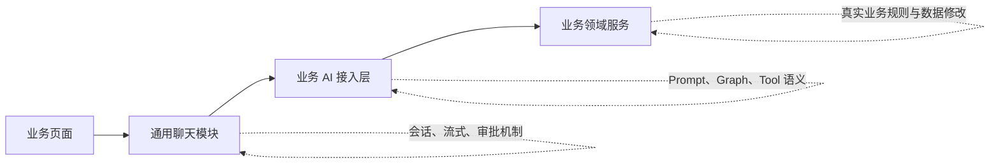

## 1. 判断边界的原则

可以用三个问题判断功能应该放在哪里。

### 通用聊天模块

如果把“个人经历库”完全移除，这个功能仍然成立，就属于通用聊天模块。

例如：

- 会话和消息；
- 模型流式调用；
- 可供业务 API 转换的内部流式事件；
- Tool Call 接收；
- 用户审批机制；
- LangGraph 的执行、暂停与恢复；
- 幂等和失败恢复。

### 业务 AI 接入层

如果功能是“为了让通用聊天能够理解某种业务”，就属于业务 AI 接入层。

例如：

- `experience_id` 表示什么；
- `evidence.metrics` 指向哪个字段；
- 应该给模型哪些经历上下文；
- 经历补全使用什么 Prompt；
- `content_change` 的目标和建议内容如何校验；
- 经历补全的 Graph 如何流转。

### 业务领域服务

如果没有 AI，手动编辑或普通 API 同样需要遵守这个规则，就属于业务领域服务。

例如：

- 用户是否有权修改经历；
- 字段如何保存；
- 字段组是否必须一起保存；
- revision 如何增加；
- 完整度如何计算；
- Evidence 是否属于指定经历；
- 归档和永久删除如何执行。

这是最重要的划分：AI 业务接入层不能重新实现一套经历保存规则。

---

# 2. 通用聊天模块的功能边界

## 2.1 会话生命周期

通用聊天负责：

- 创建会话；
- 保存会话绑定的 `adapter`；
- 保存不透明的 `subject` 和 `target` 引用；
- 判断会话是 `active` 还是 `ended`；
- 结束会话；
- 限制同一会话只能有一个当前运行；
- 保存历史会话，但不决定历史是否在业务页面展示。

通用聊天不负责：

- 判断某个经历字段是否存在；
- 判断目标字段是否可编辑；
- 决定用户切换哪个字段时应结束会话。

业务页面决定“什么时候请求关闭会话”，通用模块执行关闭。

## 2.2 消息与运行

通用聊天负责：

- 保存用户消息和 AI 消息；
- 分配消息顺序；
- 用户消息幂等；
- 创建和结束模型运行；
- 排除失败或取消的 assistant 消息；
- 构造通用聊天历史；
- 判断当前能否发起新运行。

通用聊天不负责：

- 决定哪些业务数据应加入上下文；
- 解释某段业务数据的含义；
- 为经历字段生成摘要或完整度说明。

## 2.3 模型调用与流式输出

通用聊天负责：

- 对接模型服务；
- 流式接收普通文本；
- 聚合 Tool Call 参数；
- 生成稳定的内部流式事件；
- 在调用方取消消费时结束运行；
- 持久化最终完整回复；
- 统一模型错误和运行状态。

业务负责：

- System Prompt 和业务 Prompt；
- 可用 Tool；
- 当前业务是否允许 Tool；
- 业务 Graph 在什么节点调用模型；
- 哪些上下文传给模型。

因此，通用聊天提供“模型流式执行能力”，业务决定“模型这次具体做什么”。

## 2.4 LangGraph 基础设施

通用聊天负责：

- 提供 Runtime；
- 提供 checkpointer；
- 根据业务定义构建 Graph；
- 分配稳定 `thread_id`；
- 编译和缓存 Graph；
- 执行 `astream()`；
- 使用 `Command(resume=...)` 恢复；
- 把 Graph 输出转换成通用事件。

业务负责：

- State 扩展字段；
- Graph 节点；
- 条件边；
- interrupt 的位置；
- interrupt 前后执行哪些业务步骤；
- Tool 校验失败、无变化、有效提案分别走哪条路径。

所以不能把一张固定聊天 Graph 放在通用模块里要求所有业务使用。

## 2.5 Tool Call 通用生命周期

通用聊天负责机制：

```text
接收 Tool Call
→ 聚合完整参数
→ 找到对应 Handler
→ 调用业务校验
→ 保存 Tool 记录
→ 发送原子提案
→ 暂停 Graph
→ 接收用户审批
→ 调用业务应用逻辑
→ 保存 Tool Result
→ 恢复 Graph
```

业务负责语义：

- Tool 参数代表什么；
- 参数是否合法；
- 是否与当前值相同；
- 是否需要用户审批；
- 审批后具体修改什么；
- 如何检查业务并发；
- Tool Result 中返回哪些业务结果。

通用聊天不需要认识，只需要转发：

```text
因业务导致的失败
字段 revision
EvidenceItem
经历完整度
字段组
```

## 2.6 审批机制

通用聊天负责：

- proposal ID；
- proposal 状态；
- 审批 Service 接口；
- `client_resolution_id` 幂等；
- 同意和拒绝的通用状态流转；
- 等待审批时暂停运行；
- 审批后恢复运行；
- 防止同一 proposal 被处理两次；
- 向业务 API 返回通用审批事件。

业务负责：

- 审批框需要显示的业务数据；
- 同意后是否还能应用；
- 应用前需要检查哪些 guard；
- 应用失败时的业务原因；
- 返回哪些更新后的业务字段。

通用审批模块不应该直接比较字段 revision。它只把持久化的 `guard_payload` 交给业务 Handler。

## 2.7 审批收尾和 Tool Result 延迟投递

通用聊天负责：

- 审批后恢复相同 checkpoint，使 Graph 完成中断收尾；
- 是否立即调用模型由业务 Graph 决定，通用层不得写死；
- Graph 输出模型文本时，通用层负责流式发送、消息持久化和 Tool Result consumed；
- Graph 不调用模型时，Tool Result 保持 pending，等待下一条用户消息补传；
- 收尾失败不回滚已经完成的业务操作；
- 保存 pending Tool Result；
- 静默恢复输入；
- 下一条用户消息中补传 Tool Result；
- 补传只调用一次模型；
- 正常补传时允许 Tool；
- 判断 Tool Result 是否 consumed。

业务不需要为每个模块重新实现 checkpoint 恢复和 Tool Result 补传。

业务只需要保证：

- Tool 的 `apply()` 是幂等或受到业务 guard 保护；
- 重复出现相同建议时能够通过当前值判断为 no-change；
- 不因为模型重试重复修改业务数据。

## 2.8 对外传输与前端边界

通用聊天本轮只提供内部后端运行库，不提供通用 HTTP Router、SSE API 或前端组件。业务 Router/Service 负责：

- 调用 `AiChatService`；
- 把 `AsyncIterator[AiChatEvent]` 转换为业务 SSE；
- 定义业务 API 的请求、响应和错误映射；
- 在业务前端实现消息、输入、审批和页面联动。

通用层仍负责取消、失败、审批、checkpoint 收尾和 pending Tool Result 等后端状态，但不决定其 UI 表现。

---

# 3. 业务 AI 接入层的功能边界

业务 AI 接入层是通用聊天和领域服务之间的翻译层。

## 3.1 能力注册

业务接入层负责声明：

- Adapter 名称；
- Graph Factory；
- Tool Handlers；
- 业务 State；
- Prompt。

例如经历补全能力可以注册为：

```text
ExperienceAdapter
```

通用聊天只通过 Adapter 查找定义，不直接导入经历模块。

## 3.2 Adapter 基类设计

### 3.2.1 设计目的

`BaseAdapter` 是通用聊天模块与业务 AI 接入层之间唯一稳定的后端扩展契约。

它的作用不是实现一套默认聊天业务，也不是封装业务领域服务，而是把通用聊天运行一次业务 Graph 所必需的差异集中到一个入口中：

- 识别并校验业务对象引用；
- 把通用运行输入转换成业务 State；
- 提供业务 Graph；
- 提供该 Graph 使用的 Tool Handlers。

通用聊天只依赖 `BaseAdapter`，不依赖 `ExperienceAdapter` 或任何业务 Service。新增业务时，应增加新的 Adapter 实现并注册，不修改通用聊天。

### 3.2.2 继承关系
```text
BaseAdapter
    ├── ExperienceAdapter
    ├── ResumeOptimizationAdapter
    └── 其他业务 Adapter
```

注册表使用具体 Adapter 的稳定名称作为键；会话中的 `adapter` 保存同一个名称。例如：

```text
ExperienceAdapter
```

因此同一个具体 Adapter 名称必须全局唯一。类名一旦用于已经持久化的会话，就不能在没有同步处理历史数据的情况下随意修改。

### 3.2.3 实例生命周期与状态约束

Adapter 在应用启动时创建并注册，运行期间作为无请求状态的长生命周期对象复用。

Adapter 实例可以持有：

- 业务 Service factory；
- 只读配置；
- Prompt 模板引用；
- 无请求状态的 Tool Handler；
- Graph 构建所需的静态依赖。

Adapter 实例不能持有：

- 当前用户；
- 当前 conversation、run、subject 或 target；
- 请求级数据库 Session；
- 当前 Graph State；
- SSE 连接；
- 可被并发请求修改的临时结果。

所有请求级数据必须通过方法参数、Graph State 或 `AiChatRuntime` 显式传入。这样同一个 Adapter 才能安全服务多个并发会话。

### 3.2.4 与业务领域服务的关系

Adapter 是协议转换和流程装配层，不是新的业务 Service。

```text
通用聊天输入
→ BaseAdapter 契约
→ ExperienceAdapter 解释业务含义
→ ExperienceService 执行领域规则
→ ExperienceRepository 持久化
```

具体 Adapter 可以调用业务 Service，但不能：

- 直接复制业务保存规则；
- 绕过 Service 直接修改 Repository；
- 自己计算本应由领域服务维护的派生值；
- 为 AI 单独建立一套与手动编辑不同的数据一致性规则。

### 3.2.5 parse_input 的 State 转换边界

`AdapterInput` 是通用聊天层提供的统一调用输入；`BaseState` 是所有业务 Graph 的公共状态基础。`BaseAdapter.parse_input()` 的核心职责是把前者转换为扩展 `BaseState` 的完整业务 State，例如 `ExperienceState`。

Graph Runner 不合并通用输入与业务字段，只验证 Adapter 返回值可 JSON 序列化并直接交给 LangGraph。State 中不得包含 ORM、Pydantic 对象、数据库 Session、异常对象、流连接或回调函数。

## 3.3 解释 subject 和 target

通用聊天保存：

```json
{
  "subject": {"type": "experience", "id": "7"},
  "target": {"key": "evidence.metrics", "ref_id": 12}
}
```

经历业务接入层负责解释：

- `experience` 是否是受支持的 subject；
- `"7"` 如何转换成 `experience_id`；
- `evidence.metrics` 对应什么保存单元；
- `ref_id=12` 是否是 Evidence ID；
- Evidence 是否属于该经历；
- 目标是否允许 AI 对话和覆盖。

通用聊天不应该硬编码任何字段白名单。

## 3.4 加载业务上下文

业务接入层负责通过领域服务读取：

- 当前目标字段的已保存值；
- 必要的相邻字段；
- 字段 revision；
- 经历级上下文；
- 当前完整度；
- 权限和可编辑状态。

业务接入层决定哪些数据提供给模型，但不应直接从 Repository 拼接一套绕过领域规则的查询。

## 3.5 定义业务 Graph

经历补全的 Graph 属于经历业务接入层，因为以下决策都是业务相关的：

- 如何使用 Adapter 在执行前构造的经历上下文；
- 什么情况下允许 `content_change`；
- Tool 无效时如何引导模型；
- no-change 时如何继续；
- 提案形成前检查什么；
- 审批恢复后执行哪个经历事务；
- Tool Result 中如何描述字段修改结果。

其他业务可以使用完全不同的 Graph。

## 3.6 定义 Tool 业务语义

经历接入层只定义一个 `content_change` Tool。Tool Handler 负责参数解析和 Service 路由：

- 通过独立 `description` 字段向模型说明工具用途和调用条件；
- 参数 Schema；
- 根据 target 形态选择字段修改、Evidence 修改或 Evidence 追加 Service；
- 将 Service 结果转换为通用 proposal 或 Tool Result。

Evidence 业务只创建一个集合级会话。模型修改已有 EvidenceItem 时在 Tool 参数中提交 `evidence_id` 和完整 `action/result/metrics`，Handler 路由到按 ID 整体覆盖服务；创建时不提交 ID 并追加到末尾。通用聊天层仍不理解这些业务语义。

目标白名单、字段值规范化、Evidence 所有权、no-change、revision guard、proposal 内容、真正写入和结果构造全部由经历领域服务完成。

Tool 名称、调用条件和参数提交规则不写死在系统 Prompt。通用模型层从 Handler 读取 `name`、`description` 和 `arguments_schema`，统一构造模型提供方所需的 Tool 定义。

## 3.7 业务前端接入

经历页面负责：

- 字段聚焦时显示 AI 启动确认；
- 创建绑定当前字段的会话；
- 提示未保存内容 AI 无法感知；
- 审批期间锁定目标字段；
- 禁用全局保存；
- 允许其他独立字段继续编辑和局部保存；
- 根据 `business_payload` 精确更新字段；
- 不覆盖其他未保存草稿；
- 切换字段或经历时结束会话。

通用聊天组件不应直接访问经历表单状态。

---

# 4. 通用聊天与业务共同完成的流程

两边不是互相调用一个方法就结束，而是在几个明确接口点协作。

| 流程 | 通用聊天负责 | 业务负责 |
|---|---|---|
| 创建会话 | 保存会话、状态和引用 | 校验 subject/target 是否有效 |
| 开始一轮 | 保存消息和 run | 解析输入、加载业务上下文 |
| 模型调用 | 模型客户端、内部流式事件 | Prompt、Graph、Tools、业务 SSE 转换 |
| Tool 校验 | 聚合参数、调用 Handler | 类型校验、no-change、guard |
| 形成提案 | 持久化、原子事件、interrupt | proposal 展示数据 |
| 用户审批 | 幂等、状态流转、resume | 应用业务修改或判断失效 |
| 审批收尾 | 恢复 checkpoint、持久化可选续答、投递 Tool Result | 决定直接结束或继续调用模型 |
| 页面回写 | 透传 business payload | 精确更新业务表单 |
| 删除清理 | 提供按 subject 清理接口 | 决定何时调用清理 |

---

# 5. 建议确定的模块边界

## 通用模块 `ai_chat`

只包含：

```text
会话
消息
运行
Tool Call 通用记录
审批机制
模型流
内部流式事件
LangGraph Runtime/checkpoint
Adapter 注册协议
幂等和失败恢复
```

## 经历 AI 模块 `ExperienceAdapter`

只包含：

```text
ExperienceAdapter
经历 State
经历 Graph
经历 Prompt
content_change Handler
经历上下文构造
经历业务 API 与前端接入
```

## 已有经历领域模块

继续包含：

```text
ExperienceService
ExperienceRepository
字段保存
字段组保存
全局保存
字段 revision
完整度计算
权限
归档与永久删除
```

最关键的限制是：

```text
ExperienceAdapter 可以调用 ExperienceService
ExperienceAdapter 不应直接实现另一套经历写入规则
ai_chat 不能调用或导入 ExperienceService
```

---

# 6. 目录结构设计

目录结构直接表达前述功能边界：通用聊天、经历 AI 接入和经历领域逻辑分别存放。通用聊天代码不能散落到全局 `services/`、`repositories/`、`schemas/` 或业务组件目录中。

## 6.1 后端目录

```text
apps/backend/app/
├── ai_chat/                              # 通用聊天模块
│   ├── __init__.py
│   ├── container.py                      # 注册表、checkpoint 与 Service 生命周期
│   ├── types.py                          # JSON 和业务绑定引用类型
│   ├── errors.py                         # 稳定内部错误
│   │
│   ├── adapters/
│   │   ├── __init__.py
│   │   ├── base.py                       # BaseAdapter 抽象协议
│   │   └── registry.py                   # AdapterRegistry
│   │
│   ├── graph/
│   │   ├── __init__.py
│   │   ├── runner.py                     # 编译、astream、interrupt/resume
│   │   ├── runtime.py                    # AiChatRuntime；Graph 执行依赖
│   │   └── state.py                      # 统一调用输入、Graph 基础状态和审批恢复类型
│   │
│   ├── models/
│   │   ├── __init__.py
│   │   └── models.py                     # 会话、消息、run、Tool Call ORM 模型
│   │
│   ├── services/
│   │   ├── __init__.py
│   │   └── service.py                    # AiChatService；通用流程入口
│   │
│   ├── tools/
│   │   ├── __init__.py
│   │   ├── handler.py                    # ToolHandler 抽象协议
│   │   ├── lifecycle.py                  # Tool Call 通用生命周期
│   │   ├── buffer.py                     # Tool 参数分片聚合
│   │   └── results.py                    # Tool 提案、结果和延迟投递类型
│   │
│   ├── repositories/
│   │   ├── __init__.py
│   │   ├── conversation_repository.py
│   │   ├── message_repository.py
│   │   ├── run_repository.py
│   │   └── tool_call_repository.py
│   │
│   ├── checkpoint/
│   │   ├── __init__.py
│   │   └── factory.py                    # 持久化 checkpointer 创建与配置
│   │
│   └── streaming/
│       ├── __init__.py
│       ├── events.py                     # 供业务 API 转换的内部事件
│       └── model.py                      # LiteLLM 流式适配器
│
└── experience/                           # 完整经历业务模块
│   ├── __init__.py
│   ├── adapters/
│   │   ├── __init__.py
│   │   └── adapter.py                    # ExperienceAdapter
│   ├── routers/
│   │   ├── __init__.py
│   │   ├── ai_chat.py                    # 经历专用聊天 API/SSE 转换
│   │   └── experiences.py                # 经历库 CRUD API
│   ├── schemas/
│   │   ├── __init__.py
│   │   ├── ai_chat.py                    # 经历聊天请求、响应和业务事件
│   │   ├── evidence_items.py
│   │   └── experiences.py
│   │
│   ├── graph/
│   │   ├── __init__.py
│   │   ├── state.py                      # 经历 Graph 扩展 State
│   │   ├── builder.py                    # 经历 Graph 定义
│   │   ├── context.py                    # 经历模型上下文构造
│   │   └── prompts.py                    # 经历补全 Prompt
│   │
│   ├── tools/
│   │   ├── __init__.py
│   │   ├── common.py                     # Tool 上下文解析
│   │   └── content_change.py             # 统一内容修改路由 Handler
│   ├── services/
│   │   ├── experience_service.py         # 经历领域写入与业务规则
│   │   ├── evidence_service.py
│   │   ├── experience_field_service.py
│   │   ├── experience_global_save_service.py
│   │   ├── experience_import_service.py
│   │   ├── experience_ai_mutation_service.py
│   │   ├── experience_completeness_service.py
│   │   └── experience_fields.py
│   └── repositories/
│       ├── experience_repository.py      # 经历领域持久化
│       ├── evidence_repository.py
│       ├── experience_field_state_repository.py
│       └── experience_revision_repository.py
```

## 6.2 对外接入边界

通用聊天是内部后端运行库，不提供通用 HTTP Router、SSE API 或前端 UI。具体业务的 Router/Service 取得 `AiChatService`，把内部 `AiChatEvent` 转换为该业务的 API 与 SSE 协议。业务前端也由具体业务模块负责，不在 `ai_chat/` 下建立通用前端目录。

`experience/` 是完整的经历业务模块，包含经历库 HTTP 接口、应用服务、数据访问以及 AI Chat 业务适配层；通用 `ai_chat/` 不反向依赖它。
