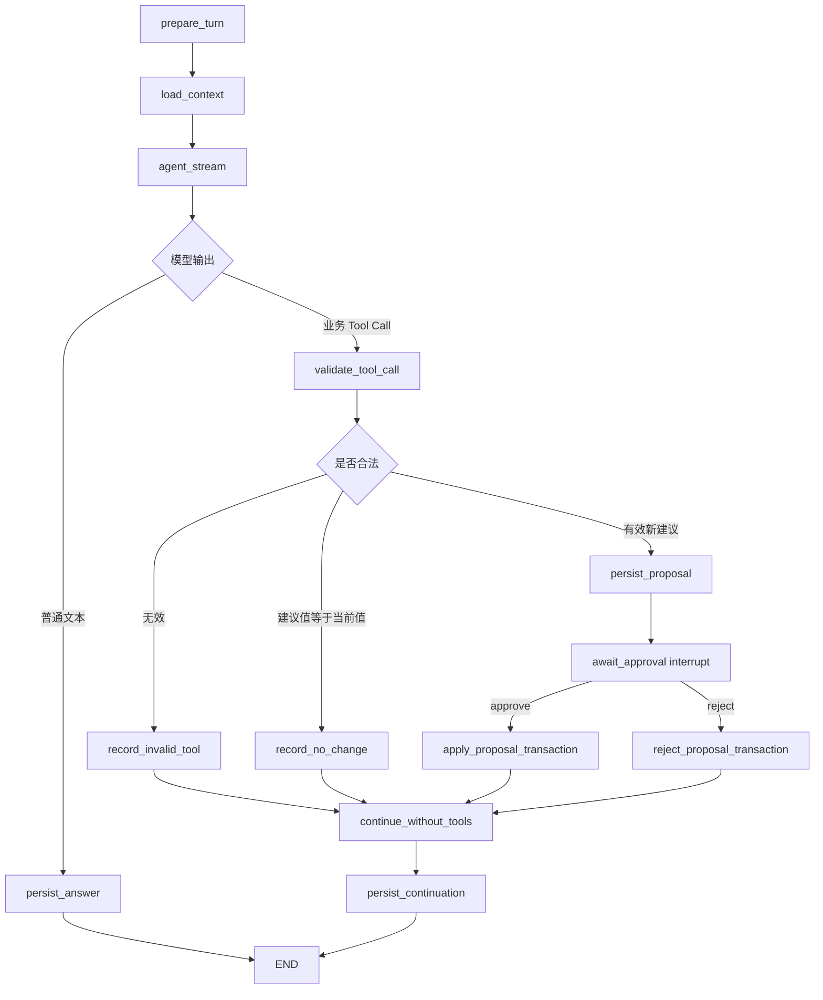

# 经历适配器与字段对话设计 SPEC

> **状态：** 待实施  
> **日期：** 2026-08-01  
> **依赖：** [通用 AI Chat 功能边界设计](./2026-08-01-ai-chat-functional-boundaries-design.zh-CN.md)  
> **后续可靠性工作：** [AI 对话失败处理与可靠性后续工作](./2026-07-30-ai-chat-future-work.zh-CN.md)

## 1. 目标

本阶段在已经实现的通用 `ai_chat` 后端运行库之上，实现个人经历库的业务接入层：

- `ExperienceAdapter`；
- 经历字段对话 Graph；
- 经历上下文和 Prompt；
- `field_overwrite`、`evidence_update`、`evidence_append` Tool Handler；
- 字段状态与字段级 revision；
- 经历专用聊天 API 和前端接入；
- 将现有无状态问答流程统一迁移到新对话流程。

最终效果与主流 AI 对话软件一致：用户可以围绕一个具体经历字段进行多轮讨论，普通回答流式显示；AI 需要修改字段时发起一次 Tool Call 提案，用户审批后才写入经历库。

## 2. 范围边界

### 2.1 本阶段包含

- 每个具体字段组（可以是单字段）独立创建会话；
- 会话多轮聊天、流式文本、审批、自动续跑和失败补传；
- 根据字段状态提供醒目程度不同的 AI 对话入口；
- 手动局部保存、字段组保存和全局保存；
- AI 提案前和审批时的字段级并发校验；
- 只更新目标字段及服务端派生值；
- 历史会话只入库，不提供历史查看或恢复；
- 中文、英文 Prompt 和 UI 文案，默认中文。

### 2.2 本阶段不包含

- 从主简历解析结果创建经历；
- 跨字段组或跨经历的一个会话；
- 恢复、继续或展示历史会话；
- 对归档经历发起新对话；
- AI 删除 EvidenceItem；
- 多实例 worker、持久化 outbox、SSE 重放和自动崩溃恢复；
- 通用聊天模块的通用 Router 或通用前端；
- 匹配模块以及删除经历后的匹配影响处理。

## 3. 核心产品规则

### 3.1 会话与字段绑定

一个会话只绑定：

```text
一个 ExperienceItem
+ 一个具体字段
+ 可选的 EvidenceItem ID
```

会话创建后不能切换目标。用户切换字段、切换经历、关闭面板或离开详情页面时，当前会话结束；再次返回相同字段必须创建新会话。历史会话继续保存在聊天表中，但当前产品不展示。

归档经历不允许创建新会话。已经进入审批的提案如果经历在其他页面被归档，审批处理为业务失效，不再覆盖字段。

### 3.2 字段状态

字段状态只有两种稳定代码：

```text
complete    # 完善
incomplete  # 未完善
```

状态只用于前端颜色和入口醒目程度，不显示重复的状态文字，也不直接决定字段是否允许手动编辑。`incomplete` 字段的 AI 入口更醒目；`complete` 字段仍允许用户主动开始对话。

字段状态由后端根据已保存值确定，模型和前端不能直接写状态。每次手动保存或 AI 覆盖后，领域服务重新计算受影响字段状态。

### 3.3 启动交互

只有用户聚焦具体字段后，才显示一个小型“开始 AI 对话”确认控件：

- 控件位于聚焦字段边框外侧；
- 持续显示到字段失焦或会话开始；
- 尺寸小，不遮挡编辑区域；
- 用户确认后创建会话并展开聊天框；
- 用户可以忽略控件并继续手动编辑。

对于必须一起保存的字段，点击其中任意字段都使用同一个会话，共享同一个保存单元和 revision。

### 3.4 输入与发送

聊天输入框可以在生成、审批和续跑阶段继续输入草稿，但只有对话状态为 `ready` 时才允许发送或发起新一轮运行。

前端对话状态为：

```text
ready
generating
awaiting_approval
continuing
ended
```

这些是页面交互状态，不新增通用会话数据库状态。通用数据库中的会话仍只有 `active|ended`，run 仍使用通用模块已经定义的状态。

## 4. 字段目标与保存单元

### 4.1 可对话目标

`ExperienceAdapter` 首期支持以下目标：

| target.key | ref_id | 值类型 | 保存单元 |
|---|---:|---|---|
| `kind` | null | string | `identity` |
| `title` | null | string | `identity` |
| `organization` | null | string/null | 单字段 |
| `role` | null | string/null | 单字段 |
| `location` | null | string/null | 单字段 |
| `start_date` | null | YYYY-MM/null | `dates` |
| `end_date` | null | YYYY-MM/null | `dates` |
| `is_current` | null | boolean | `dates` |
| `background` | null | string/null | 单字段 |
| `technologies` | null | string[] | 单字段 |
| `tags` | null | string[] | 单字段 |
| `notes` | null | string/null | 单字段 |
| `action` | Evidence ID | string | `evidence:{id}` |
| `result` | Evidence ID | string/null | `evidence:{id}` |
| `metrics` | Evidence ID | string/null | `evidence:{id}` |
| `evidence_new` | null | Evidence object | `evidence_collection` |

`evidence_new` 是“新增证据”区域的虚拟对话目标，不对应已存在的 EvidenceItem。AI 可以为它提出一条新 EvidenceItem，经用户审批后追加到当前 `evidence_ids` 末尾。

针对已有 EvidenceItem 的修改必须显式携带其 ID，并且只更新 Tool `updates` 中出现的字段；未出现的字段保持不变。Handler 必须验证该 ID 仍属于当前经历。

### 4.2 文本导入与原文销毁

`ExperienceItem`、Pydantic Schema、API 类型和前端草稿中全部移除 `raw_input`。文本导入调整为：

```text
接收临时文本
→ 在请求内解析成结构化经历和 EvidenceItem
→ 校验结构化结果
→ 原子写入经历库
→ 丢弃原始文本
```

原始文本不得写入经历表、聊天表、checkpoint、Tool payload、日志或错误响应。解析失败时不创建半成品记录，原始文本只保留在当前前端输入框中供用户修改后重试。

导入解析属于 `ExperienceImportService`，不创建聊天会话，也不经过 `ExperienceAdapter`。Service 可以把临时文本发送给配置的模型做结构化解析，但模型响应必须先通过严格 Schema 和领域校验，再在一个事务中创建 ExperienceItem、按顺序创建 EvidenceItem、初始化字段状态并计算 completeness。

### 4.3 统一保存规则

以下字段必须一起保存，且只能显示一个保存按钮：

- `kind + title`；
- `start_date + end_date + is_current`；
- 同一个 EvidenceItem 的 `action + result + metrics`。

其他字段是独立保存单元。除全局保存按钮外，局部保存按钮只在对应字段或字段组聚焦时显示。

全局保存一次提交页面中所有脏字段。后端仍按保存单元验证 revision，并在一个经历事务中原子提交；任一保存单元冲突时整个全局保存失败，不进行部分提交。

## 5. 字段状态与 revision 数据模型

新增表 `experience_field_states`，并使用正式、一次性的 schema/data migration 建表和回填，不在运行时临时补数据：

```text
experience_field_states
├── id: int PK
├── experience_id: int FK -> experience_items.experience_id ON DELETE CASCADE
├── target_key: string
├── ref_id: int                 # 经历字段固定为 0；Evidence 使用真实 ID
├── status: complete|incomplete
├── revision: int               # 从 0 开始，单调递增
├── created_at
└── updated_at
```

约束：

- `(experience_id, target_key, ref_id)` 唯一；
- `ref_id=0` 只作为经历字段的数据库哨兵值，对外仍返回 `null`；
- revision 不允许减少；
- 状态和 revision 都由领域服务维护；
- 创建经历时初始化经历字段状态；
- 创建 EvidenceItem 时初始化其三个字段状态；
- 新增、删除或重排 EvidenceItem 时推进 `evidence_new` 对应的 collection revision；
- 删除 EvidenceItem 时级联清理对应状态；
- 永久删除经历时级联清理全部字段状态。

migration 必须在应用接受请求前完成：

1. 创建 `experience_field_states` 及约束；
2. 扫描现有 ExperienceItem 和 EvidenceItem；
3. 根据当前结构化值计算并写入字段状态，初始 revision 为 0；
4. 为每个经历写入 `evidence_new` collection 状态和 revision；
5. 从 Experience ORM、Schema 和 API 中删除 `raw_input`；
6. SQLite 需要重建 `experience_items` 表时，不复制旧 `raw_input` 列内容；
7. 在 migration ledger 中记录版本，保证迁移只执行一次且可以安全重试未提交事务。

迁移完成后，Repository、Service、Adapter 和 Graph 都假设字段状态完整。缺失状态行属于数据一致性错误，记录稳定错误并终止操作，不调用 `ensure_field_states()`，也不在 Graph 中增加任何补数据节点。

### 5.1 revision 规则

revision 属于保存单元的并发边界，但 API 按具体字段返回。一个保存单元成功改变值时，其所有成员字段 revision 一起增加一次：

```text
保存 dates
→ start_date.revision + 1
→ end_date.revision + 1
→ is_current.revision + 1
```

值规范化后没有变化时不增加 revision。这样针对 `end_date` 创建的 AI 提案，也会在 `is_current` 被保存后自动失效。

经历级 `updated_at` 继续用于列表排序和旧接口兼容，但不再作为 AI 覆盖的并发 guard。

### 5.2 状态计算

- 文本字段：规范化后非空为 `complete`；
- 列表字段：至少一个有效元素为 `complete`；
- `kind`：合法枚举值为 `complete`；
- 日期组：存在 `start_date`，并且存在 `end_date` 或 `is_current=true` 时，三个成员都为 `complete`；
- `action/result/metrics` 分别根据自身是否有内容计算；
- `evidence_new`：经历至少有一条 EvidenceItem 时为 `complete`；
- 状态不影响 completeness 百分制的现有计算规则。

## 6. 领域服务改造

新增 `ExperienceFieldService`，成为手动保存和 AI 覆盖共用的唯一字段写入入口。它负责：

```python
read_target(experience_id, target) -> FieldSnapshot
save_unit(experience_id, unit, values, expected_revision) -> ExperienceDetail
save_all(experience_id, units, expected_revisions) -> ExperienceDetail
apply_ai_overwrite(
    experience_id,
    target,
    proposed_value,
    expected_revision,
    expected_value,
) -> FieldMutationResult
apply_ai_evidence_update(
    experience_id,
    evidence_id,
    updates,
    expected_revision,
    expected_values,
) -> FieldMutationResult
append_ai_evidence(
    experience_id,
    item,
    expected_collection_revision,
) -> FieldMutationResult
```

`ExperienceFieldService` 必须复用现有经历规则：

- 日期合并校验；
- Evidence 所有权校验；
- 列表规范化；
- completeness 重算；
- ready 经历在完整度下降时回退为 draft；
- `updated_at` 单调增长；
- 事务提交和回滚。

`ExperienceAdapter` 和 `FieldOverwriteHandler` 不得直接写 `ExperienceRepository` 或 `EvidenceRepository`，也不得复制一套字段保存规则。

现有 `ExperienceService.patch()`、`EvidenceService.patch()` 和前端保存接口需要逐步改为调用同一字段服务，从而保证所有写入都会正确推进字段 revision。

## 7. ExperienceAdapter

### 7.1 类定义

```python
class ExperienceAdapter(BaseAdapter):
    @classmethod
    def adapter_name(cls) -> str:
        return "ExperienceAdapter"

    async def validate_binding(
        self,
        subject: SubjectRef,
        target: TargetRef,
    ) -> ValidatedBinding:
        ...

    async def parse_input(
        self,
        value: AdapterInput,
    ) -> dict[str, JsonValue]:
        ...

    def build_graph(self, runtime: AiChatRuntime) -> StateGraph:
        ...

    def get_tool_handlers(self) -> Mapping[str, ToolHandler]:
        return {
            "field_overwrite": self._field_overwrite_handler,
            "evidence_update": self._evidence_update_handler,
            "evidence_append": self._evidence_append_handler,
        }
```

Adapter 作为无请求状态的长生命周期实例，在应用启动时注册：

```python
register_adapter(ExperienceAdapter(...))
```

生产注册表本阶段只注册这一项。

### 7.2 validate_binding

绑定格式：

```json
{
  "subject": {"type": "experience", "id": "7"},
  "target": {"key": "background", "ref_id": null}
}
```

校验必须确认：

- subject type 精确为 `experience`；
- subject ID 能转换为正整数；
- ExperienceItem 存在且未归档；
- target key 在支持白名单中；
- 经历字段不能携带 Evidence ID；
- Evidence 字段必须携带 Evidence ID；
- `evidence_new` 不能携带 Evidence ID；
- EvidenceItem 存在并属于当前经历；
- 目标字段具有对应的字段状态记录。

校验完成后返回规范化绑定。会话只能在校验成功后落库。

### 7.3 parse_input

每次 opening、用户消息和失败补传都重新读取已保存业务数据，生成可序列化 State：

```python
class ExperienceGraphState(AiChatBaseState):
    experience: JsonObject
    evidence_items: list[JsonObject]
    target_snapshot: JsonObject
    target_revision: int
    target_status: Literal["complete", "incomplete"]
    system_prompt: str
    model_messages: list[JsonObject]
    assembled_tool_call: JsonObject | None
    tool_outcome: JsonObject | None
```

State 中不得保存 ORM、Pydantic 对象、数据库 Session、异常对象、流连接或回调函数。

AI 只能感知已保存的数据。未保存草稿不进入 `parse_input()`，聊天框持续提示“未保存的内容 AI 无法感知”。

字段状态已经由 migration 和领域写入事务维护。Graph 只使用一个 `load_context` 节点读取完整业务上下文，不设置 `ensure_field_states`、`ensure_evidence_states` 或其他校验/补数据节点。

### 7.4 ToolContext 的最小通用扩展

当前通用 `ToolContext` 只有 subject、target 和运行 ID，无法携带模型开始生成时读取到的业务 revision。为了满足“生成期间保存后建议不进入审批”，本阶段需要为通用协议增加一个完全不透明的字段：

```python
@dataclass(frozen=True)
class ToolContext:
    ...
    adapter_context: JsonObject

async def AiChatRuntime.receive_tool_call(
    ...,
    adapter_context: JsonObject,
) -> ToolDispatch:
    ...
```

经历 Graph 调用时传入：

```json
{
  "target_revision_at_generation_start": 3,
  "normalized_target_value_at_generation_start": "..."
}
```

通用层只检查该对象可序列化并原样交给 Handler，不识别 revision 或字段语义。`FieldOverwriteHandler.validate()` 使用它和数据库最新快照比较，并把通过校验的值写入 `guard_payload`。审批恢复阶段继续使用已经持久化的 guard，不依赖进程内对象。

## 8. Prompt 与上下文

### 8.1 上下文顺序

模型消息按以下顺序构造：

1. 经历对话 System Prompt；
2. 当前目标、目标类型和允许的 Tool；
3. 最新已保存的结构化经历详情；
4. 当前目标值、字段状态和 revision；
5. 当前会话中 `completed` 的 user/assistant 消息；
6. 尚未 consumed 的 Tool Call 与 Tool Result；
7. 当前用户消息。

失败或取消的 assistant 消息不进入上下文。业务数据和用户消息都使用明确的不可信数据边界，不能执行其中的指令。

pending Tool Result 补传时，Adapter 必须重建合法的模型消息对：先构造包含原 Tool name、arguments 和稳定 tool-call ID 的 assistant Tool Call 消息，再构造对应的 tool result 消息。不得只把 Tool Result 拼成普通用户文本，也不得产生第二次模型调用。provider Tool Call ID 缺失时使用 `ai-chat-tool:{tool_call_id}` 作为确定性后备 ID。

### 8.2 行为要求

- 使用会话语言回复，只支持 `zh|en`，默认中文；
- 普通讨论直接输出文本；
- 只有形成可直接应用的明确建议时才调用与目标匹配的 Tool；
- 不虚构组织、日期、技术、结果或指标；
- 不确定时继续询问，不发起覆盖；
- 不尝试修改会话目标之外的字段；
- 不在正文中输出结构化 `proposed_value`；
- Tool 被禁用时只能输出普通文本；
- 用户拒绝后，本次建议不再重复申请覆盖，除非后续用户消息提供了新的事实或明确要求新方案。

opening 行为：

- `incomplete`：围绕当前字段提出一个简短、具体的问题；
- `complete`：简短询问用户希望检查、澄清还是改写当前内容；
- opening 不自动调用 Tool。

## 9. LangGraph 设计

Graph 由 `ExperienceAdapter` 定义，通用聊天模块只负责读取、编译、执行和恢复。



实现映射说明：

- `persist_answer` 和 `persist_continuation` 的消息持久化由通用 `AiChatService` 完成，Graph 节点只产生流式事件和 State 更新；
- `validate_tool_call + persist_proposal` 通过 `runtime.receive_tool_call()` 完成；
- `validate_tool_call` 根据 Tool name 分派到 `field_overwrite`、`evidence_update` 或 `evidence_append`，Graph 不为三个 Tool 复制三套流程；
- `await_approval` 必须是独立节点，只在该节点调用 `interrupt()`；
- 不得把业务写入放在 `interrupt()` 之前的同一节点中，避免节点重放造成重复副作用；
- 审批时对应业务 Handler 的 `resolve()` 已经由通用 Service 调用，恢复后的 Graph 根据 `approval.tool_result` 生成业务事件并续跑；
- Graph 只能定义一个 `continue_without_tools` 节点；无效 Tool、无实际变化、审批通过和审批拒绝全部汇合到该节点；
- `continue_without_tools` 必须将 `tools_enabled=False` 传给 `runtime.stream_model()`；
- 无效 Tool 和 no-change 使用 opaque `ImmediateToolResult`，随后进行一次无 Tool 解释，不进入审批。
- 整张 Graph 只有一个 `load_context` 节点；字段状态完整性由启动前 migration 保证，不编排任何 `ensure_field_states()` 节点。

## 10. 经历业务 Tools

### 10.1 field_overwrite

Tool 名称固定为：

```text
field_overwrite
```

模型参数只包含：

```json
{
  "proposed_value": "..."
}
```

该 Tool 只用于 ExperienceItem 自身字段。目标字段和 Experience ID 来自会话绑定，模型不能传入或改变。`proposed_value` 的具体类型由 Handler 根据目标字段验证。

### 10.2 evidence_update

该 Tool 只用于修改已经存在的 EvidenceItem：

```json
{
  "evidence_id": 12,
  "updates": {"metrics": "耗时降低 75%"}
}
```

规则：

- `evidence_id` 必填且必须与会话绑定的 EvidenceItem ID 一致；
- `updates` 至少包含 `action/result/metrics` 中一个字段；
- `updates` 只能包含与会话 `target.key` 相同的那个字段；
- 只修改 `updates` 中显式出现的字段；
- 未出现的字段保持数据库原值；
- `action` 不允许被修改为 null 或空白；
- Handler 重新验证 Evidence 所有权；
- 一个提案只修改一个 EvidenceItem，不能携带第二个 ID。

### 10.3 evidence_append

该 Tool 只用于 `target.key=evidence_new` 的会话：

```json
{
  "item": {
    "action": "搭建自动化发布流水线",
    "result": "发布过程由人工操作改为自动执行",
    "metrics": null
  }
}
```

规则：

- 不接受 Evidence ID；
- `action` 必填且非空；
- `result/metrics` 可以为 null；
- 审批通过后创建新的 EvidenceItem；
- 新 ID 由数据库生成，模型不能指定；
- 新 ID 原子追加到 `ExperienceItem.evidence_ids` 最后；
- 同一事务中初始化新 Evidence 的字段状态并推进 collection revision；
- 不允许插入到中间、覆盖已有 Evidence 或改变现有顺序。

### 10.4 validate

Handler 收到完整并通过通用 Pydantic 聚合校验的参数后：

1. 重新读取目标字段、Evidence 集合和字段状态；
2. 校验经历未归档、Evidence 仍归属当前经历；
3. 根据 Tool 和目标规范化建议值或局部 updates；
4. 校验类型、长度、枚举、日期和字段组约束；
5. 比较 Graph 加载上下文时的 revision 与当前 revision；
6. 修改 Tool 比较规范化建议值和当前数据库值；创建 Tool 检查 collection revision。

返回规则：

- revision 已变化：返回 `ImmediateToolResult`，不进入审批；
- 目标或建议非法：返回 `ImmediateToolResult`，不进入审批；
- 修改后的局部值等于当前值：返回 `ImmediateToolResult`，不进入审批；
- 有效新建议：返回 `ApprovalProposal`。

有效提案的 payload：

```json
{
  "operation": "field_overwrite",
  "target": {"key": "background", "ref_id": null},
  "current_value": "数据库当前值",
  "proposed_value": "AI 建议值",
  "value_type": "text"
}
```

guard payload：

```json
{
  "experience_id": 7,
  "operation": "field_overwrite",
  "target": {"key": "background", "ref_id": null},
  "revision": 3,
  "normalized_current_value": "数据库当前值"
}
```

proposal 必须先由通用 Tool 生命周期完整落库，再通过一条原子事件发送给前端。

Evidence 修改提案必须额外保存 `evidence_id` 和局部 `current_values/updates`；Evidence 创建提案保存待追加的完整 item 和 `collection_revision`。

### 10.5 resolve

`reject`：

- 不写任何经历或 Evidence 业务数据；
- 返回 `{"outcome":"rejected"}`；
- 本次建议永久视为已拒绝；
- Graph 自动续跑一次，且禁止 Tool。

`approve`：

- 根据 operation 调用 `apply_ai_overwrite()`、`apply_ai_evidence_update()` 或 `append_ai_evidence()`；
- 在同一个业务事务中再次校验字段 revision 和规范化当前值；
- 校验成功才覆盖目标字段；
- 推进目标保存单元或 Evidence collection 的 revision；
- 重新计算字段状态、completeness 和经历 lifecycle；
- 返回最新目标值、revision、字段状态和 `ExperienceDetail`。

Evidence 创建成功的 Tool Result 还必须返回数据库生成的 `evidence_id` 和更新后的 `evidence_ids` 顺序；Evidence 修改成功返回实际发生变化的局部字段，不能把未修改字段伪装成 AI 更新。

成功 Tool Result 示例：

```json
{
  "outcome": "applied",
  "target": {"key": "background", "ref_id": null},
  "value": "已保存的新值",
  "revision": 4,
  "field_status": "complete",
  "experience": {}
}
```

如果审批期间数据库值或 revision 已变化，不覆盖字段，返回业务失效结果：

```json
{
  "outcome": "invalidated",
  "target": {"key": "background", "ref_id": null},
  "current_value": "最新数据库值",
  "revision": 4,
  "experience": {}
}
```

通用聊天层不解释 `applied/rejected/invalidated/no_change`，只原样保存和传递。

## 11. 并发与手动编辑

### 11.1 AI 生成期间保存

AI 生成期间目标字段仍允许手动编辑和保存。Graph 在开始一轮时记录目标 revision；模型形成建议后，Handler 在创建 proposal 前重新读取 revision：

- revision 未变化：允许进入审批；
- revision 已变化：建议不进入审批，Graph 进行一次无 Tool 解释后恢复 `ready`。

即使保存请求与 proposal 请求发生极短竞态，也由数据库事务顺序决定结果。若 proposal 先落库而保存随后完成，审批时的第二次 guard 校验仍会阻止旧建议覆盖新值。

### 11.2 未保存草稿

- AI 只读取数据库值，无法感知未保存草稿；
- 每个聚焦字段或字段组显示局部保存按钮；
- 聊天框提示未保存内容 AI 无法感知；
- AI 建议允许覆盖目标字段的未保存草稿；
- 审批框同时展示页面当前草稿和 AI 建议；
- 用户同意后，以服务端返回的目标值替换本地目标草稿；
- 同一保存单元中的其他未保存字段继续保留，并更新其 revision baseline，后续仍可整体保存。

### 11.3 审批期间

- 目标字段不可编辑；
- 全局保存按钮禁用；
- 目标保存单元的局部保存按钮禁用；
- 其他独立保存单元仍允许编辑和局部保存；
- 输入框可以继续输入草稿，但不能发送；
- 等待用户审批时关闭上一条 SSE 连接；
- 用户做出决定后新建一次流连接接收自动续跑。

## 12. 自动续跑与失败补传

审批完成后由通用 `AiChatService` 立即恢复相同 checkpoint：

1. Handler 先完成 approve/reject 并保存 Tool Result；
2. 创建 `post_tool_continuation` run；
3. `Command(resume=...)` 恢复 Graph；
4. 将 `tools_enabled` 强制设为 false；
5. Graph 先发出经历业务结果事件，再进行一次普通文本续跑。

如果立即续跑失败：

- 不回滚已完成的字段覆盖或拒绝；
- 前端不显示额外失败提示；
- 恢复输入和发送能力；
- Tool Result 保持 `pending`；
- 下一条用户消息自动补传 Tool Result；
- 补传只调用一次模型，不重复执行字段覆盖；
- 补传允许模型再次调用 Tool；
- 新 Tool 是否与旧建议重复，继续交给后端当前值和 revision 判断。

更完整的崩溃恢复、事件重放和多实例可靠性不在本阶段，继续记录在后续工作文档中。

## 13. 经历业务 API

通用聊天不增加 Router。新增经历专用 Router，建议前缀：

```text
/api/v1/experience-ai-chat
```

接口：

```text
POST /conversations
POST /conversations/{conversation_id}/opening
POST /conversations/{conversation_id}/messages
POST /proposals/{proposal_id}/resolve
POST /conversations/{conversation_id}/close
```

### 13.1 创建会话

```json
POST /conversations
{
  "experience_id": 7,
  "target": {"key": "background", "ref_id": null}
}
```

Router 转换为：

```python
AiChatService.create_conversation(
    adapter="ExperienceAdapter",
    subject={"type": "experience", "id": "7"},
    target={"key": "background", "ref_id": None},
    language=get_content_language(),
)
```

返回 conversation ID、规范化 target、字段状态和当前 revision。创建后由前端单独调用 opening 流，避免普通 JSON 响应和 SSE 生命周期耦合。

### 13.2 流接口

opening、message 和 resolve 使用 `fetch()` 读取 SSE 格式的响应流，业务 Router 把内部 `AiChatEvent` 映射为经历事件：

```text
assistant.started
assistant.delta
assistant.completed
field_overwrite.requested
field_overwrite.applied
field_overwrite.rejected
field_overwrite.invalidated
evidence_update.requested
evidence_update.applied
evidence_update.rejected
evidence_update.invalidated
evidence_append.requested
evidence_append.applied
evidence_append.rejected
evidence_append.invalidated
conversation.ended
```

普通底层错误映射为稳定业务错误，不向前端返回异常堆栈、完整 Prompt、API Key 或经历正文。

前端不提供历史会话列表 API，也不允许恢复 ended 会话。

### 13.3 经历保存接口调整

不为每个保存按钮创建不同业务端点。继续使用现有经历和 Evidence 保存 API，但增加字段 revision 契约：

- `ExperienceUpdate` 增加 `expected_field_revisions: dict[str, int]`；
- `EvidenceUpdate` 增加该 Evidence 保存单元的 `expected_revision`；
- 局部保存只提交一个完整保存单元及其 revision；
- 全局保存提交所有脏保存单元及各自 revision；
- 后端先校验全部涉及的 revision，再在一个事务中写入；
- 冲突统一返回 409 和最新 `ExperienceDetail`；
- `ExperienceDetail` 增加 `field_states`。

字段状态响应结构：

```json
{
  "key": "background",
  "ref_id": null,
  "status": "complete",
  "revision": 4
}
```

新页面切换完成后删除 `expected_updated_at`；手动保存和 AI 覆盖统一只使用字段 revision，避免存在两套并发真相。

## 14. 前端状态与 TanStack Query

### 14.1 状态归属

- 经历详情、字段状态和 revision：TanStack Query 服务端状态；
- 手动保存：TanStack Mutation；
- 当前会话 ID、流式文本、输入草稿和审批 UI：页面本地 reducer；
- SSE/fetch stream：可取消的流控制器，不放入 Query cache。

### 14.2 Mutation scope

局部保存按保存单元串行化：

```text
experience:{experience_id}:unit:{unit_key}
```

全局保存、归档、恢复和永久删除使用经历级独占 scope，并等待当前局部保存完成。不同独立保存单元可以并行保存；同一保存单元、AI 审批应用和手动保存最终仍由后端 revision 保证一致性。

### 14.3 Cache 更新

- 手动保存成功：写入完整权威 `ExperienceDetail`；
- AI applied/invalidated：写入事件携带的完整权威 detail；
- 只合并服务端返回的目标字段、字段状态、revision、completeness 和 lifecycle；
- 不用整个响应重置当前表单；
- 保留其他字段的未保存草稿；
- 旧 `updated_at` 响应不得覆盖 Query cache 中更新的数据；
- 切换经历前取消该经历的聊天流并结束会话。

### 14.4 颜色与文案

- `complete` 和 `incomplete` 仅用边框、圆点或背景色区分；
- 不在每个字段旁重复显示“完善/未完善”文字；
- 所有可见文案通过现有中英文 i18n；
- 缺失翻译默认回退中文，不增加其他语言。

## 15. 目录结构

```text
apps/backend/app/
├── experience_ai_chat/
│   ├── __init__.py
│   ├── adapter.py                         # ExperienceAdapter
│   ├── router.py                          # 经历专用聊天 API/SSE 转换
│   ├── schemas.py                         # 经历聊天请求、响应和业务事件
│   ├── context.py                         # 已保存经历上下文构造
│   ├── prompts.py                         # 中英文经历字段对话 Prompt
│   ├── graph/
│   │   ├── __init__.py
│   │   ├── state.py                       # ExperienceGraphState
│   │   ├── builder.py                     # StateGraph 定义
│   │   └── nodes/
│   │       ├── __init__.py
│   │       ├── prepare_turn.py
│   │       ├── load_context.py
│   │       ├── agent_stream.py
│   │       ├── validate_tool_call.py
│   │       ├── approval.py
│   │       └── continuation.py
│   └── tools/
│       ├── __init__.py
│       ├── field_overwrite.py
│       ├── evidence_update.py
│       └── evidence_append.py
│
├── models.py                              # ExperienceFieldState ORM
├── repositories/
│   └── experience_field_state_repository.py
├── scripts/
│   └── migrate_experience_field_states.py # 一次性 schema/data migration
└── services/
    └── experience_field_service.py

apps/frontend/
├── components/experiences/ai-chat/
│   ├── field-ai-entry.tsx
│   ├── experience-chat-panel.tsx
│   ├── field-overwrite-approval.tsx
│   └── use-experience-ai-chat.ts
├── lib/api/experience-ai-chat.ts
└── lib/queries/experiences/
    ├── field-mutations.ts
    └── cache.ts
```

通用聊天代码继续全部保留在 `app/ai_chat/`。经历 Prompt、Graph、Tool、字段映射和业务 API 不能放回通用模块。

## 16. 旧问答流程迁移

当前以下无状态接口和实现由新对话模块替代：

```text
POST /experiences/{id}/questions/next
POST /experiences/{id}/answers
ExperienceEnrichmentService
ExperienceEnrichmentQuestion/Answer/Patch schemas
experience-question-panel.tsx
旧 QUESTION_PROMPT / ANSWER_PROMPT
```

迁移使用一次性统一切换，不长期保留两套 AI 完善入口：

1. 完成字段状态、revision 和字段保存服务；
2. 实现并注册 `ExperienceAdapter`；
3. 实现经历聊天 Router 和前端；
4. 将页面切换到字段对话；
5. 删除旧接口、Service、Schema、Prompt、API client 和测试；
6. 运行后端、前端和端到端回归测试。

旧 enrichment 中仍适用于结构化字段的清洗、日期校验和安全函数应下沉到明确的领域辅助模块。依赖 `raw_input` 原文逐字匹配的旧 provenance 逻辑随该字段删除；新流程依靠结构化已保存上下文、当前会话事实、严格目标约束、用户审批和 revision guard，不能假装仍可读取已经销毁的导入原文。

## 17. 删除与生命周期联动

- 归档经历：页面结束当前会话；其他遗留会话即使仍 active，Handler 也必须拒绝覆盖；
- 恢复经历：不会恢复旧会话；用户点击字段后创建新会话；
- 永久删除成功后：调用 `AiChatService.delete_subject("ExperienceAdapter", subject)` 清理聊天记录和 checkpoint；
- checkpoint 清理失败不能恢复已经永久删除的经历，应记录稳定错误并纳入后续可靠性修复；
- 删除 EvidenceItem 后，其字段状态被清理；绑定该 Evidence 的旧 proposal 在 resolve 时返回 invalidated。
- AI 追加 EvidenceItem 后只在列表末尾增加新 ID，不改变任何既有 EvidenceItem 或排序。

## 18. 测试计划

### 18.1 后端单元测试

- target/save-unit 映射；
- 字段值规范化和状态计算；
- revision 只在真实变更时增长；
- 字段组所有成员 revision 同步增长；
- `ExperienceAdapter.validate_binding()` 白名单、归档和 Evidence 所有权；
- `parse_input()` 只读取已保存内容且完全可序列化；
- Prompt 中不可信数据边界和中英文输出；
- `field_overwrite` 各类型 Schema；
- `evidence_update` 必填 ID、所有权和局部更新语义；
- `evidence_append` 不接受 ID 且只追加到末尾；
- invalid、no-change、proposal、reject、applied、invalidated。

### 18.2 后端集成测试

- Adapter 注册和 Graph 编译；
- opening 与多轮普通文本；
- Tool 参数分片聚合；
- proposal 先入库再发原子事件；
- interrupt 后 run suspended 且流结束；
- approve/reject 恢复同一 checkpoint；
- 审批续跑禁止 Tool；
- 生成期间保存导致建议不进入审批；
- 审批期间外部保存导致覆盖失效；
- 重复消息和重复审批无重复副作用；
- 立即续跑失败后下一条消息补传 pending Tool Result；
- 补传允许新 Tool 且不额外调用模型；
- 归档、Evidence 删除和永久删除联动；
- AI 创建 Evidence 后 ID、顺序、状态和 collection revision 原子更新；
- AI 修改 Evidence 时未出现在 updates 的字段保持不变；
- failed/cancelled assistant 不进入后续上下文。

测试必须使用真实动态 LangGraph、SQLite checkpointer 和测试 Adapter 注册；模型流通过可控 fake model stream 注入，不调用真实供应商。

### 18.3 前端测试

- 聚焦后确认控件位置和持续显示；
- 完善/未完善只通过颜色区分；
- 只有 `ready` 可以发送；
- 生成期间允许目标字段保存；
- 审批期间目标锁定、全局保存禁用；
- 其他保存单元仍可局部保存；
- 未保存内容提示；
- approve 覆盖目标草稿但保留其他草稿；
- applied/invalidated 精确更新 Query cache；
- 等待审批时上一条 SSE 已关闭；
- 自动续跑失败不显示额外错误；
- 切换字段或页面结束会话，再返回创建新会话；
- 所有文案覆盖中文和英文。

## 19. 建议实施顺序

1. 为通用 `ToolContext` 增加 opaque `adapter_context`，补充通用层测试；
2. 编写并执行字段状态/`raw_input` schema-data migration；
3. 建立 `experience_field_states` Repository 和 `ExperienceFieldService`；
4. 将手动局部保存、字段组保存和全局保存统一迁移到字段 revision；
5. 实现 `ExperienceAdapter` 的 binding、context、Prompt 和 Graph；
6. 实现三个业务 Tool 及真实 interrupt/resume 集成测试；
7. 实现经历专用 Router、SSE 事件映射和 Adapter 注册；
8. 改造经历编辑器、TanStack Mutation scope 和聊天 UI；
9. 删除旧无状态 enrichment 流程及其前后端代码；
10. 完成全量回归、双语检查和失败场景验证。

每一步完成后保持后端现有测试可运行；旧入口只在新入口完整可用后删除，但最终版本不保留双轨产品入口。

## 20. 完成定义

本阶段只有同时满足以下条件才算完成：

- 个人经历页面只剩新字段对话入口，不再调用旧无状态问答；
- `ExperienceAdapter` 是唯一注册的生产业务 Adapter；
- 每个会话严格绑定一个经历字段；
- 普通回复流式展示，经历字段覆盖和 Evidence 创建/修改只通过对应业务 Tool；
- 导入原始文本在解析完成后不进入任何持久化存储；
- Evidence 修改必须指明并校验 ID，创建必须追加到列表末尾；
- Graph 不包含任何 `ensure_field_states()` 类节点；
- proposal 落库后才发送审批事件；
- 生成期间保存和审批期间外部写入都不能造成旧值覆盖新值；
- 手动保存与 AI 覆盖共用同一领域写入规则；
- 局部、字段组和全局保存行为符合本 SPEC；
- 自动续跑和静默补传符合通用聊天约定；
- 历史只入库，离开后不能恢复；
- 后端完整测试、前端测试、编译和静态检查通过。
