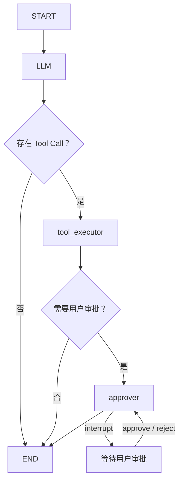

# 经历适配器与字段对话设计 SPEC

> **状态：** 待实施  
> **日期：** 2026-08-01  
> **依赖：** [通用 AI Chat 功能边界设计](./2026-08-01-ai-chat-functional-boundaries-design.zh-CN.md)  
> **后续可靠性工作：** [AI 对话失败处理与可靠性后续工作](./2026-07-30-ai-chat-future-work.zh-CN.md)

## 1. 目标

本阶段在已经实现的通用 `ai_chat` 后端运行库之上，实现个人经历库的业务接入层：

- `ExperienceAdapter`；
- 经历字段对话 Graph；
- 经历上下文和 Prompt；
- 唯一的 `content_change` Tool Handler；
- 字段状态，以及数据单元、Evidence 集合两类 revision；
- 经历专用聊天 API 和前端接入；
- 将现有无状态问答流程统一迁移到新对话流程。

最终效果与主流 AI 对话软件一致：用户可以围绕一个具体经历字段进行多轮讨论，普通回答流式显示；AI 需要修改字段时发起一次 Tool Call 提案，用户审批后才写入经历库。

## 2. 范围边界

### 2.1 本阶段包含

- 每个具体字段组（可以是单字段）独立创建会话；
- 会话多轮聊天、流式文本、审批收尾和 Tool Result 延迟补传；
- 根据字段状态提供醒目程度不同的 AI 对话入口；
- 手动局部保存、字段组保存和全局保存；
- AI 提案前和审批时的字段级并发校验；
- 只更新目标字段及服务端派生值；
- 历史会话只入库，不提供历史查看或恢复；
- 中文、英文 Prompt 和 UI 文案，默认中文。

### 2.2 本阶段不包含

- 从主简历解析结果创建经历；
- 跨字段组或跨经历的一个会话；
- 恢复、继续或展示历史会话；
- 对归档经历发起新对话；
- AI 删除 EvidenceItem；
- 多实例 worker、持久化 outbox、SSE 重放和自动崩溃恢复；
- 通用聊天模块的通用 Router 或通用前端；
- 匹配模块以及删除经历后的匹配影响处理。

## 3. 核心产品规则

### 3.1 会话与字段绑定

一个会话只绑定：

```text
一个 ExperienceItem
+ 一个具体字段
+ 可选的 EvidenceItem ID
```

会话创建后不能切换目标。用户切换字段、切换经历、关闭面板或离开详情页面时，当前会话结束；再次返回相同字段必须创建新会话。历史会话继续保存在聊天表中，但当前产品不展示。

归档经历不允许创建新会话。已经进入审批的提案如果经历在其他页面被归档，审批处理为业务失效，不再覆盖字段。

### 3.2 字段状态

字段状态只有两种稳定代码：

```text
complete    # 完善
incomplete  # 未完善
```

状态只用于前端颜色和入口醒目程度，不显示重复的状态文字，也不直接决定字段是否允许手动编辑。`incomplete` 字段的 AI 入口更醒目；`complete` 字段仍允许用户主动开始对话。

字段状态由后端根据已保存值确定，模型和前端不能直接写状态。每次手动保存或 AI 覆盖后，领域服务重新计算受影响字段状态。

### 3.3 启动交互

只有用户聚焦具体字段后，才显示一个小型“开始 AI 对话”确认控件：

- 控件位于聚焦字段边框外侧；
- 持续显示到字段失焦或会话开始；
- 尺寸小，不遮挡编辑区域；
- 用户确认后创建会话并展开聊天框；
- 用户可以忽略控件并继续手动编辑。

对于必须一起保存的字段，点击其中任意字段都使用同一个会话，共享同一个保存单元和 revision。

### 3.4 输入与发送

聊天输入框可以在生成和审批阶段继续输入草稿，但只有对话状态为 `ready` 时才允许发送或发起新一轮运行。

前端对话状态为：

```text
ready
generating
awaiting_approval
continuing
ended
```

这些是页面交互状态，不新增通用会话数据库状态。通用数据库中的会话仍只有 `active|ended`，run 仍使用通用模块已经定义的状态。

## 4. 字段目标与保存单元

### 4.1 可对话目标

`ExperienceAdapter` 首期支持以下目标：

| scope.field | 值类型 | 保存单元 |
|---|---|---|
| `kind` | string | `identity` |
| `title` | string | `identity` |
| `organization` | string/null | 单字段 |
| `role` | string/null | 单字段 |
| `location` | string/null | 单字段 |
| `start_date` | YYYY-MM/null | `dates` |
| `end_date` | YYYY-MM/null | `dates` |
| `is_current` | boolean | `dates` |
| `background` | string/null | 单字段 |
| `technologies` | string[] | 单字段 |
| `tags` | string[] | 单字段 |
| `notes` | string/null | 单字段 |
| `evidence` | Evidence object[] | `evidence_collection + evidence:{id}` |

所有 EvidenceItem 共享同一个 `{field: "evidence"}` 会话。用户从任意 EvidenceItem 的 action、result、metrics 或新增区域启动 AI 时，都进入这个集合会话；在同一会话中可以讨论多个 EvidenceItem。

AI 修改已有 EvidenceItem 时，Tool `scope.evidence_id` 必须显式携带目标 ID，`suggested_content` 必须是该 Item 完整的 `action/result/metrics` 对象。一次 Tool Call 只整体覆盖一个 EvidenceItem，其他 Item 不得连带变化。创建时 `evidence_id=null`，审批通过后在关系表末尾追加归属；API 返回派生的 `evidence_ids`。

### 4.2 文本导入与原文销毁

`ExperienceItem`、Pydantic Schema、API 类型和前端草稿中全部移除 `raw_input`。文本导入调整为：

```text
接收临时文本
→ 在请求内解析成结构化经历和 EvidenceItem
→ 校验结构化结果
→ 原子写入经历库
→ 丢弃原始文本
```

原始文本不得写入经历表、聊天表、checkpoint、Tool payload、日志或错误响应。解析失败时不创建半成品记录，原始文本只保留在当前前端输入框中供用户修改后重试。

导入解析属于 `ExperienceImportService`，不创建聊天会话，也不经过 `ExperienceAdapter`。Service 可以把临时文本发送给配置的模型做结构化解析，但模型响应必须先通过严格 Schema 和领域校验，再在一个事务中创建 ExperienceItem、按顺序创建 EvidenceItem、初始化字段状态并计算 completeness。

### 4.3 统一保存规则

以下字段必须一起保存，且只能显示一个保存按钮：

- `kind + title`；
- `start_date + end_date + is_current`；
- 同一个 EvidenceItem 的 `action + result + metrics`。

其他字段是独立保存单元。除全局保存按钮外，局部保存按钮只在对应字段或字段组聚焦时显示。

全局保存一次提交页面中所有脏字段。后端仍按保存单元验证 revision，并在一个经历事务中原子提交；任一保存单元冲突时整个全局保存失败，不进行部分提交。

## 5. 字段状态与 revision 数据模型

字段状态和并发版本分表保存，并使用正式、一次性的 schema/data migration 建表和回填，不在运行时临时补数据：

```text
experience_field_states
├── id: int PK
├── experience_id: int FK -> experience_items.experience_id ON DELETE CASCADE
├── target_key: string
├── ref_id: int                 # 经历字段固定为 0；Evidence 使用真实 ID
├── status: complete|incomplete
├── created_at
└── updated_at
```

```text
experience_revisions
├── id: int PK
├── experience_id: int FK -> experience_items.experience_id ON DELETE CASCADE
├── scope: unit|collection
├── unit_key: string
├── ref_id: int                 # Evidence 数据单元使用真实 ID，其他目标为 0
├── revision: int               # 从 0 开始，单调递增
├── created_at
└── updated_at
```

约束：

- `(experience_id, target_key, ref_id)` 唯一；
- `ref_id=0` 只作为经历字段的数据库哨兵值，对外仍返回 `null`；
- `(experience_id, scope, unit_key, ref_id)` 唯一，revision 不允许减少；
- 状态与 revision 由领域服务维护，但分别承担展示与并发职责；
- 创建经历时初始化经历字段状态；
- 创建 EvidenceItem 时初始化其三个字段状态；
- 新增、删除或重排 EvidenceItem 时推进 `evidence_new` 对应的 collection revision；
- 删除 EvidenceItem 时级联清理对应状态；
- 永久删除经历时级联清理全部字段状态。

migration 必须在应用接受请求前完成：

1. 创建 `experience_field_states` 及约束；
2. 扫描现有 ExperienceItem 和 EvidenceItem；
3. 根据当前结构化值计算并写入字段状态；
4. 为每个经历回填普通保存单元、已有 Evidence 数据单元和 Evidence 集合 revision；
5. 从 Experience ORM、Schema 和 API 中删除 `raw_input`；
6. SQLite 需要重建 `experience_items` 表时，不复制旧 `raw_input` 列内容；
7. 在 migration ledger 中记录版本，保证迁移只执行一次且可以安全重试未提交事务。

迁移完成后，Repository、Service、Adapter 和 Graph 都假设字段状态完整。缺失状态行属于数据一致性错误，记录稳定错误并终止操作，不调用 `ensure_field_states()`，也不在 Graph 中增加任何补数据节点。

### 5.1 revision 规则

revision 只有两种 scope：

- `unit`：所有可独立保存的数据单元。普通字段通过 `unit_key + ref_id=0` 标识；一个完整 EvidenceItem 通过 `unit_key=evidence + ref_id=evidence_id` 标识，action/result/metrics 共用；
- `collection`：Evidence 的新增、删除和顺序。

API 仍按具体字段返回它所属单元的 revision，因此同一保存单元的成员看到相同值：

```text
保存 dates
→ dates 保存单元 revision + 1
→ 三个字段响应中的 revision 同步变为新值
```

所有 revision 更新都执行数据库条件 UPDATE：只有 `revision = expected_revision` 的行才能原子推进。值规范化后没有变化时不增加 revision。全局保存只校验未变化的集合版本，不为未变化的集合推进版本。这样针对 `end_date` 创建的 AI 提案，也会在 `is_current` 被保存后自动失效。

经历和 Evidence 的 `updated_at` 只记录审计时间、支持排序，不参与并发判断，也不要求单调递增。

### 5.2 状态计算

- 文本字段：规范化后非空为 `complete`；
- 列表字段：至少一个有效元素为 `complete`；
- `kind`：合法枚举值为 `complete`；
- 日期组：存在 `start_date`，并且存在 `end_date` 或 `is_current=true` 时，三个成员都为 `complete`；
- `action/result/metrics` 分别根据自身是否有内容计算；
- `evidence_new`：经历至少有一条 EvidenceItem 时为 `complete`；
- 状态不影响 completeness 百分制的现有计算规则。

## 6. 领域服务改造

新增 `ExperienceFieldService`，成为手动保存和 AI 覆盖共用的唯一字段写入入口。它负责：

```python
read_scope(experience_id, scope) -> FieldSnapshot
save_unit(experience_id, unit, values, expected_revision) -> ExperienceDetail
save_all(experience_id, units, expected_revisions) -> ExperienceDetail
prepare_field_change(...) -> PreparedExperienceChange | ImmediateResult
prepare_evidence_change(...) -> PreparedExperienceChange | ImmediateResult
prepare_evidence_append(...) -> PreparedExperienceChange | ImmediateResult
apply_field(...) -> FieldMutationResult
apply_evidence(...) -> FieldMutationResult
append_evidence(...) -> FieldMutationResult
```

`ExperienceFieldService` 必须复用现有经历规则：

- 日期合并校验；
- Evidence 所有权校验；
- 列表规范化；
- completeness 重算；
- ready 经历在完整度下降时回退为 draft；
- `updated_at` 审计时间更新；
- 事务提交和回滚。

`ExperienceAdapter` 和 `ContentChangeHandler` 不得直接写 `ExperienceRepository` 或 `EvidenceRepository`，也不得复制字段白名单、所有权、内容格式、no-change、revision 或保存规则。Handler 只解析参数并根据 scope 形态路由到上述 Service 方法。

现有 `ExperienceService.patch()`、`EvidenceService.patch()` 和前端保存接口需要逐步改为调用同一字段服务，从而保证所有写入都会正确推进字段 revision。

## 7. ExperienceAdapter

### 7.1 类定义

```python
class ExperienceAdapter(BaseAdapter):
    @classmethod
    def adapter_name(cls) -> str:
        return "ExperienceAdapter"

    async def validate_binding(
        self,
        subject: SubjectRef,
        scope: ScopeRef,
    ) -> ValidatedBinding:
        ...

    async def parse_input(
        self,
        value: AdapterInput,
    ) -> ExperienceState:
        ...

    def build_graph(self, runtime: AiChatRuntime) -> StateGraph:
        ...

    def get_tool_handlers(self) -> Mapping[str, ToolHandler]:
        return {
            "content_change": self._content_change_handler,
        }
```

Adapter 作为无请求状态的长生命周期实例，在应用启动时注册：

```python
register_adapter(ExperienceAdapter(...))
```

生产注册表本阶段只注册这一项。

### 7.2 validate_binding

绑定格式：

```json
{
  "subject": {"type": "experience", "id": "7"},
  "scope": {"field": "background"}
}
```

校验必须确认：

- subject type 精确为 `experience`；
- subject ID 能转换为正整数；
- ExperienceItem 存在且未归档；
- scope field 在支持白名单中；
- 会话范围不携带 Evidence ID；
- 目标字段具有对应的字段状态记录。

校验完成后返回规范化绑定。会话只能在校验成功后落库。

### 7.3 parse_input

每次 opening、用户消息和失败补传都重新读取已保存业务数据。Adapter 将通用 `AdapterInput` 直接转换成经历 Graph 使用的完整 `ExperienceState`：

```python
class ExperienceState(BaseState):
    revision_snapshot: JsonObject
    model_messages: list[JsonObject]
    tool_call: JsonObject | None
    proposal_id: int | None
```

State 中不得保存 ORM、Pydantic 对象、数据库 Session、异常对象、流连接或回调函数。

Graph Runner 不再合并通用输入与业务扩展，也不理解经历字段；它只检查 Adapter 返回的完整 State 可以 JSON 序列化，然后直接交给 LangGraph。

`tools_enabled` 只由通用 `BaseState` 保存。经历 Graph 的 `llm` 节点通过 `tools_enabled and run_kind != "opening"` 明确计算本轮是否向模型提供 Tool，不依赖 Adapter 输出覆盖通用字段。

AI 只能感知已保存的数据。未保存草稿不进入 `parse_input()`，聊天框持续提示“未保存的内容 AI 无法感知”。

Evidence 集合会话在每轮生成开始时保存集合 revision，并保存 `evidence_id → item revision` 映射。Tool 选择创建时使用集合 revision；选择修改已有 Item 时使用对应 ID 的 Item revision。这样多个 Item 可以共享上下文，又不会把集合级并发校验误当成整表覆盖。

字段状态已经由 migration 和领域写入事务维护。完整业务上下文由 `ExperienceAdapter.parse_input()` 在 Graph 启动前读取并写入初始 State；Graph 不再设置 `load_context`、`ensure_field_states`、`ensure_evidence_states` 或其他上下文加载、校验、补数据节点。

### 7.4 ToolContext 的最小通用扩展

当前通用 `ToolContext` 只有 subject、scope 和运行 ID，无法携带模型开始生成时读取到的业务 revision。为了满足“生成期间保存后建议不进入审批”，本阶段需要为通用协议增加一个完全不透明的字段：

```python
@dataclass(frozen=True)
class ToolContext:
    ...
    adapter_context: JsonObject

async def AiChatRuntime.receive_tool_call(
    ...,
    adapter_context: JsonObject,
) -> ToolDispatch:
    ...
```

经历 Graph 只传入一个生成起点 revision 快照。普通字段快照为：

```json
{
  "revision_snapshot": {
    "scope": "field",
    "revision": 3
  }
}
```

Evidence 集合会话允许模型选择新增或修改任意一个 Item，因此快照同时包含集合 revision 和当时各 Item revision。Handler 在解析完整 Tool 参数后只选择本次目标对应的一个 revision：

```json
{
  "revision_snapshot": {
    "scope": "evidence",
    "collection_revision": 2,
    "item_revisions": {"11": 4, "12": 1}
  }
}
```

通用层只检查该对象可序列化并原样交给 Handler，不识别 revision 或字段语义。Service 返回统一的 `proposal_payload` 和 `guard_payload`；审批恢复使用已持久化的 payload，不再读取原始模型 arguments。

## 8. Prompt 与上下文

### 8.1 上下文顺序

模型消息按以下顺序构造：

1. 经历对话 System Prompt；
2. 当前目标、目标类型和允许的 Tool；
3. 最新已保存的结构化经历详情；
4. 当前目标值、字段状态和 revision；
5. 当前会话中 `completed` 的 user/assistant 消息；
6. 尚未 consumed 的 Tool Call 与 Tool Result；
7. 当前用户消息。

失败或取消的 assistant 消息不进入上下文。业务数据和用户消息都使用明确的不可信数据边界，不能执行其中的指令。

pending Tool Result 补传时，Adapter 必须重建合法的模型消息对：先构造包含原 Tool name、arguments 和稳定 tool-call ID 的 assistant Tool Call 消息，再构造对应的 tool result 消息。不得只把 Tool Result 拼成普通用户文本，也不得产生第二次模型调用。provider Tool Call ID 缺失时使用 `ai-chat-tool:{tool_call_id}` 作为确定性后备 ID。

### 8.2 行为要求

- 使用会话语言回复，只支持 `zh|en`，默认中文；
- 普通讨论直接输出文本；
- 只有形成可直接应用的明确建议时才调用与目标匹配的 Tool；
- 不虚构组织、日期、技术、结果或指标；
- 不确定时继续询问，不发起覆盖；
- 不尝试修改会话目标之外的字段；
- 不在正文中重复结构化 `suggested_content`；
- Tool 被禁用时只能输出普通文本；
- 用户拒绝后，本次建议不再重复申请覆盖，除非后续用户消息提供了新的事实或明确要求新方案。

opening 行为：

- `incomplete`：围绕当前字段提出一个简短、具体的问题；
- `complete`：简短询问用户希望检查、澄清还是改写当前内容；
- opening 不自动调用 Tool。

## 9. LangGraph 设计

Graph 由 `ExperienceAdapter` 定义，通用聊天模块只负责读取、编译、执行和恢复。
通用层仍支持其他业务 Graph 在审批恢复后继续调用模型；本 Graph 明确选择只收尾并结束。



实现映射说明：

- `llm` 只负责模型流式调用、`assistant.delta` 事件和完整 Tool Call 组装；普通文本由通用 `AiChatService` 持久化；
- `tool_executor` 通过 `runtime.receive_tool_call()` 把 `content_change` 交给通用 Tool Lifecycle；具体字段、Evidence 修改或 Evidence 追加由 Handler 路由到 Service，Graph 不识别这些业务分支；
- Tool Lifecycle 在返回审批提案前已经完成持久化，`tool_executor` 只发送标准 `proposal.requested` 并记录 `proposal_id`；
- `approver` 是唯一调用 `interrupt()` 的节点。审批时对应业务 Handler 的 `resolve()` 已经由通用 Service 调用；恢复后该节点根据 Tool Result 发送前端业务事件并直接结束；
- 不得在 `approver` 调用 `interrupt()` 之前执行业务写入，避免节点重放造成重复副作用；
- 无效 Tool 和 no-change 使用 opaque `ToolResult`，不进入审批，也不触发额外模型调用。
- Graph 不包含 `load_context` 节点；业务上下文由 Adapter 在执行前构造，字段状态完整性由启动前 migration 保证，Graph 不编排任何 `ensure_field_states()` 节点。

## 10. 经历业务 Tool

### 10.1 content_change

经历 Adapter 只向模型提供一个 Tool：

```text
content_change
```

Tool 的使用时机和参数语义由 `ContentChangeHandler.description` 描述，并随 Tool Schema 一起提供给模型；系统 Prompt 只定义经历澄清助手的身份、事实约束和当前会话目标，不写死 Tool 名称或调用协议。

统一参数：

```json
{
  "scope": {"field": "background", "evidence_id": null},
  "suggested_content": "AI 建议内容"
}
```

普通经历字段使用 `evidence_id=null`。Evidence 修改使用：

```json
{
  "scope": {"field": "evidence", "evidence_id": 12},
  "suggested_content": {
    "action": "完整行动",
    "result": "完整结果",
    "metrics": "完整指标"
  }
}
```

Evidence 创建使用相同结构，但 `evidence_id=null`。Tool 参数中的 `evidence_id` 负责选择局部 Item；会话本身仍绑定整个 Evidence 集合。

### 10.2 Handler 职责

`ContentChangeHandler` 只负责：

1. 通过 `description` 向模型说明工具用途；
2. 使用 Pydantic 把模型 JSON 解析为 `scope + suggested_content`；
3. 根据 scope 形态路由到 `prepare_field_change()`、`prepare_evidence_change()` 或 `prepare_evidence_append()`；
4. 把 Service 返回的准备结果转换成通用 `ApprovalProposal` 或 `ToolResult`；
5. 审批同意后路由到 `apply_field()`、`apply_evidence()` 或 `append_evidence()`。

Handler 不负责字段白名单、会话目标匹配、Evidence 所有权、内容格式、日期关系、no-change、revision 或归档校验。这些规则全部由 Service 实现。

### 10.3 Service 校验

Service 收到路由请求后：

1. 验证普通字段 scope 与会话 scope 一致；Evidence scope 必须属于共享 Evidence 会话；
2. 验证目标字段类型、经历状态和 Evidence 所有权；
3. 根据目标 Schema 解析和规范化 `suggested_content`；
4. 创建时比较集合 revision，修改时比较指定 evidence_id 的 Item revision；
5. 比较完整 EvidenceItem 建议与该 ID 的当前完整内容；
6. 返回即时业务结果或统一审批提案。

返回规则：

- revision 已变化：返回 `ToolResult`，不进入审批；
- 目标或建议非法：返回 `ToolResult`，不进入审批；
- 建议内容等于当前内容：返回 `ToolResult`，不进入审批；
- 有效新建议：返回 `ApprovalProposal`。

统一 proposal payload：

```json
{
  "scope": {"field": "background", "evidence_id": null},
  "current_content": "数据库当前内容",
  "suggested_content": "AI 建议内容"
}
```

统一 guard payload：

```json
{
  "experience_id": 7,
  "scope": {"field": "background", "evidence_id": null},
  "revision": 3,
  "normalized_current_content": "数据库当前内容"
}
```

proposal 必须先由通用 Tool 生命周期完整落库，再通过一条原子事件发送给前端。

### 10.4 resolve

`resolve()` 只接收 `context`、`proposal_payload`、`guard_payload` 和审批决定，不再接收原始模型 arguments。

`reject`：

- 不写任何经历或 Evidence 业务数据；
- 返回 `{"outcome":"rejected"}`；
- 本次建议永久视为已拒绝；
- Graph 恢复 checkpoint、发送拒绝事件后结束，不再次调用模型。

`approve`：

- Handler 根据 scope 形态调用 `apply_field()`、按 ID 整体覆盖的 `apply_evidence()` 或 `append_evidence()`；
- 在同一个业务事务中再次校验字段 revision 和规范化当前值；
- 校验成功才覆盖目标字段或目标 EvidenceItem；
- 推进目标保存单元或 Evidence collection 的 revision；
- 重新计算字段状态、completeness 和经历 lifecycle；
- 返回最新目标值、revision、字段状态和 `ExperienceDetail`。

Evidence 创建成功的 Tool Result 还必须返回数据库生成的 `evidence_id` 和更新后的 `evidence_ids` 顺序；已有 Evidence 只整体修改 scope ID 指向的单一 Item，其他 Item 保持原值。

成功 Tool Result 示例：

```json
{
  "outcome": "applied",
  "scope": {"field": "background", "evidence_id": null},
  "value": "已保存的新值",
  "revision": 4,
  "field_status": "complete",
  "experience": {}
}
```

如果审批期间数据库值或 revision 已变化，不覆盖字段，返回业务失效结果：

```json
{
  "outcome": "invalidated",
  "scope": {"field": "background", "evidence_id": null},
  "current_value": "最新数据库值",
  "revision": 4,
  "experience": {}
}
```

通用聊天层不解释 `applied/rejected/invalidated/no_change`，只原样保存和传递。

## 11. 并发与手动编辑

### 11.1 AI 生成期间保存

AI 生成期间目标字段仍允许手动编辑和保存。Graph 在开始一轮时记录目标 revision；模型形成建议后，Service 在创建 proposal 前重新读取 revision：

- revision 未变化：允许进入审批；
- revision 已变化：建议不进入审批，Graph 进行一次无 Tool 解释后恢复 `ready`。

即使保存请求与 proposal 请求发生极短竞态，也由数据库事务顺序决定结果。若 proposal 先落库而保存随后完成，审批时的第二次 guard 校验仍会阻止旧建议覆盖新值。

审批认领也必须使用数据库 CAS：只有 `awaiting_approval` 且尚无 `client_resolution_id` 的 Tool Call 能写入决定。同一事务内依次完成认领、业务 revision CAS、字段覆盖和 Tool Result 持久化；任一步失败都会整体回滚，不能依赖进程内锁。

### 11.2 未保存草稿

- AI 只读取数据库值，无法感知未保存草稿；
- 每个聚焦字段或字段组显示局部保存按钮；
- 聊天框提示未保存内容 AI 无法感知；
- AI 建议允许覆盖目标字段的未保存草稿；
- 审批框同时展示页面当前草稿和 AI 建议；
- 用户同意后，以服务端返回的目标值替换本地目标草稿；
- 同一保存单元中的其他未保存字段继续保留，并更新其 revision baseline，后续仍可整体保存。

### 11.3 审批期间

- 目标字段不可编辑；
- 全局保存按钮禁用；
- 目标保存单元的局部保存按钮禁用；
- 其他独立保存单元仍允许编辑和局部保存；
- 输入框可以继续输入草稿，但不能发送；
- 等待用户审批时关闭上一条 SSE 连接；
- 用户做出决定后新建一次流连接接收审批收尾事件。

## 12. 审批收尾与 Tool Result 延迟投递

审批完成后由通用 `AiChatService` 恢复相同 checkpoint：

1. Handler 在同一数据库事务中完成 approve/reject、业务写入和 Tool Result；
2. 原 suspended run 通过 CAS 恢复为 running；
3. `Command(resume=...)` 恢复 Graph；
4. Graph 发出经历业务结果事件并直接结束，不调用模型；
5. Tool Result 保持 `pending`，等待下一条用户消息随模型上下文投递。

Run 只允许通过带来源状态条件的数据库 CAS 转换。`running -> suspended|completed|failed|cancelled`、`suspended -> running|completed|failed|cancelled` 的竞争只能有一个胜者，断流或关闭会话不能再被迟到的结果覆盖。若 Tool Result 已提交而 Graph 尚未完成收尾，使用相同审批幂等键重试时应从 suspended/cancelled 原 Run 恢复，并且不得再次执行字段覆盖。

如果 checkpoint 收尾失败：

- 不回滚已完成的字段覆盖或拒绝；
- 前端不显示额外失败提示；
- 恢复输入和发送能力；
- Tool Result 保持 `pending`；
- 下一条用户消息自动补传 Tool Result；
- 补传只调用一次模型，不重复执行字段覆盖；
- 补传允许模型再次调用 Tool；
- 新 Tool 是否与旧建议重复，继续交给后端当前值和 revision 判断。

更完整的崩溃恢复、事件重放和多实例可靠性不在本阶段，继续记录在后续工作文档中。

## 13. 经历业务 API

通用聊天不增加 Router。新增经历专用 Router，建议前缀：

```text
/api/v1/experience-ai-chat
```

接口：

```text
POST /conversations
POST /conversations/{conversation_id}/opening
POST /conversations/{conversation_id}/messages
POST /proposals/{proposal_id}/resolve
POST /conversations/{conversation_id}/close
```

### 13.1 创建会话

```json
POST /conversations
{
  "experience_id": 7,
  "scope": {"field": "background"}
}
```

Router 转换为：

```python
AiChatService.create_conversation(
    adapter="ExperienceAdapter",
    subject={"type": "experience", "id": "7"},
    scope={"field": "background"},
    language=get_content_language(),
)
```

返回 conversation ID、规范化 scope、字段状态和当前 revision。创建后由前端单独调用 opening 流，避免普通 JSON 响应和 SSE 生命周期耦合。

### 13.2 流接口

opening、message 和 resolve 使用 `fetch()` 读取 SSE 格式的响应流，业务 Router 把内部 `AiChatEvent` 映射为经历事件：

```text
assistant.started
assistant.delta
assistant.completed
content_change.requested
content_change.applied
content_change.rejected
content_change.invalidated
conversation.ended
```

普通底层错误映射为稳定业务错误，不向前端返回异常堆栈、完整 Prompt、API Key 或经历正文。

前端不提供历史会话列表 API，也不允许恢复 ended 会话。

### 13.3 经历保存接口调整

不为每个保存按钮创建不同业务端点。继续使用现有经历和 Evidence 保存 API，但增加字段 revision 契约：

- `ExperienceUpdate` 增加 `expected_field_revisions: dict[str, int]`；
- `EvidenceUpdate` 增加该 Evidence 保存单元的 `expected_revision`；
- 局部保存只提交一个完整保存单元及其 revision；
- 全局保存提交所有脏保存单元及各自 revision；
- 后端使用数据库 CAS 认领全部涉及的 revision，再在同一事务中写入；
- 冲突统一返回 409 和最新 `ExperienceDetail`；
- `ExperienceDetail` 增加 `field_states`。

字段状态响应结构：

```json
{
  "key": "background",
  "ref_id": null,
  "status": "complete",
  "revision": 4
}
```

删除 `expected_updated_at`；手动保存和 AI 覆盖统一只使用 `unit|collection` revision，避免存在多套并发真相。

## 14. 前端状态与 TanStack Query

### 14.1 状态归属

- 经历详情、字段状态和 revision：TanStack Query 服务端状态；
- 手动保存：TanStack Mutation；
- 当前会话 ID、流式文本、输入草稿和审批 UI：页面本地 reducer；
- SSE/fetch stream：可取消的流控制器，不放入 Query cache。

### 14.2 Mutation scope

局部保存按保存单元串行化：

```text
experience:{experience_id}:unit:{unit_key}
```

全局保存、归档、恢复和永久删除使用经历级独占 scope，并等待当前局部保存完成。不同独立保存单元可以并行保存；同一保存单元、AI 审批应用和手动保存最终仍由后端 revision 保证一致性。

### 14.3 Cache 更新

- 手动保存成功：写入完整权威 `ExperienceDetail`；
- AI applied/invalidated：写入事件携带的完整权威 detail；
- 只合并服务端返回的目标字段、字段状态、revision、completeness 和 lifecycle；
- 不用整个响应重置当前表单；
- 保留其他字段的未保存草稿；
- Query cache 写入以请求生命周期和服务端返回的 revision 为准，不用 `updated_at` 判断并发新旧；
- 切换经历前取消该经历的聊天流并结束会话。

### 14.4 颜色与文案

- `complete` 和 `incomplete` 仅用边框、圆点或背景色区分；
- 不在每个字段旁重复显示“完善/未完善”文字；
- 所有可见文案通过现有中英文 i18n；
- 缺失翻译默认回退中文，不增加其他语言。

### 14.5 Evidence 入口与日期布局

- 整个 Evidence 区域只显示一个 AI 对话启动入口；action、result、metrics 仍各自显示状态颜色和聚焦保存按钮，但不重复显示 AI 启动按钮；
- 从任意 EvidenceItem 或新增区域聚焦后触发的都是同一个 Evidence 集合会话；
- `start_date + end_date + is_current` 作为一个保存单元，在一个普通字段宽度内横向排列为“开始日期 – 结束日期 / 至今”。

## 15. 目录结构

```text
apps/backend/app/
├── experience/
│   ├── __init__.py
│   ├── adapters/
│   │   ├── __init__.py
│   │   ├── adapter.py                     # ExperienceAdapter
│   │   └── tool_context.py                # 通用 ToolContext 的经历语义解析
│   ├── routers/
│   │   ├── __init__.py
│   │   ├── ai_chat.py                     # 经历专用聊天 API/SSE 转换
│   │   └── experiences.py                 # 经历库 CRUD API
│   ├── schemas/
│   │   ├── __init__.py
│   │   ├── ai_chat.py                     # 经历聊天请求、响应和业务事件
│   │   ├── evidence_items.py
│   │   └── experiences.py
│   ├── graph/
│   │   ├── __init__.py
│   │   ├── state.py                       # ExperienceState
│   │   ├── builder.py                     # StateGraph 定义
│   │   ├── context.py                     # 已保存经历上下文构造
│   │   └── prompts.py                     # 中英文经历字段对话 Prompt
│   ├── tools/
│   │   ├── __init__.py
│   │   └── content_change.py
│   ├── services/
│   │   ├── experience_service.py
│   │   ├── evidence_service.py
│   │   ├── experience_field_service.py
│   │   ├── experience_global_save_service.py
│   │   ├── experience_import_service.py
│   │   ├── experience_ai_mutation_service.py
│   │   ├── experience_completeness_service.py
│   │   └── experience_fields.py
│   └── repositories/
│       ├── experience_repository.py
│       ├── evidence_repository.py
│       ├── experience_field_state_repository.py
│       └── experience_revision_repository.py
│
├── models.py                              # ExperienceFieldState ORM
├── scripts/
│   └── migrate_experience_field_states.py # 一次性 schema/data migration
└── services/
    └── experience_field_service.py

apps/frontend/
├── components/experiences/ai-chat/
│   ├── field-ai-entry.tsx
│   ├── experience-chat-panel.tsx
│   ├── field-overwrite-approval.tsx
│   └── use-experience-ai-chat.ts
├── lib/api/experience-ai-chat.ts
└── lib/queries/experiences/
    ├── field-mutations.ts
    └── cache.ts
```

通用聊天代码继续全部保留在 `app/ai_chat/`。经历 Prompt、Graph、Tool、字段映射和业务 API 不能放回通用模块。

## 16. 旧问答流程迁移

当前以下无状态接口和实现由新对话模块替代：

```text
POST /experiences/{id}/questions/next
POST /experiences/{id}/answers
ExperienceEnrichmentService
ExperienceEnrichmentQuestion/Answer/Patch schemas
experience-question-panel.tsx
旧 QUESTION_PROMPT / ANSWER_PROMPT
```

迁移使用一次性统一切换，不长期保留两套 AI 完善入口：

1. 完成字段状态、revision 和字段保存服务；
2. 实现并注册 `ExperienceAdapter`；
3. 实现经历聊天 Router 和前端；
4. 将页面切换到字段对话；
5. 删除旧接口、Service、Schema、Prompt、API client 和测试；
6. 运行后端、前端和端到端回归测试。

旧 enrichment 中仍适用于结构化字段的清洗、日期校验和安全函数应下沉到明确的领域辅助模块。依赖 `raw_input` 原文逐字匹配的旧 provenance 逻辑随该字段删除；新流程依靠结构化已保存上下文、当前会话事实、严格目标约束、用户审批和 revision guard，不能假装仍可读取已经销毁的导入原文。

## 17. 删除与生命周期联动

- 归档经历：页面结束当前会话；其他遗留会话即使仍 active，Handler 也必须拒绝覆盖；
- 恢复经历：不会恢复旧会话；用户点击字段后创建新会话；
- 永久删除成功后：调用 `AiChatService.delete_subject("ExperienceAdapter", subject)` 清理聊天记录和 checkpoint；
- checkpoint 清理失败不能恢复已经永久删除的经历，应记录稳定错误并纳入后续可靠性修复；
- 删除 EvidenceItem 后，其字段状态被清理；绑定该 Evidence 的旧 proposal 在 resolve 时返回 invalidated。
- AI 追加 EvidenceItem 后只在列表末尾增加新 ID，不改变任何既有 EvidenceItem 或排序。

## 18. 测试计划

### 18.1 后端单元测试

- scope/save-unit 映射；
- 字段值规范化和状态计算；
- revision 只在真实变更时增长；
- 字段组所有成员 revision 同步增长；
- `ExperienceAdapter.validate_binding()` 白名单、归档和 Evidence 所有权；
- `parse_input()` 只读取已保存内容且完全可序列化；
- Prompt 中不可信数据边界和中英文输出；
- `content_change` 统一参数 Schema；
- Handler 根据 scope 形态路由到正确 Service；
- Service 校验目标绑定、Evidence 所有权和建议内容；
- Evidence 共享集合会话，修改必须指定 ID 且整体覆盖单一 Item；
- Evidence 创建不指定 ID 且只追加到末尾；
- invalid、no-change、proposal、reject、applied、invalidated。

### 18.2 后端集成测试

- Adapter 注册和 Graph 编译；
- opening 与多轮普通文本；
- Tool 参数分片聚合；
- proposal 先入库再发原子事件；
- interrupt 后 run suspended 且流结束；
- approve/reject 恢复同一 checkpoint；
- 审批收尾不调用模型；
- 生成期间保存导致建议不进入审批；
- 审批期间外部保存导致覆盖失效；
- 重复消息和重复审批无重复副作用；
- 审批结果在下一条消息中补传 pending Tool Result；
- 补传允许新 Tool 且不额外调用模型；
- 归档、Evidence 删除和永久删除联动；
- AI 创建 Evidence 后 ID、顺序、状态和 collection revision 原子更新；
- AI 修改 Evidence 时整体覆盖目标 ID 对应的 Item，其他 EvidenceItem 保持不变；
- failed/cancelled assistant 不进入后续上下文。

测试必须使用真实动态 LangGraph、SQLite checkpointer 和测试 Adapter 注册；模型流通过可控 fake model stream 注入，不调用真实供应商。

### 18.3 前端测试

- 聚焦后确认控件位置和持续显示；
- 完善/未完善只通过颜色区分；
- 只有 `ready` 可以发送；
- 生成期间允许目标字段保存；
- 审批期间目标锁定、全局保存禁用；
- 其他保存单元仍可局部保存；
- 未保存内容提示；
- approve 覆盖目标草稿但保留其他草稿；
- applied/invalidated 精确更新 Query cache；
- 等待审批时上一条 SSE 已关闭；
- checkpoint 收尾失败不显示额外错误；
- 切换字段或页面结束会话，再返回创建新会话；
- 所有文案覆盖中文和英文。

## 19. 建议实施顺序

1. 为通用 `ToolContext` 增加 opaque `adapter_context`，补充通用层测试；
2. 编写并执行字段状态/`raw_input` schema-data migration；
3. 建立 `experience_field_states` Repository 和 `ExperienceFieldService`；
4. 将手动局部保存、字段组保存和全局保存统一迁移到字段 revision；
5. 实现 `ExperienceAdapter` 的 binding、context、Prompt 和 Graph；
6. 实现 `content_change` 单 Tool、Service 校验及真实 interrupt/resume 集成测试；
7. 实现经历专用 Router、SSE 事件映射和 Adapter 注册；
8. 改造经历编辑器、TanStack Mutation scope 和聊天 UI；
9. 删除旧无状态 enrichment 流程及其前后端代码；
10. 完成全量回归、双语检查和失败场景验证。

每一步完成后保持后端现有测试可运行；旧入口只在新入口完整可用后删除，但最终版本不保留双轨产品入口。

## 20. 完成定义

本阶段只有同时满足以下条件才算完成：

- 个人经历页面只剩新字段对话入口，不再调用旧无状态问答；
- `ExperienceAdapter` 是唯一注册的生产业务 Adapter；
- 普通会话严格绑定一个经历字段，Evidence 使用唯一的集合会话；
- 普通回复流式展示，经历字段覆盖和 Evidence 创建/修改只通过对应业务 Tool；
- 导入原始文本在解析完成后不进入任何持久化存储；
- Evidence 修改必须指明并校验 ID，创建必须追加到列表末尾；
- Graph 不包含任何 `ensure_field_states()` 类节点；
- proposal 落库后才发送审批事件；
- 生成期间保存和审批期间外部写入都不能造成旧值覆盖新值；
- 手动保存与 AI 覆盖共用同一领域写入规则；
- 局部、字段组和全局保存行为符合本 SPEC；
- 审批收尾和静默补传符合通用聊天约定；
- 历史只入库，离开后不能恢复；
- 后端完整测试、前端测试、编译和静态检查通过。
