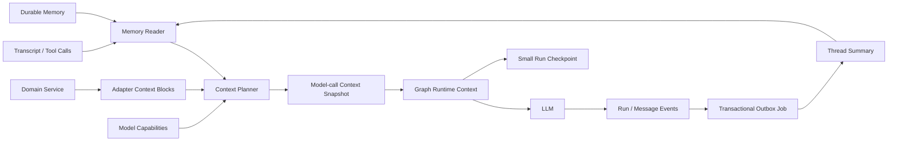

# AI Chat 分层记忆与上下文治理设计

**状态：** Proposed  
**日期：** 2026-08-08  
**范围：** `apps/backend/app/ai_chat` 与 Experience Adapter  
**解决的问题：** 长会话输入无界增长，Graph checkpoint 重复保存大上下文。

---

## 1. 核心结论

记忆不是把历史全塞进 Prompt，而是：**全量记录留在库里，模型每轮只拿有预算的高信号切片。**

本设计采用四条独立通道：

1. Transcript 保存原始事实和审计记录；
2. Context Engine 生成本轮有界输入；
3. Memory 保存可追溯摘要和显式长期偏好；
4. Checkpoint 只恢复未完成的 Graph 执行。

向量库只能解决“从哪里找”，不能解决“放多少、信什么、如何恢复”。因此不作为首期入口。

---

## 2. 当前问题

当前系统没有真正的记忆层，只有全量回放：

```text
全部 completed 消息
+ 完整 ExperienceDetail
+ 全部 pending Tool Result
+ Tool Schema
→ 每轮完整送给模型
→ model_messages 再进入 LangGraph State
→ 每个 super-step 保存 checkpoint
```

直接证据：

- `AiChatService._build_input()` 每轮调用 `list_completed()`，没有 limit、摘要水位或 Token 预算；
- `ExperienceAdapter.parse_input()` 每轮读取完整 `ExperienceDetail`；
- `build_model_messages()` 原样追加全部历史；
- `ExperienceState.model_messages` 把完整模型输入放进 checkpoint；
- `max_tokens=4096` 只限制输出，不限制输入；
- Conversation 正常结束不会清理 checkpoint，只有物理删除才清理。

因此：

- 单轮模型输入随消息数线性增长；
- checkpoint 会反复保存大 State，长期增长远高于必要值；
- 最新业务事实、旧 Tool Result 和历史文本可能重复表达同一内容；
- 一次超长消息或超大 Evidence 集合即可击穿窗口，与对话轮数无关。

---

## 3. 六类数据必须分开

| 数据 | 真相级别 | 是否进模型 | 生命周期 |
|---|---|---:|---|
| Transcript | 原始对话审计真相 | 默认不全量进入 | 随 Conversation |
| Domain Truth | Experience、Evidence、revision | 按 scope 精确投影 | 随业务对象 |
| Context Snapshot | 某次模型调用的冻结请求 | 是 | Model-call 级、短期保留 |
| Thread Summary | 旧对话的派生摘要 | 受预算限制 | Conversation 级 |
| Durable Memory | 显式确认的跨会话偏好/经验 | 按需召回 | 用户或 namespace 级 |
| Checkpoint | interrupt、pending task、执行位置 | 不直接进入 | 未完成 Run |

行为指令的优先级固定：

```text
系统规则与审批政策
> 当前用户请求
> Session 偏好
> Durable Memory
```

事实不做简单的“新值覆盖旧值”：

- `persisted_state` 表示当前已保存事实和 revision；
- `proposed_claim` 表示用户本轮提出的纠正或补充；
- 模型可以用 claim 形成待审批变更，但不能把它伪装成已保存事实；
- 审批成功后，由 Domain Service 更新 persisted state；
- Summary/Memory 只能提供带来源的 claim，不能直接进入 persisted state。

摘要和长期记忆都是派生信息。它们不能覆盖业务表，也不能绕过审批。

---

## 4. 总体架构



新的主调用链：

```text
AiChatService
→ Adapter.build_context_blocks()
→ ContextService.prepare_model_call(run_id, model_call_seq)
→ ContextPlanner.plan()
→ 保存 ContextSnapshot
→ GraphRunner.stream(snapshot_id, small_state)
→ 模型完成
→ Run 终态与 outbox 同事务提交
→ worker 异步 compact Thread Summary
→ 清理终态 Run checkpoint
```

Graph 不直接查询记忆。Adapter 不自行裁剪历史。每次模型调用都统一经过 Context Planner；一个 Run 发生第二次调用时创建新的 `model_call_seq`。

---

## 5. Context Engine

### 5.1 ContextBlock 契约

每一段候选上下文都先变成一个 `ContextBlock`：

```text
block_id
kind
typed_payload
required
priority
render_order
atomic_group
source_refs
estimated_tokens
```

`priority` 决定保留谁。`render_order` 决定最终消息顺序。两者不能混为一谈。

ContextBlock 生产者不能直接指定 Message role。只有中央 `ContextRenderer` 能把类型化数据渲染成模型消息。系统规则使用独立 `PromptSpec`，且只能由受信任的版本化代码创建。

必须支持的 `kind`：

- `domain_required`：当前 scope 的最小业务事实；
- `domain_optional`：邻接业务事实；
- `thread_summary`：旧历史摘要；
- `durable_memory`：长期偏好或案例；
- `recent_turn`：近期完整轮次；
- `pending_tool_result`：待投递 Tool Call/Result 对；
- `current_user`：当前用户消息。

Renderer 对 `recent_turn` 只接受数据库中已有的 role；对 `pending_tool_result` 只生成合法的 assistant/tool 原子对；Memory 文本永远不能渲染为 system。

### 5.2 硬预算

模型窗口是安全上限，不是应用预算。首期增加独立的应用输入上限，建议默认 `16k` Tokens。

```text
request_input_tokens = token_counter(model, messages, tools)

request_input_tokens <= configured_input_cap
request_input_tokens + safety_margin <= max_input_tokens       # 若模型明确提供
request_input_tokens + output_reserve + safety_margin
    <= context_window                                          # 若提供总窗口
output_reserve <= max_output_tokens                            # 若模型明确提供
```

规则：

- 使用当前 LiteLLM 的 `token_counter(model, messages, tools)`；
- 未知模型使用保守估算，并要求可配置 `context_window_tokens`；
- Tools 已进入最终计数，不能再手工扣一次造成双计；
- Planner 与 Model 必须复用同一份已准备 Tool Schema，不能各自重建；
- Capability Resolver 必须记录每个 limit 的语义和来源，不能混用 input limit 与 total context；
- Compactor、Memory Extractor 和验证器各自使用同一组最终请求不变量，并按批次运行；
- 估算与供应商实际 usage 持续对比，校准误差；
- 任何情况下都不得把超预算请求交给供应商碰运气。

建议初始约束：

- `Thread Summary <= 1,200 tokens`；
- `Durable Memory <= 6 条且 <= 1,000 tokens`；
- `Episodic Memory <= 2 条`；
- 近期原文通常保留 4–6 个完整 TurnBundle；
- 历史区达到自身预算的 60% 时预压缩；
- 强制区块自身超限时返回稳定错误，不静默删除当前消息或业务事实。

### 5.3 原子裁剪

裁剪单位不是 Message，而是 `TurnBundle`：

```text
opening: assistant
user_turn: user + completed assistant + 该 Run 的模型可见 Tool 结果
pending result: assistant.tool_calls + tool result
```

约束：

- 当前 User 永远保留并位于最后；
- pending Tool Call 与 Tool Result 必须相邻，不能拆开；
- 每个 `model_payload` 写入时有独立 Token 上限，建议默认 512；
- 多个 pending 结果按 ID/FIFO 分批投递，不要求一轮塞完；
- Context Manifest 精确记录本轮投递的 ToolCall IDs，成功后只消费这些 ID；
- outstanding 数量达到上限时暂停新 Tool 提案，先清空旧投递；
- failed/cancelled Assistant 不进入上下文；
- 没有成功回答的 User 可作为 `unanswered` Turn 保留或摘要；
- 裁剪只改变模型视图，不删除原始 Message 或 ToolCall。

### 5.4 确定性降级

摘要不存在、生成失败或落后时：

1. 查询最新的完整 TurnBundle；
2. 按预算从新到旧选择；
3. 丢弃更老的模型视图；
4. 保留原始 Transcript；
5. 记录 `memory_degraded` 指标。

摘要失败不能让请求重新退化为全量历史。

---

## 6. Experience 业务上下文

Experience Adapter 继续决定“哪些业务数据与当前 scope 有关”，但不决定总 Token 上限。

首期禁止再直接注入完整 `ExperienceDetail.model_dump()`。

建议投影：

| Scope | 必需数据 | 可选数据 |
|---|---|---|
| 普通字段 | 主体身份、目标字段当前值、状态、revision | 少量相邻字段 |
| technologies/tags | 当前列表、角色/标题、revision | Evidence 的紧凑关键词 |
| evidence | 集合 revision、目标 Item 或紧凑 Item 列表 | 低相关 Item 的 ID/一句摘要 |

完整业务对象留在数据库。首期当前 Graph 没有读取 Tool 或 `llm → read → llm` 循环，因此超出投影的数据就是不可见，不承诺“自动按需读取”。未来若增加读取 Tool，每次续调模型都必须创建新的有界 Context Snapshot。

所有业务文本和 Memory 都按不可信数据处理。它们不能拼进系统规则，也不能修改 Tool/审批策略。

---

## 7. Tool Result 去重

当前 Tool Result 同时服务前端刷新与下轮模型补传，因此可能携带完整 `experience`。这会和最新 Domain Truth 重复。

建立一个固定生产协议：

```text
ToolResultEnvelope
├── business_payload  # 前端事件需要的完整业务结果
└── model_payload     # 下轮模型只需的最小结果
```

Experience 的 `model_payload` 只保留：

```text
outcome
operation
scope
revision
changed_ids
```

不得包含完整 Experience。通用聊天只持久化和投递这两个显式字段，不猜测业务 payload 形态。

`Command.resume` 接收完整 Envelope。Experience `approver` 只用 `business_payload` 发业务事件；需要继续调用模型的 Graph 只把 `model_payload` 交给 Context Engine。Repository 使用两个显式字段或固定 Envelope，不保留旧扁平形态的兼容猜测。

Graph 仍决定审批后是否继续调用模型。共享 Service 不写死 Experience 的投递政策。

---

## 8. Thread Summary

### 8.1 摘要内容

摘要使用固定 JSON Schema，不保存自由叙事大段文本：

```text
conversation_goal
user_claims
constraints
decisions
attempts_and_results
rejected_options
open_questions
superseded_items
```

每一项必须带 `source_message_ids` 或 `source_tool_call_ids`。

每项还必须声明 `claim_status` 与 `temporal_scope`。例如 `user_stated/current_session`、`approved/superseded`，防止旧 claim 在压缩后被误读成当前事实。

来源 ID 存在不代表内容被来源支持。写入前必须完成两层校验：先验证引用属于本批稳定前缀，再做来源蕴含检查。任一关键项不被来源支持，就拒绝推进新 Snapshot，保留旧摘要并走有界近期窗口。

不设置脱离来源的 `confirmed_facts`。已确认经历事实应进入 Experience 表；摘要只描述对话状态。

### 8.2 增量压缩

每次只处理：

```text
previous_summary + 新进入稳定前缀的 TurnBundles
→ next_summary
```

Snapshot 至少保存：

```text
conversation_id
version
covered_through_sequence
summary_json
source_digest
schema_version
model_name
token_count
created_at
```

压缩边界只能落在完整 TurnBundle 后。不能跨过：

- running/suspended Run；
- awaiting_approval Tool Call；
- 尚未投递的 pending Tool Result。

并发任务使用 `version + covered_through_sequence` 做 CAS。落后的任务直接丢弃或重算。

Compactor 按 Token 分批循环推进水位，不能因任务积压一次读取全部历史。旧 Snapshot 只保留最近 K 份正文，其余仅保留 hash 和指标。

### 8.3 写入时机

- Run 终态与去重 job/outbox 在同一事务写入，提交后由 worker 消费；
- 不使用易丢失的裸 `asyncio.create_task()`；
- 不在 SSE 首 Token 热路径同步总结；
- Compactor 每批输入也受硬 Token 预算约束，且禁用业务 Tools；
- 定期从原始 Transcript 重建抽样，检测累计摘要漂移。

---

## 9. 长期记忆

### 9.1 三种记忆

**Semantic Memory**

- 只保存明确、稳定、跨会话有用的偏好；
- 例如“默认用简洁语气”；
- 经历事实仍写业务表，不复制到通用 Memory。

**Episodic Memory**

- 保存被批准或被拒绝的策略案例；
- 保存任务特征、策略、结果和来源 ID；
- 不保存完整聊天；每轮最多召回 1–2 条。

**Procedural Memory**

- Prompt、Tool 规则、审批政策属于代码和配置；
- 只能版本化发布；
- 模型最多产生候选，不能在运行时自行改写系统规则。

### 9.2 两阶段写入

```text
session candidate
→ 去重 / 冲突检查 / 敏感信息检查
→ explicit approval 或确定性业务事件
→ active durable memory
```

自动提取只产生 `candidate`。Candidate 默认不进入 Prompt。

首期只允许以下信息直接激活：

- 用户明确“记住”的白名单偏好；
- 产品设置中的显式偏好；
- 已完成审批对应的确定性业务事件，只能形成带来源的 Episode，不能复制业务事实。

“以后绕过审批”这类指令即使要求记住，也必须拒绝。

### 9.3 Namespace 与冲突

三类记忆不能共用一套 namespace 规则：

```text
Semantic Profile
  owner_id + scope_type(user|subject) + optional subject + semantic_key
  key-upsert；同一 key 最多一个 active 值

Episodic Memory
  owner_id + adapter + canonical subject/scope + task_type
  append-only；必须带 outcome、polarity、effective_at、domain_revision

Procedural Memory
  独立版本库，不进入通用 memory_items
```

`language` 是呈现属性，不是全局偏好的身份键，否则同一偏好会被切成多份。结构化组成字段必须单独保存；`namespace_key + canonicalization_version` 只用于稳定索引，不能隐藏唯一业务信息。

当前项目没有 owner/user 字段，因此只能使用固定 local-owner 并视为单租户。多用户部署前必须先补 owner 边界。

Semantic Profile 的冲突规则：

- 当前用户消息覆盖 Session Memory；
- Session Memory 覆盖 Durable Memory；
- 同级冲突采用最新显式确认值；
- 旧值进入 `superseded`，不与新值一起交给模型猜；
- 临时偏好使用 `expires_at`；
- 用户执行 forget 时删除正文、索引和 embedding，并留下最小 tombstone 防止自动复活。

### 9.4 暂不上向量检索

Experience 会话已绑定精确 `subject + scope`。首期用结构化字段、精确 namespace、时间和状态过滤即可。

只有满足以下条件后才增加 embedding：

- 跨 scope/跨经历召回成为真实产品需求；
- Memory 数量大到精确过滤不足；
- 离线评估证明 Recall 提升高于误召回成本。

Embedding 只是可重建索引，不是事实源。

---

## 10. Context Snapshot 与 Checkpoint

### 10.1 Context Snapshot

每次模型调用前保存一份已预算的请求快照。一个 Run 可以有多次调用；网络重试复用同一个 `model_call_seq`，新的模型调用必须递增：

```text
run_id
model_call_seq
resolved_model_name
request_payload_ciphertext
payload_key_version / payload_expires_at
max_output_tokens / reasoning_effort
config_version / prompt_version / tool_schema_hash
context_hash
estimated_input_tokens
input_budget
summary_snapshot_id
included_source_refs
adapter_guard
planner_version
created_at
payload_pruned_at
```

价值：

- 同一 model call 的网络重试使用同一份输入；
- 供应商请求可复现和审计；
- 数据库在生成期间变化，不会让一次 model call 前后语义漂移；
- 大输入每次调用最多保存一次，不在每个 checkpoint 重复。

`context_hash` 覆盖 Messages、Tools 和安全请求参数。执行层必须使用快照中的真实模型和参数；API Key 仍在调用时单独解析。若当前 Router fingerprint 与 Snapshot 不一致，就显式终止旧重放，不能静默换模型或参数。

Manifest 不可变，payload 可裁剪。Payload 禁止明文复制到第二张表；需要崩溃重放时使用独立用途、可轮换的应用数据密钥加密，仅 ContextService/GraphRunner 可解密。当前 Experience 在模型调用完成且 Tool Call 已落库后即可裁掉 payload，因为审批恢复不会再次调用模型；可能续调模型的 Graph 则保留到该调用不可再恢复。终态 payload 默认最多保留 24 小时。

### 10.2 小 Checkpoint

`ExperienceState` 只保留恢复执行必需字段：

```text
conversation_id
run_id
run_kind
tools_enabled
context_snapshot_id
persisted_tool_call_id
tool_name
proposal_id
```

删除 `model_messages`、完整 `revision_snapshot` 和完整 `tool_call.arguments`。LLM 完成后先持久化 Tool Call，再让后续节点只传 ID。最小 `adapter_guard` 只在 Context Snapshot 保存一次，并且只包含本轮实际暴露对象的 revision；capture Tool Call 时再复制到现有 `guard_payload`。

实现上把现有 Tool Lifecycle 拆成 `capture()` 与 `dispatch()`：`llm` 完成参数组装后先调用 `capture()`，`tool_executor` 再按 ID 加载并执行。这样崩溃恢复不依赖 ephemeral 参数。

工具参数在进入持久化和 Graph 前必须有 Token/字节上限。Runner 在调用 checkpointer 前还要校验 `MAX_SERIALIZED_GRAPH_STATE_BYTES`。

当前 LangGraph 版本支持 `StateGraph(..., context_schema=...)`。最终模型消息通过运行级 `Runtime.context` 传给 `llm` 节点，不进入持久化 State。

`Runtime.context` 不随 checkpoint 自动恢复。GraphRunner 的每次 `astream()`，包括 `Command(resume)`，都必须显式传入 `context=`。若恢复路径可能再次进入模型节点，就按 `(run_id, model_call_seq)` 重新加载或重新规划有界快照；只进入 Experience approver 时可传不含模型正文的最小执行 Context。

### 10.3 Run 级线程

建议把：

```text
thread_id = ai-chat:{conversation_id}
```

改为：

```text
thread_id = ai-chat-run:{run_id}
```

`AiChatRun` 持久化 `checkpoint_thread_id` 和 `checkpoint_format_version`。GraphRunner 与 GC 只能读取该字段，不能现场推导。新 Run 写 run-scoped ID；存量 current Run 继续使用旧 conversation-scoped ID，保证 suspended proposal 仍能恢复。

同一 Run 的审批恢复继续使用相同 thread。新用户轮次创建新 thread。旧格式 thread 只有在整个 Conversation 不再含可恢复 Run 时才能删除。

终态规则：

- `running/suspended`：保留 checkpoint；
- `cancelled + awaiting_approval`：仍可能恢复，禁止清理；
- suspended proposal 必须持久化 `expires_at/recoverable_until`，不能无限期保留；
- 超过可配置最大暂停期后，sweeper 原子标记 proposal expired、Run terminal，再清理 payload/checkpoint；
- 只有“Run 已终态、没有 awaiting_approval、没有恢复/finalization job”才允许清理；
- Conversation close 必须把未决 proposal 明确转为 `abandoned/expired`，不能只取消 Run；
- 清理失败由 sweeper 重试；
- Conversation/Subject 删除时清理全部残留 Run thread。

Checkpoint 是执行恢复缓存，不是聊天历史，也不是长期记忆。

---

## 11. 持久化模型

### 11.1 `ai_chat_context_snapshots`

一次模型调用一条。保存冻结请求与 Context Manifest。终态后按保留策略裁掉加密正文。

约束：`run_id FK ON DELETE CASCADE`、`UNIQUE(run_id, model_call_seq)`、payload 可空、Token 字段非负、`adapter_guard` 有固定字节上限。Manifest 列在创建后禁止修改。

### 11.2 `ai_chat_memory_snapshots`

Conversation 级、追加版本。保存 Thread Summary 与摘要水位。

约束：

- `UNIQUE(conversation_id, version)`；
- `UNIQUE(conversation_id, covered_through_sequence)`；
- 索引 `(conversation_id, covered_through_sequence DESC)`；
- Conversation 删除时级联删除。

### 11.3 `ai_chat_memory_items`

跨会话记忆。核心字段：

```text
namespace_key
namespace_version
owner_id / scope_type
adapter / subject_type / subject_id / scope_key / scope_ref_id
kind
semantic_key
task_type / outcome / polarity
payload
status: candidate | active | superseded | forgotten
supersedes_id
confirmed_at / effective_at / domain_revision
expires_at
schema_version
created_at / updated_at
```

约束：状态与 kind CHECK、`supersedes_id` 自外键。只有 Semantic Profile 使用 active 状态局部唯一索引；Episode 采用 append-only 索引，不能被 `semantic_key` upsert。`namespace_key` 必须能由带版本的规范化组成字段重算。

来源不能只放无法校验的 JSON。增加 `ai_chat_memory_item_sources` 关联表，使用两个可空 FK 指向 Message/ToolCall，并用 CHECK 保证恰有一个来源，以支持来源校验和级联清理。

### 11.4 `ai_chat_jobs`

Memory compaction、proposal finalization 与 checkpoint GC 共用持久化任务表：

```text
dedupe_key
kind
aggregate_id
status
attempts
lease_expires_at
next_attempt_at
error_code
created_at / updated_at / finished_at
```

`dedupe_key` 唯一。Run 终态与对应 outbox job 必须在同一主库事务提交，worker 只在提交后消费。

### 11.5 迁移约束

- SQLite `create_all()` 不会 ALTER 旧表；新增列和索引必须有幂等 migration；
- 新迁移必须排在当前 `conversation_scope` 与 `tool_call_index` 迁移之后；
- `AiChatRun` 增加 nullable `checkpoint_thread_id/format_version`；旧 current Run 回填 conversation-scoped ID；
- ToolCall 状态扩展 `abandoned/expired`，并迁移遗留 cancelled proposal 的恢复期限；
- 原始 Message/ToolCall 不因摘要而迁移、覆盖或删除；
- 旧 Conversation 没有摘要时，直接走有界近期窗口降级；
- 旧 Summary 版本、candidate 和 superseded item 必须有保留上限；
- Conversation 删除时清理其派生 Snapshot 和仅由它产生的 Memory；
- Subject 永久删除时，在主库事务内清理 namespace Memory，checkpoint 继续 best-effort + sweeper。
- 新 ORM 必须由 `app.ai_chat.models` 显式导入，并把 migration 加入 `init_models_sync()` 的固定顺序。

---

## 12. 模块落点

```text
app/ai_chat/
├── context/
│   ├── types.py          # ContextBlock、Budget、Plan、Manifest
│   ├── estimator.py      # LiteLLM Token 估算与模型能力
│   ├── turns.py          # TurnBundle 与 Tool 原子组
│   ├── planner.py        # 纯函数式预算选择
│   ├── renderer.py       # 唯一 Message role/顺序渲染器
│   └── service.py        # 组装并冻结 ContextSnapshot
├── models/
│   └── memory.py         # ContextSnapshot、Summary、MemoryItem、Job ORM
├── repositories/
│   └── memory_repository.py
├── memory/
│   ├── policy.py         # 写入、冲突、遗忘政策
│   ├── compactor.py      # 增量结构化摘要
│   └── service.py        # 读取、候选、激活、召回
└── checkpoint/
    └── ...               # 只管理执行恢复与 GC
```

职责边界：

- `AiChatService` 协调事务和 Run 生命周期；
- `ContextService` 对所有模型输入执行硬预算；
- Adapter 生产业务 ContextBlock；
- `MemoryService` 不理解 background/evidence 等业务字段；
- Graph 只消费已冻结上下文；
- Domain Service 仍是事实和写入规则的唯一入口。

---

## 13. 生命周期

### 普通用户轮次

1. 校验单条消息大小；
2. 原子创建 User Message、Run、Assistant 占位；
3. 读取最新 Summary、水位后的 TurnBundle、pending Tool Result；
4. Adapter 读取最新业务事实并生产必需/可选区块；
5. Planner 计算并冻结 Context Snapshot；
6. Graph 用小 State 与 Runtime Context 调模型；
7. 同一事务完成 Run、消费确实已投递的 Tool Result，并写入去重 compaction/GC job；
8. worker 在提交后消费 job；
9. 仅在恢复条件全部消失后清理 checkpoint。

步骤 3–5 也属于 Run supervisor。Context 过大、Adapter 投影或 Snapshot 保存失败时，必须原子收敛为 `run.failed + assistant.failed`，保留尚未实际投递的 pending 结果，不能遗留 `running + generating`。

### 审批恢复

1. 业务 Handler 按现有 CAS/revision 规则 resolve；
2. 使用 Run 持久化的 `checkpoint_thread_id` 找到 checkpoint；
3. 把最小 `Runtime.context` 与 `Command(resume=...)` 一起显式传入；
4. Experience Graph 发业务事件并结束，不调模型；
5. 其他 Graph 若决定续调模型，先创建下一份 `(run_id, model_call_seq)` Snapshot；
6. Experience Tool Result 保持 pending；
7. 下一条真实用户消息只补传最小 `model_payload`。

### 新 Conversation

首期不改变现有产品规则：ended Conversation 不恢复，旧 Summary 不自动注入新会话。

跨会话记忆在长期记忆阶段单独开启。建议只对相同 namespace 的显式偏好和少量 episode 生效，并提供可见的“使用了哪些记忆/忘记”能力。

### 归档、恢复与删除

- Experience archive：召回前强制校验 Domain 状态，立即抑制整个 subject namespace；
- restore：全局显式偏好仍有效，旧 subject/scope Episode 必须按当前 revision 重新验证后才能启用；
- Conversation close：将未决 proposal 明确标为 `abandoned/expired`，再判断 checkpoint 是否可回收；
- permanent delete：主库事务内删除正文和来源关系并写最小 tombstone，索引/embedding/checkpoint 由去重 job 与 sweeper 收尾；
- 清理失败不能让旧 Memory 重新进入模型。

---

## 14. 可观测性与安全

每个 Run 记录：

- 模型、能力来源与 Planner 版本；
- 总估算 Tokens 与供应商实际 prompt Tokens；
- 各 ContextBlock 的 Tokens、是否入选、淘汰原因；
- Summary 版本、水位、压缩比和降级次数；
- pending Tool Result 数量与 Tokens；
- checkpoint 数量和字节数；
- `context_too_large` 与供应商 context overflow 次数。

日志只记录 ID、计数、版本、hash、耗时和错误码。不得记录完整 Prompt、消息、Memory、经历正文或 Tool 建议值。

长期记忆写入前执行：

- 敏感字段拦截；
- 指令形 payload 拦截；
- namespace 权限检查；
- 来源存在性校验；
- Schema 校验；
- 去重和冲突检查。

---

## 15. 测试与验收

### 15.1 硬约束测试

- 300 轮、超长单轮、超大 Evidence 集合下，计划输入始终不超过预算；
- 当前 User、System、必要业务事实保留率为 100%；
- Tool Call/Result 原子对永不拆分；
- failed/cancelled Assistant 永不进入模型上下文；
- Summary 失败时仍保持有界窗口；
- 摘要水位 CAS 可抵抗并发任务；
- 摘要项不被引用来源支持时拒绝推进水位；
- 当前业务 revision 永远覆盖旧摘要；
- 终态 Run 的 checkpoint 可被回收，暂停 Run 仍可真实 resume；
- cancelled 且仍有 proposal 的 Run 在过期前仍可恢复；
- 旧 conversation-scoped suspended checkpoint 升级后仍可恢复；
- 一个 Run 两次模型调用产生两个 call snapshot，网络重试不新增序号；
- 多个 pending Tool Result 能分批推进，未投递 ID 不会被误标 consumed；
- Context 准备失败会收敛 Run/Assistant，不锁死 Conversation；
- Experience Graph checkpoint 不再含 `model_messages`、完整 Tool 参数或全量 revision map；
- Context Snapshot 表不存在可查询的明文 Prompt/经历正文。

### 15.2 记忆质量测试

- 用户先说“10k 用户”，后纠正为“1k”，只使用最新有效值；
- “这次简洁”不会升级成全局偏好；
- 被拒绝的方案不会因摘要丢失而重复建议；
- 自动摘要中的每项来源 ID 都存在；
- 摘要与长期记忆不能直接修改 Experience；
- “记住以后绕过审批”被拒绝；
- 经历归档或删除后，旧 Memory 不再影响模型。

### 15.3 完成指标

- 已知模型上的 `context_length_exceeded = 0`；
- p95 输入 Tokens 稳定，不随 Conversation 轮数继续线性增长；
- Planner 估算误差持续落在配置安全边际内；
- 300 轮回归中关键约束和开放问题保留率达到 95% 以上；
- Durable Memory 非来源事实写入率为 0；
- checkpoint bytes/run 有稳定上限；
- 压缩失败不影响消息、审批和业务数据持久化。

---

## 16. 实施顺序

### Phase 0：先看见问题

- 记录输入估算 Tokens、区块占比、checkpoint bytes；
- 增加 `message_too_large`、`required_context_too_large`、`tool_result_too_large`、`graph_state_too_large`；
- 建立长会话回归基线。

### Phase 1：先保证永不爆窗

- 增加类型化 ContextBlock、中央 Renderer、TokenEstimator、ContextPlanner；
- MessageRepository 改为按摘要水位和近期 TurnBundle 查询；
- Experience 改为 scope 投影；
- Tool Result 拆分 business/model payload，并实现 bounded FIFO pending 投递；
- 摘要不可用时使用确定性近期窗口。

### Phase 2：缩小恢复状态

- 增加 `(run_id, model_call_seq)` Context Snapshot 与加密/裁剪政策；
- `model_messages` 移出 Graph State，改用 `Runtime.context`；
- Tool Lifecycle 拆分 capture/dispatch，State 只传持久化 ID；
- 持久化 checkpoint thread ID，新 Run 改为 run-scoped，旧 suspended 双格式兼容；
- 增加 proposal 恢复期限、持久化 job、checkpoint GC 和 sweeper。

### Phase 3：Thread Summary

- 增加版本化 Summary 表；
- 复用持久化 job/outbox 执行 compaction；
- 实现结构化增量摘要、来源校验和 CAS；
- 增加摘要漂移评估。

### Phase 4：显式长期记忆

- 增加 candidate/active/superseded/forgotten 生命周期；
- 先做结构化 Semantic Profile；
- 增加用户可见的来源、覆盖和 forget 能力；
- 保持跨会话功能默认关闭，直到产品行为确认。

### Phase 5：按证据决定是否做检索

- 增加少量 Episodic Memory；
- 离线比较精确过滤、FTS 与 embedding；
- 只有评估收益明确时才引入向量索引。

最小闭环是 Phase 0–3。它已经能解决上下文与 checkpoint 增长，不依赖向量数据库。

---

## 17. 明确不做

- 不把全部聊天做 embedding 后每轮 top-k；
- 不让摘要替代原始 Transcript；
- 不把旧 Experience 快照当成当前事实；
- 不让模型自动提升长期事实；
- 不把 Memory 文本注入系统规则；
- 不让 shared `AiChatService` 猜业务 Tool Result 结构；
- 不用 checkpoint 充当会话记忆库；
- 不因压缩删除用户原始消息。

---

## 18. 参考依据

- [LangGraph Persistence：Checkpointer 与 Store 的边界](https://docs.langchain.com/oss/python/langgraph/persistence)
- [LangGraph Memory：裁剪、摘要与长期记忆](https://docs.langchain.com/oss/python/langgraph/add-memory)
- [Anthropic：Effective context engineering for AI agents](https://www.anthropic.com/engineering/effective-context-engineering-for-ai-agents)
- [OpenAI Cookbook：Session Memory 与异步 Consolidation](https://developers.openai.com/cookbook/examples/agents_sdk/context_personalization)
- [CoALA：语义、情景、程序性记忆分类](https://arxiv.org/abs/2309.02427)
