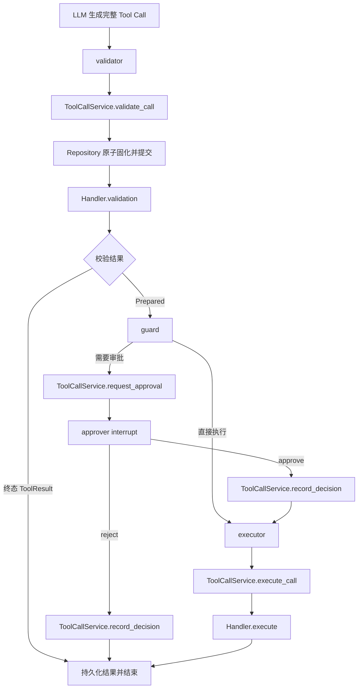

# ToolCallService 统一工具调用设计

**状态：** Proposed（方向已确认，待书面审阅）
**日期：** 2026-08-08
**范围：** `apps/backend/app/ai_chat`、Experience Graph 与现有 Tool 文档
**目标：** 所有当前及未来 Tool 统一经过同一条固化、校验、审批记录和执行路径。

---

## 1. 核心结论

新增应用层 `ToolCallService`，但不恢复旧 `ToolLifecycle`：

> Handler 管业务，Repository 管 SQL，ToolCallService 管二者如何安全协作，Graph 管流程和审批策略。

当前 `experience/graph/builder.py` 同时负责 Handler 查找、Tool Call 状态机、事务、审批 CAS 和事件编排。新设计把前三类通用机制移入 `ToolCallService`，Graph 只保留节点、路由、`interrupt/resume` 和业务事件。

## 2. 职责边界

| 组件 | 负责 | 不负责 |
|---|---|---|
| `ToolHandler` | `validation`、`execute`、`show_result`、`security` | 审批判断、事务提交、Tool Call 状态机 |
| `ToolCallRepository` | 原子写入、查询、CAS 和 ORM 字段更新 | Handler 查找、审批策略、事件 |
| `ToolCallService` | Handler 绑定与查找、调用固化、校验结果落库、审批决定落库、原子执行 | 风险策略、`interrupt`、SSE/业务事件 |
| Graph | `validator → guard → approver → executor` 路由、审批策略、暂停恢复、事件 | SQL、Handler 直接调用、Tool Call CAS |
| `AiChatService` | Conversation/Run、checkpoint 恢复、Tool Result 投递 | Tool 业务执行 |

只读的提案预检和 pending-result 投递可以继续通过 Repository；任何 Tool Call 状态变更与 Handler 生产调用必须经过 `ToolCallService`。

## 3. 统一调用链



`guard` 根据 Handler 的 `security`、触发来源和确认状态决定直接执行、审批或拒绝。Service 只执行已经给出的决定，不参与策略判断。

## 4. ToolCallService 最小接口

```python
class ToolCallService:
    def __init__(
        self, session_factory: SessionFactory, repositories: RepositoryFactory
    ) -> None: ...

    def bind_handlers(self, handlers: Mapping[str, ToolHandler]) -> ToolCallService: ...

    @property
    def model_handlers(self) -> Mapping[str, ToolHandler]: ...

    async def validate_call(
        self, context: ToolContext, call: AssembledToolCall
    ) -> ToolCallState: ...

    async def request_approval(
        self, tool_call_id: int
    ) -> ApprovalRequest | ApprovedToolCall | CompletedToolCall: ...

    async def record_decision(
        self, approval: ApprovalInput
    ) -> ApprovedToolCall | CompletedToolCall: ...

    async def execute_call(
        self, context: ToolContext, tool_call_id: int
    ) -> CompletedToolCall: ...
```

返回值使用不可变类型，不向 Graph 暴露 ORM：

- `PreparedToolCall`：`id`、`tool_name`、`security`，对应 `validated`；
- `ApprovalRequest`：`id`、`tool_name`、`proposal_payload`；
- `ApprovedToolCall`：已持久化的批准身份；
- `CompletedToolCall`：`id`、`tool_name`、`result`、`decision`、`replayed`。

`ToolCallState` 是上述状态的联合类型。Service 不提供按字符串动态调用 Handler 方法的通用入口，生产代码只能使用这些类型化方法。

`AiChatRuntime` 改为持有绑定后的 `ToolCallService`。模型 Schema 从 `model_handlers` 获取，Graph 节点只调用 Service。

## 5. 持久状态机

```text
received
  ├─ validation immediate result ─────────────→ resolved
  └─ validation prepared ─────────────────────→ validated

validated
  ├─ low-risk execution ─→ executing ─────────→ resolved
  └─ guard requests approval ─────────────────→ awaiting_approval

awaiting_approval
  ├─ reject ──────────────────────────────────→ resolved
  └─ approve ─────────────────────────────────→ approved

approved ────────────────→ executing ─────────→ resolved
```

新增 `validated`、`approved`、`executing` 状态，消除当前依靠 `proposal_payload/guard_payload` 是否为空来猜测阶段的做法。

- `approved` 必须先提交，再进入 executor；数据库成为审批真相源。
- `executing` 只在执行事务内作为 CAS 状态；失败回滚后恢复到 `validated` 或 `approved`。
- `resolved` 必须存在 `tool_result`。

迁移时把已有 `received + proposal_payload + guard_payload` 回填为 `validated`；已有 `awaiting_approval` 和 `resolved` 保持原义。

## 6. 事务与幂等

### 6.1 调用固化

`ToolCallRepository.materialize()` 必须是原子幂等边界：

```text
INSERT ... ON CONFLICT DO NOTHING
→ 按 (run_id, tool_call_index) reload
→ 比较 tool_name 与 arguments
```

- 等价重放返回同一记录；
- 首次 `provider_tool_call_id` 保留，重试生成的新 ID 不覆盖；
- 同一索引承载不同工具或参数时抛稳定 `ToolProtocolError`；
- 原始调用在 Handler 校验前提交，后续失败不会丢失调用证据。

### 6.2 校验

Handler 的 `validation()` 必须无业务写副作用。Service 注入共享 session，校验读取与 `proposal_payload/guard_payload` 落库处于同一事务。

Handler 不再自行打开全局数据库连接；未来 Tool 必须使用 `ToolContext.session`。

### 6.3 审批

`record_decision()` 先原子保存 `decision + client_resolution_id`：

- 同一 resolution 重放返回既有状态；
- 不同 decision 或不同 resolution 冲突；
- reject 同事务保存稳定 `{"outcome": "rejected"}`；
- approve 提交为 `approved` 后才允许 executor 运行。

这避免 checkpoint 已保存 approve、数据库仍显示 awaiting 的双真相。

### 6.4 执行

以下操作必须使用同一 session 和一次提交：

```text
CAS 认领 validated/approved
→ Handler.execute
→ 业务写入
→ 保存 ToolResult
→ resolved
```

瞬时异常整体回滚并保持可重试。预期业务失败由 Handler 的 `show_result()` 形成 `ToolResult`；系统异常继续抛出，由 Run 收敛为 `run.failed`。

## 7. Graph 约束

保留节点名称与拓扑：

```text
llm → validator → guard ───────────────→ executor → END
                    └→ approver ─approve→ executor → END
                                 └reject─→ END
```

- `validator`：只调用 `validate_call()` 并写入 JSON State；已持久化的 awaiting、approved 或 resolved 重放由返回类型表达；
- `guard`：先尊重已持久化阶段，再对新的 `validated` 调用做风险策略，并按需调用 `request_approval()`；
- `approver`：只负责 `interrupt()`、调用 `record_decision()` 和路由；
- `executor`：只调用 `execute_call()`；
- Tool 业务事件必须在 Service 提交成功后由 Graph 发出；
- State 只保存 JSON 和持久化 ID，不保存 Handler、ORM 或 Session。

保留现有节点和 State 字段，并增加可选的 JSON `tool_phase`，使现有 checkpoint 可以恢复。对旧 checkpoint 中“approval 已在 State、数据库仍 awaiting”的情况，executor 先幂等调用 `record_decision()`，再执行。

## 8. 剔除旧设计

实施时必须同时完成：

1. 保持 `tools/lifecycle.py` 删除，并清除全部导入和文字引用；
2. 删除 Experience Graph 中 `_handler()`、直接 Repository 状态机和直接 Handler 调用；
3. `AiChatRuntime` 不再直接暴露 `RepositoryFactory` 与 `tool_handlers`；
4. `ContentChangeHandler` 不再自行打开数据库 session；
5. 更新以下旧文档中的 `ToolLifecycle`、`tool_executor`、`invoke/resolve` 和旧拓扑：
   - `docs/superpowers/specs/2026-08-01-ai-chat-functional-boundaries-design.zh-CN.md`；
   - `docs/superpowers/specs/2026-08-01-experience-adapter-design.zh-CN.md`；
   - `docs/superpowers/specs/2026-08-08-ai-chat-memory-and-context-design.zh-CN.md`；
   - `docs/agent/learning/agent-development-reading-path.zh-CN.md`。

不删除 Handler 协议、Repository SQL 原语、五节点 Graph 或 Handler 单元测试。

## 9. 实施文件

新增：

- `apps/backend/app/ai_chat/services/tool_call_service.py`；
- Tool Call 状态约束与旧数据回填迁移；
- 独立的 `ToolCallService` 单元测试。

修改：

- `ai_chat/services/__init__.py`、`tools/results.py`；
- `ai_chat/graph/runtime.py`、`graph/runner.py`、`container.py`；
- `ai_chat/repositories/tool_call_repository.py`、`models/models.py`；
- `experience/graph/builder.py`、`graph/state.py`；
- `experience/tools/content_change.py`；
- 现有 Experience AI Chat 测试和第 8 节列出的文档。

不新增第二套 Tool 表，也不改变 `proposal_payload`、`guard_payload` 和 `tool_result` 的事实边界。

## 10. 测试要求

Service 单元测试至少覆盖：

- 未知工具与参数错误在副作用前失败；
- 并发固化只产生一条记录；
- 同 run/index 异参冲突；
- 即时 ToolResult；
- 低风险直接执行一次；
- request approval 幂等；
- reject 永不调用 Handler.execute；
- approve 决定先持久化，executor 失败后可重试；
- 同 resolution 重放与不同 resolution 冲突；
- revision guard 失效形成稳定 ToolResult；
- 结果已提交但 checkpoint/Run 未完成时只重放结果。

Graph 集成测试继续覆盖真实 `interrupt/resume`、事件顺序、旧 checkpoint 恢复和 pending Tool Result 延迟消费。

## 11. 完成标准

- 生产路径不存在 Graph 直接调用 Handler 或修改 Tool Call 状态；
- 所有 Adapter 只注册 Handler，自动获得统一 ToolCallService 路径；
- 审批策略仍只存在于 guard；
- 数据库是调用、审批和结果的唯一真相源；
- 旧设计引用清理完成；
- 全量后端测试、Ruff、迁移测试和 fresh-process import 全部通过。
