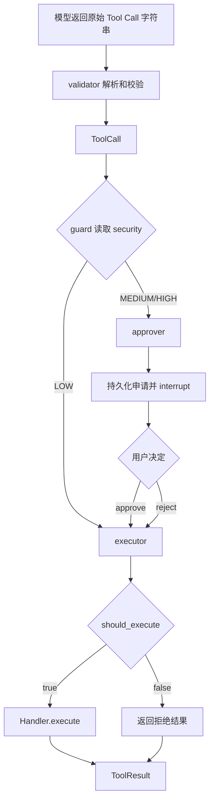

# ToolCallService 统一工具调用设计

> 历史设计说明：本方案中的 `ToolHandler`、`ToolSecurity` 和 `ToolCallService`
> 已由 LangChain `StructuredTool`、`ToolApprovalService`、`ToolCallStore` 与
> `ToolService` 四层结构替代；`proposal_payload` 也已统一为
> `interaction_payload`。当前控制面以
> [Agent Runtime 统一设计](./2026-08-17-agent-runtime-unification-design.zh-CN.md) 为准。

**状态：** Implemented

**日期：** 2026-08-09
**范围：** `apps/backend/app/ai_chat`、Experience Graph 与 Tool 文档

## 1. 核心结论

> Handler 管业务，Repository 管 SQL，ToolCallService 绑定两者，Graph 管节点和审批策略。

工具调用只使用一个 `ToolCall`。生命周期差异由 `status` 和字段值表达，不再为 validated、awaiting、approved、resolved 分别建立结构类。

## 2. 数据结构

公共 Tool 数据只保留：

- `ToolCall`：Graph 中唯一的工具调用结构；
- `ToolContext`：Service 注入 Handler 的可信身份和共享事务；
- `ToolResult`：Handler 的业务结果，Service 返回时补充持久化调用身份；
- `ApprovalDecision`：用户审批命令；
- `ToolSecurity`：Handler 声明的固有风险。

`ToolCall` 的主要字段：

```text
tool_call_id
index
provider_id
name
arguments
status
security
proposal_payload
should_execute
result
replayed
```

`decision` 与 `client_resolution_id` 不属于 `ToolCall`：前者由 `ApprovalDecision` 表达用户命令，二者都只在数据库中作为审批审计与幂等真相保存。

`guard_payload` 只保存在数据库中。Graph 和 checkpoint 不得持有它，executor 通过 Tool Call ID 让 Service 重新加载可信值。

## 3. 调用链



节点职责：

- `validator`：解析字符串、定位 Handler、校验参数、调用 `Handler.validation()`、返回 `ToolCall`；
- `guard`：只依据 `ToolCall.security` 决定直接执行还是进入审批；
- `approver`：持久化申请、生成展示内容、`interrupt()`，并把决定保存为独立 `ApprovalDecision`；
- `executor`：检查 `should_execute`，批准时调用 Service，拒绝时直接返回已固化结果。

## 4. Handler 边界

Handler 保持四项职责：

```text
validation
execute
show_result
security
```

`validation()` 返回：

- `(proposal_payload, guard_payload)`：形成可继续路由的调用；
- `ToolResult`：校验阶段已经得到终态结果。

Handler 不决定是否审批，也不提交 Tool Call 状态。

## 5. ToolCallService 接口

```python
class ToolCallService:
    def bind_handlers(self, handlers: Mapping[str, ToolHandler]) -> ToolCallService: ...

    async def validate_call(
        self, context: ToolContext, raw_call: str
    ) -> ToolCall: ...

    async def get_call(self, tool_call_id: int) -> ToolCall: ...

    async def request_approval(self, tool_call_id: int) -> ToolCall: ...

    async def record_decision(self, approval: ApprovalDecision) -> ToolCall: ...

    async def execute_call(
        self, context: ToolContext, tool_call_id: int
    ) -> ToolResult: ...
```

Service 返回的 `ToolCall` 是数据库快照。Graph 可以添加瞬时 `should_execute`，但 Service 执行时只相信数据库中的身份、状态、proposal 和 guard。

## 6. 持久状态机

```text
received
  ├─ validation immediate result ─────────────→ resolved
  └─ validation prepared ─────────────────────→ validated

validated
  ├─ LOW execution ───────→ executing ────────→ resolved
  └─ request approval ─────────────────────────→ awaiting_approval

awaiting_approval
  ├─ reject ──────────────────────────────────→ resolved
  └─ approve ─────────────────────────────────→ approved

approved ─────────────────→ executing ────────→ resolved
```

- `executing` 只存在于执行事务中，不作为稳定 Graph 状态；
- approve 必须先提交为 `approved`；
- reject 固化稳定结果，永不调用 Handler；
- `resolved` 必须包含 `tool_result`。

## 7. 事务与幂等

- `(run_id, tool_call_index)` 保证模型重放不会产生第二条调用；
- provider ID 和客户端 resolution ID 的唯一约束保持不变；
- CAS 失败后必须结束旧 session，再用新 session 读取数据库真相；
- `claim_execution → Handler.execute → 业务写 → ToolResult → resolved` 使用同一事务；
- 执行异常整体回滚到 `validated` 或 `approved`；
- `proposal_payload` 可展示，`guard_payload` 只由 Service 交给 Handler。

## 8. Checkpoint 与恢复

新 Graph State 保存：

```text
raw_tool_call: str | None
tool_call: ToolCall | None
approval: ApprovalDecision | None
```

`approval` 只保存本次恢复命令，不写入 `ToolCall`。恢复只读取嵌套 `ToolCall` 的身份和独立审批命令，不保留旧字段兼容分支。

数据库是调用、审批和结果的唯一真相源；checkpoint 只保存控制快照。

## 9. 完成标准

- 生产代码不存在生命周期结构类；
- 模型工具调用以字符串进入 validator；
- Graph 只操作一个 `ToolCall`；
- Handler 只被 `ToolCallService` 调用；
- guard 决定审批，Handler 不决定审批；
- Tool 业务事件只在数据库提交后发送；
- fresh-process import、Graph 构造、真实 interrupt/resume 和全量测试通过。
