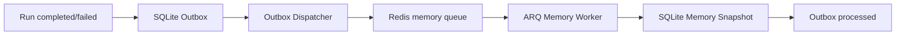

# AI Chat 后台记忆压缩设计

**状态：** Implemented

**日期：** 2026-08-10  
**范围：** `apps/backend/app/ai_chat/memory`、后台任务 Outbox 与独立 Worker

## 1. 核心结论

> SQLite 保存业务与 Snapshot 真相，Outbox 保证终态 Run 不丢任务，Redis + ARQ 只负责独立进程调度；Web 进程只读取或等待结果，绝不执行压缩。

记忆压缩使用专用队列和专用 Worker 并发额度。未来 Agent 即使运行很久，也不能占满 Memory Worker。

## 2. 组件边界

- `RunRepository`：Run 转为 `completed/failed` 时，在同一事务写入 Outbox；
- `OutboxRepository`：幂等保存、发布和完成后台事件；
- `OutboxDispatcher`：从 SQLite 投递到 Redis，失败后退避，发布超时后可重新投递；
- ARQ Memory Worker：独立进程消费 `memory.compact`；
- `MemoryService`：组装历史、等待 Snapshot、执行单 Run 累计压缩；
- `AiChatRuntime`：只取得准备完成的 Messages，不拥有后台任务生命周期。

Redis 和 ARQ Job Result 都不是记忆事实源。最终结果只能从 `ai_chat_run_memories` 读取。

## 3. 事务与投递

Run 终态事务同时完成：

```text
更新 ai_chat_runs
插入 background_job_outbox(memory.compact, run_id)
COMMIT
```

Outbox 使用稳定 `dedupe_key=memory.compact:{run_id}`。Dispatcher 发布成功后标记 `published`；Worker 完成压缩或确定跳过后标记 `processed`。

若 Worker 在写入 Snapshot 后、完成 Outbox 前退出，重新执行时复用已有 Snapshot，只补齐 `processed`，不得再次调用模型。

## 4. 后台调用链



Worker 按 Run 顺序保证 Snapshot 链完整。一个任务处理目标 Run 时，如果更早的终态 Run 尚未压缩，会先顺序补齐；同一 Run 的数据库占位和 ARQ Job ID 共同保证幂等。同一会话使用 Redis 锁串行压缩，不同会话仍可并行。

## 5. 前台等待

`prepare_request_messages()` 先按最终 `messages + tools` 计算预算：

- 原始历史可容纳：直接使用，不等待压缩；
- 需要的 Snapshot 已是 `completed/skipped`：立即使用；
- Snapshot 尚未完成：等待后台 Worker，并轮询 SQLite 真相；
- 超过等待上限：抛出 `memory_compaction_timeout`，不在 Web 进程接管压缩。

正常情况下，上一 Run 结束后后台已提前压缩，因此下一次模型调用不会等待。

## 6. 连续失败与 skipped

压缩直接复用现有 MemorySummarizer/LangChain 模型重试，不叠加 ARQ 业务重试。摘要最终抛出压缩错误后：

1. 当前 Run 标记为 `skipped`；
2. `core/other/token_count` 复制父 Snapshot；
3. 仅在现有 `error_message` 保存最终错误；
4. ARQ Job 作为成功结束，禁止继续自动重试；
5. 后续 Run 继续基于这个无变化 Snapshot 压缩。

```text
Run 10 -> completed Snapshot
Run 11 -> retries exhausted -> skipped Snapshot(content = Run 10)
Run 12 -> completed Snapshot(content = Run 11 + Run 12 operations)
```

`skipped` 只丢弃该 Run 的长期记忆增量，不中断 Snapshot 链。该 Run 在短期原始窗口内仍可直接进入上下文。

## 7. 状态机

Memory：

```text
pending -> completed
pending -> skipped
```

Outbox：

```text
pending -> published -> processed
              |
              +-- publish lease expired -> pending
```

不增加 Memory 重试次数、错误码或跳过时间字段。`status` 与现有 `error_message` 足以表达结果。

## 8. 运行与隔离

- Web：`python -m app.main`；
- Memory Worker：`arq app.ai_chat.memory.worker.WorkerSettings`；
- Redis：由 `REDIS_URL` 配置；
- Memory 使用独立队列 `ai-chat:memory`；
- Worker 并发、Job 超时、前台等待时间均可配置；
- Worker 健康检查使用 ARQ health key。

Redis 不可用时，Run 事务仍可成功，Outbox 保留待投递事件；需要压缩的前台请求会明确超时，而不会静默退化为同步压缩。

## 9. 完成标准

- 所有 `completed/failed` Run 与 Outbox 原子提交；
- Web 代码不存在压缩模型调用；
- Worker 重启和重复投递不会重复生成已完成 Snapshot；
- 一个 Run 被跳过后，后续 Run 仍能生成 Snapshot；
- Redis 暂时不可用不会丢任务；
- Memory 与 Agent 队列可独立配置并发；
- 迁移、单元测试、fresh-process import 和后端全量测试通过。
